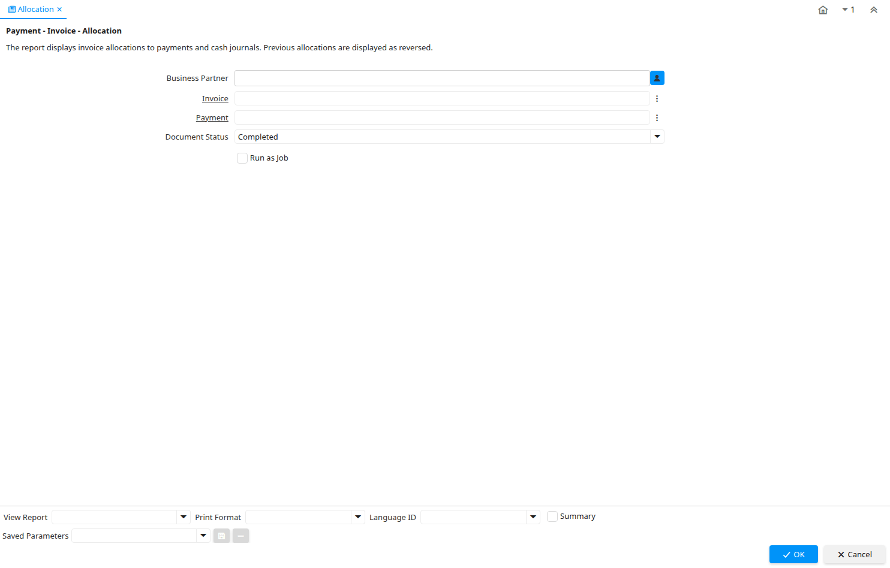

# Allocation

Report ID 148

*09/01/2001 → 27/01/2005*

**Description:** Payment - Invoice - Allocation

**Comment/Help:** The report displays invoice allocations to payments and cash journals.  Previous allocations are displayed as reversed.

## Table: Report Parameters

| **Name** | **Description** | **Comment/Help** | **Technical Data** |
|---|---|---|---|
| Business Partner  | Identifies a Business Partner | A Business Partner is anyone with whom you transact.  This can include Vendor, Customer, Employee or Salesperson | C_BPartner_ID Chosen Multiple Selection Search |
| Invoice | Invoice Identifier | The Invoice Document. | C_Invoice_ID Search |
| Payment | Payment identifier | The Payment is a unique identifier of this payment. | C_Payment_ID Search |
| Document Status | The current status of the document | The Document Status indicates the status of a document at this time.  If you want to change the document status, use the Document Action field | DocStatus List |

