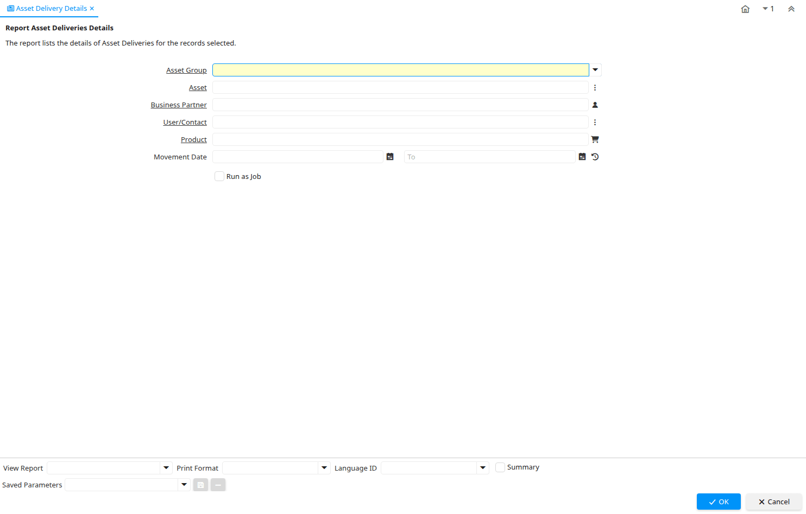

# Asset Delivery Details

Report ID 223

*28/08/2003 → 17/02/2022*

**Description:** Report Asset Deliveries Details

**Comment/Help:** The report lists the details of Asset Deliveries for the records selected.

## Table: Report Parameters

| **Name** | **Description** | **Comment/Help** | **Technical Data** |
|---|---|---|---|
| Asset Group | Group of Assets | The group of assets determines default accounts.  If an asset group is selected in the product category, assets are created when delivering the asset. | A_Asset_Group_ID Table Direct |
| Asset | Asset used internally or by customers | An asset is either created by purchasing or by delivering a product.  An asset can be used internally or be a customer asset. | A_Asset_ID Search |
| Business Partner | Identifies a Business Partner | A Business Partner is anyone with whom you transact.  This can include Vendor, Customer, Employee or Salesperson | C_BPartner_ID Search |
| User/Contact | User within the system - Internal or Business Partner Contact | The User identifies a unique user in the system. This could be an internal user or a business partner contact | AD_User_ID Search |
| Product | Product, Service, Item | Identifies an item which is either purchased or sold in this organization. | M_Product_ID Search |
| Movement Date | Date a product was moved in or out of inventory | The Movement Date indicates the date that a product moved in or out of inventory.  This is the result of a shipment, receipt or inventory movement. | MovementDate Date |

