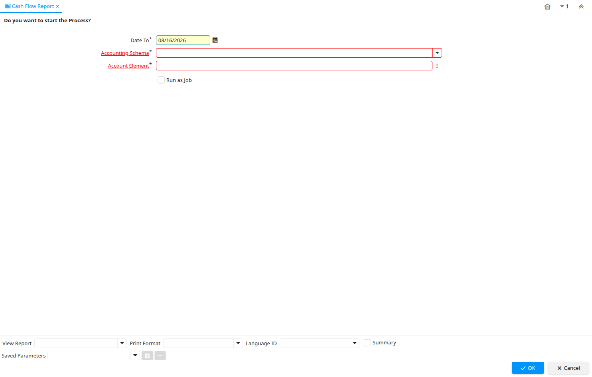

# Cash Flow Report

Report ID 53248

*08/12/2010 → 08/12/2010*

**Classname:** `org.globalqss.process.CashFlow`

## Table: Report Parameters

| **Name** | **Description** | **Comment/Help** | **Technical Data** |
|---|---|---|---|
| Date To | End date of a date range | The Date To indicates the end date of a range (inclusive) | DateTo Date |
| Accounting Schema | Rules for accounting | An Accounting Schema defines the rules used in accounting such as costing method, currency and calendar | C_AcctSchema_ID Table Direct |
| Account Element | Account Element | Account Elements can be natural accounts or user defined values. | C_ElementValue_ID Search |

