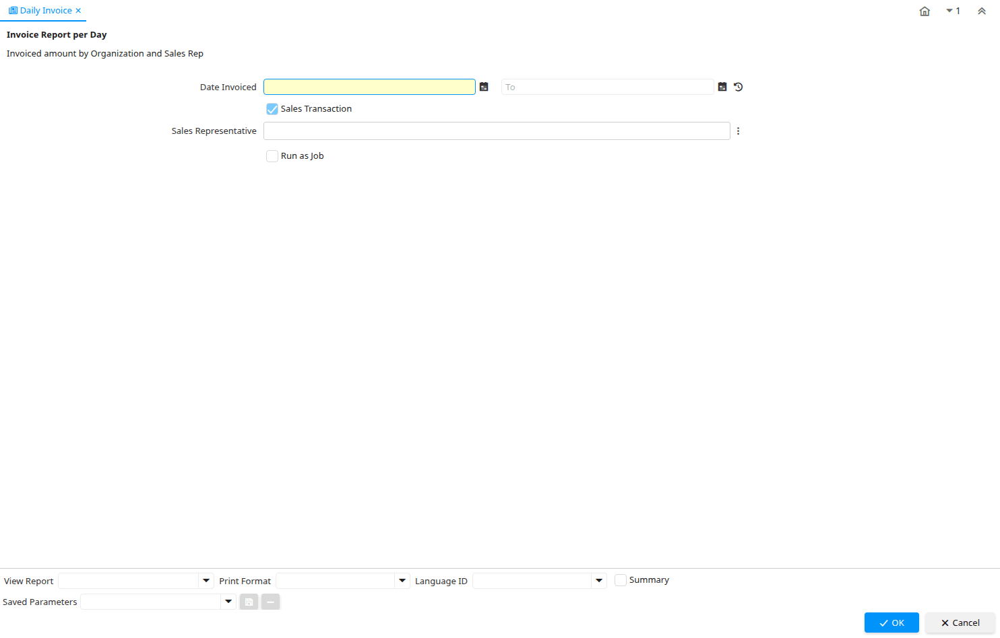

# Daily Invoice

Report ID 128

*01/06/2000 → 02/12/2008*

**Description:** Invoice Report per Day

**Comment/Help:** Invoiced amount by Organization and Sales Rep

## Table: Report Parameters

| **Name** | **Description** | **Comment/Help** | **Technical Data** |
|---|---|---|---|
| Date Invoiced | Date printed on Invoice | The Date Invoice indicates the date printed on the invoice. | DateInvoiced Date |
| Sales Transaction | This is a Sales Transaction | The Sales Transaction checkbox indicates if this item is a Sales Transaction. | IsSOTrx Yes-No |
| Sales Representative | Sales Representative or Company Agent | The Sales Representative indicates the Sales Rep for this Region.  Any Sales Rep must be a valid internal user. | SalesRep_ID Chosen Multiple Selection Table |

