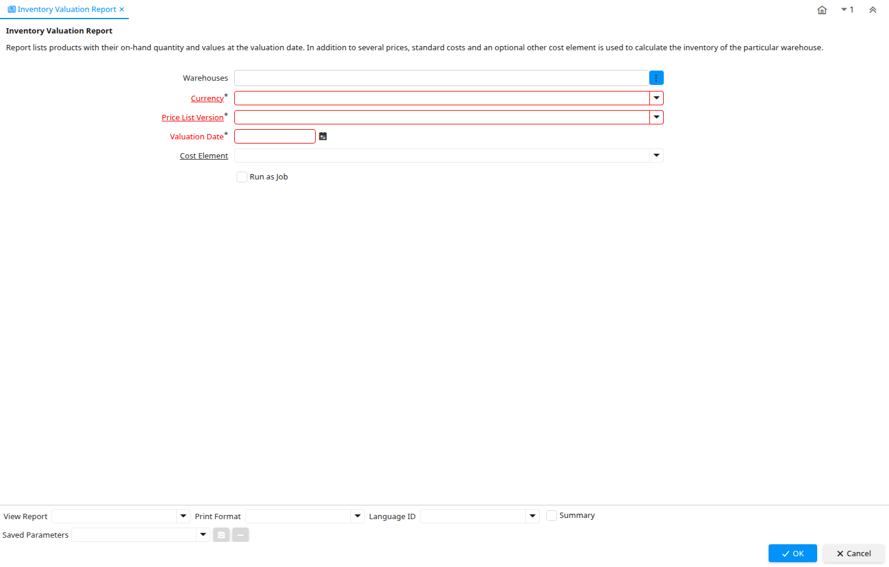

# Inventory Valuation Report

Report ID 180

*17/01/2002 → 11/01/2006*

**Description:** Inventory Valuation Report

**Comment/Help:** Report lists products with their on-hand quantity and values at the valuation date. In addition to several prices, standard costs and an optional other cost element is used to calculate the inventory of the particular warehouse.

**Classname:** `org.compiere.process.InventoryValue`

## Table: Report Parameters

| **Name** | **Description** | **Comment/Help** | **Technical Data** |
|---|---|---|---|
| Warehouses |  |  | M_Warehouse_IDs Chosen Multiple Selection Table |
| Currency | The Currency for this record | Indicates the Currency to be used when processing or reporting on this record | C_Currency_ID Table Direct |
| Price List Version | Identifies a unique instance of a Price List | Each Price List can have multiple versions.  The most common use is to indicate the dates that a Price List is valid for. | M_PriceList_Version_ID Table Direct |
| Valuation Date | Date of valuation |  | DateValue Date |
| Cost Element | Product Cost Element |  | M_CostElement_ID Table Direct |

