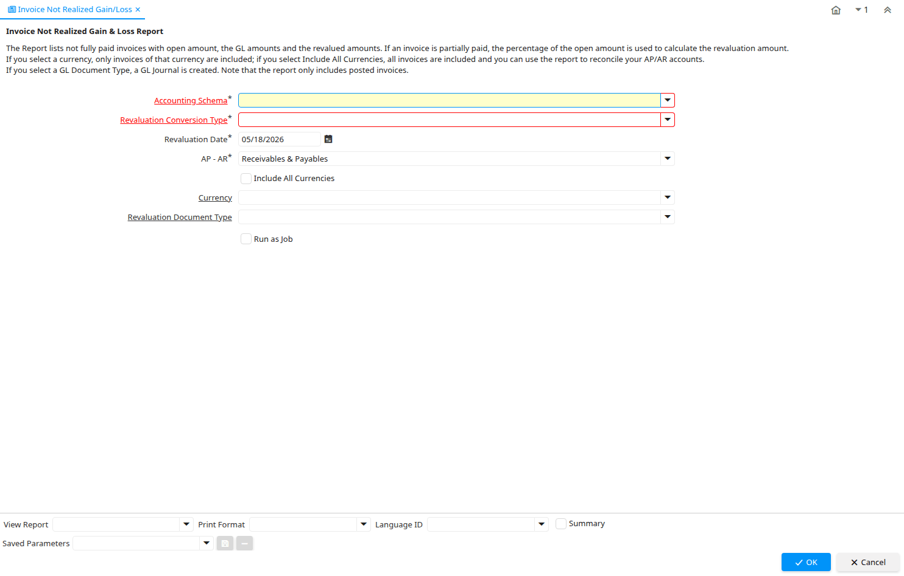

# Invoice Not Realized Gain/Loss

Report ID 326

*30/05/2005 → 23/03/2026*

**Description:** Invoice Not Realized Gain &amp; Loss Report

**Comment/Help:** The Report lists not fully paid invoices with open amount, the GL amounts and the revalued amounts.  If an invoice is partially paid, the percentage of the open amount is used to calculate the revaluation amount.&lt;br&gt;
If you select a currency, only invoices of that currency are included; if you select Include All Currencies, all invoices are included and you can use the report to reconcile your AP/AR accounts.&lt;br&gt;
If you select a GL Document Type, a GL Journal is created. 
Note that the report only includes posted invoices.

**Classname:** `org.idempiere.acct.process.InvoiceNGL`

## Table: Report Parameters

| **Name** | **Description** | **Comment/Help** | **Technical Data** |
|---|---|---|---|
| Accounting Schema | Rules for accounting | An Accounting Schema defines the rules used in accounting such as costing method, currency and calendar | C_AcctSchema_ID Table Direct |
| Revaluation Conversion Type | Revaluation Currency Conversion Type |  | C_ConversionTypeReval_ID Table |
| Revaluation Date | Date of Revaluation |  | DateReval Date |
| AP - AR | Include Receivables and/or Payables transactions |  | APAR List |
| Include All Currencies | Report not just foreign currency Invoices |  | IsAllCurrencies Yes-No |
| Currency | The Currency for this record | Indicates the Currency to be used when processing or reporting on this record | C_Currency_ID Table Direct |
| Revaluation Document Type | Document Type for Revaluation Journal |  | C_DocTypeReval_ID Table |

