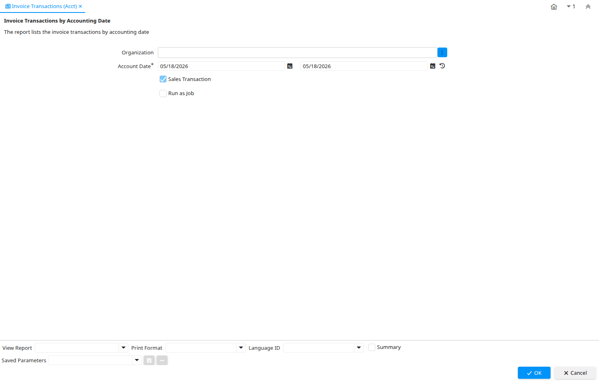

# Invoice Transactions (Acct)

Report ID 127

*15/05/2000 → 02/12/2008*

**Description:** Invoice Transactions by Accounting Date

**Comment/Help:** The report lists the invoice transactions by accounting date

## Table: Report Parameters

| **Name** | **Description** | **Comment/Help** | **Technical Data** |
|---|---|---|---|
| Organization | Organizational entity within tenant | An organization is a unit of your tenant or legal entity - examples are store, department. You can share data between organizations. | AD_Org_ID Chosen Multiple Selection Table |
| Account Date | Accounting Date | The Accounting Date indicates the date to be used on the General Ledger account entries generated from this document. It is also used for any currency conversion. | DateAcct Date |
| Sales Transaction | This is a Sales Transaction | The Sales Transaction checkbox indicates if this item is a Sales Transaction. | IsSOTrx Yes-No |

