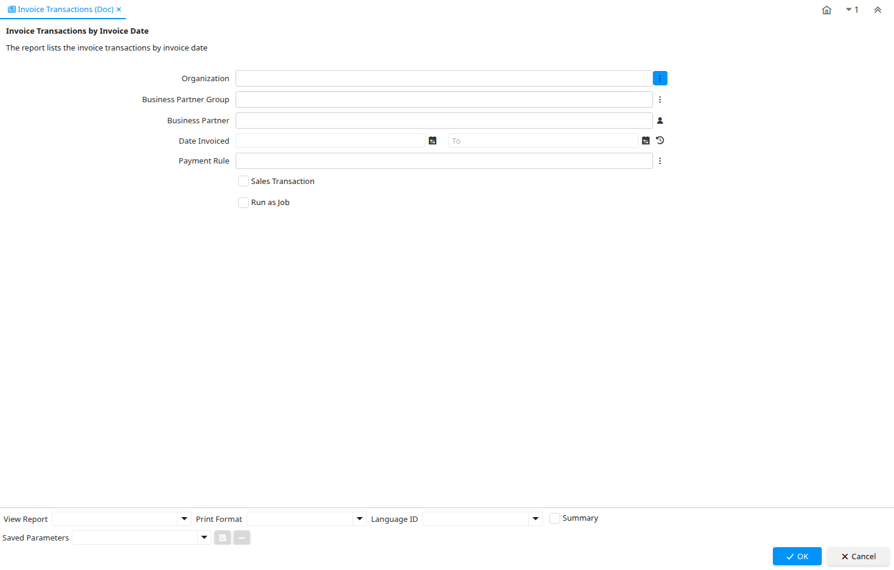

# Invoice Transactions (Doc)

Report ID 151

*27/01/2001 → 18/09/2019*

**Description:** Invoice Transactions by Invoice Date

**Comment/Help:** The report lists the invoice transactions by invoice date

## Table: Report Parameters

| **Name** | **Description** | **Comment/Help** | **Technical Data** |
|---|---|---|---|
| Organization | Organizational entity within tenant | An organization is a unit of your tenant or legal entity - examples are store, department. You can share data between organizations. | AD_Org_ID Chosen Multiple Selection Table |
| Business Partner Group | Business Partner Group | The Business Partner Group provides a method of defining defaults to be used for individual Business Partners. | C_BP_Group_ID Chosen Multiple Selection Table |
| Business Partner  | Identifies a Business Partner | A Business Partner is anyone with whom you transact.  This can include Vendor, Customer, Employee or Salesperson | C_BPartner_ID Chosen Multiple Selection Search |
| Date Invoiced | Date printed on Invoice | The Date Invoice indicates the date printed on the invoice. | DateInvoiced Date |
| Payment Rule | How you pay the invoice | The Payment Rule indicates the method of invoice payment. | PaymentRule Chosen Multiple Selection List |
| Sales Transaction | This is a Sales Transaction | The Sales Transaction checkbox indicates if this item is a Sales Transaction. | IsSOTrx Yes-No |

