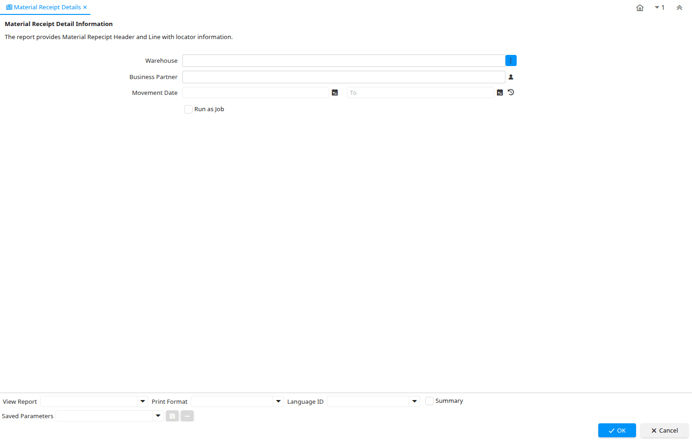

# Material Receipt Details

Report ID 293

*20/07/2004 → 02/01/2000*

**Description:** Material Receipt Detail Information

**Comment/Help:** The report provides Material Repecipt Header and Line with locator information.

## Table: Report Parameters

| **Name** | **Description** | **Comment/Help** | **Technical Data** |
|---|---|---|---|
| Warehouse | Storage Warehouse and Service Point | The Warehouse identifies a unique Warehouse where products are stored or Services are provided. | M_Warehouse_ID Chosen Multiple Selection Table |
| Business Partner | Identifies a Business Partner | A Business Partner is anyone with whom you transact.  This can include Vendor, Customer, Employee or Salesperson | C_BPartner_ID Chosen Multiple Selection Search |
| Movement Date | Date a product was moved in or out of inventory | The Movement Date indicates the date that a product moved in or out of inventory.  This is the result of a shipment, receipt or inventory movement. | MovementDate Date |

