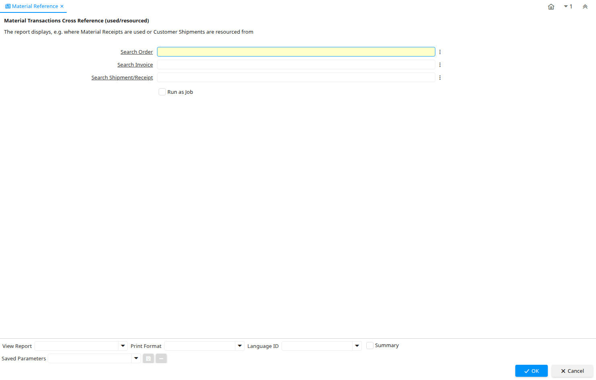

# Material Reference

Report ID 322

*30/03/2005 → 30/03/2005*

**Description:** Material Transactions Cross Reference (used/resourced)

**Comment/Help:** The report displays, e.g. where Material Receipts are used or Customer Shipments are resourced from

**Classname:** `org.compiere.process.TransactionXRef`

## Table: Report Parameters

| **Name** | **Description** | **Comment/Help** | **Technical Data** |
|---|---|---|---|
| Search Order | Order Identifier | Order is a control document. | Search_Order_ID Search |
| Search Invoice | Search Invoice Identifier | The Invoice Document. | Search_Invoice_ID Search |
| Search Shipment/Receipt | Material Shipment Document | The Material Shipment / Receipt  | Search_InOut_ID Search |

