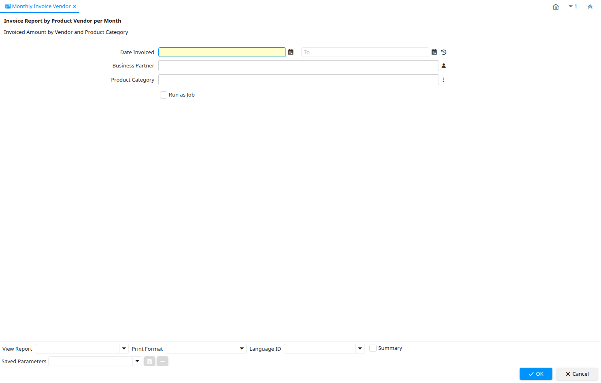

# Monthly Invoice Vendor

Report ID 133

*01/06/2000 → 02/12/2008*

**Description:** Invoice Report by Product Vendor per Month

**Comment/Help:** Invoiced Amount by Vendor and Product Category

## Table: Report Parameters

| **Name** | **Description** | **Comment/Help** | **Technical Data** |
|---|---|---|---|
| Date Invoiced | Date printed on Invoice | The Date Invoice indicates the date printed on the invoice. | DateInvoiced Date |
| Business Partner | Identifies a Business Partner | A Business Partner is anyone with whom you transact.  This can include Vendor, Customer, Employee or Salesperson | C_BPartner_ID Chosen Multiple Selection Search |
| Product Category | Category of a Product | Identifies the category which this product belongs to.  Product categories are used for pricing and selection. | M_Product_Category_ID Chosen Multiple Selection Table |

