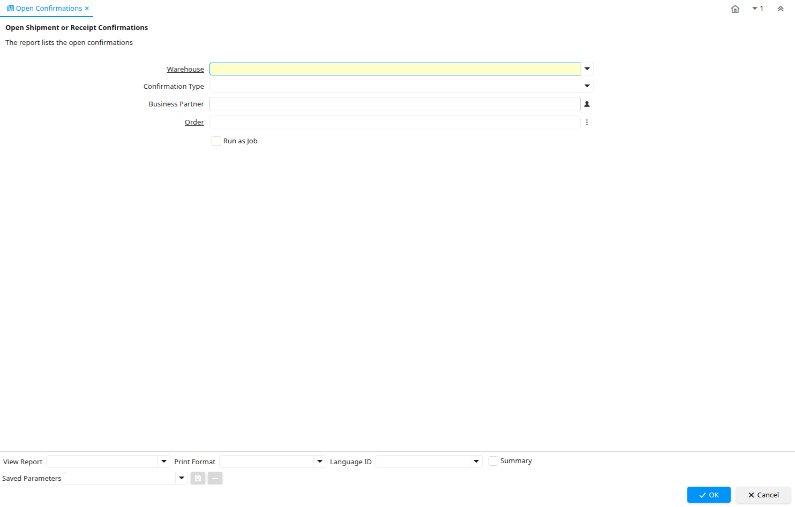

# Open Confirmations

Report ID 285

*18/05/2004 → 02/01/2000*

**Description:** Open Shipment or Receipt Confirmations

**Comment/Help:** The report lists the open confirmations

## Table: Report Parameters

| **Name** | **Description** | **Comment/Help** | **Technical Data** |
|---|---|---|---|
| Warehouse | Storage Warehouse and Service Point | The Warehouse identifies a unique Warehouse where products are stored or Services are provided. | M_Warehouse_ID Table Direct |
| Confirmation Type | Type of confirmation |  | ConfirmType List |
| Business Partner | Identifies a Business Partner | A Business Partner is anyone with whom you transact.  This can include Vendor, Customer, Employee or Salesperson | C_BPartner_ID Chosen Multiple Selection Search |
| Order | Order | The Order is a control document.  The  Order is complete when the quantity ordered is the same as the quantity shipped and invoiced.  When you close an order, unshipped (backordered) quantities are cancelled. | C_Order_ID Search |

