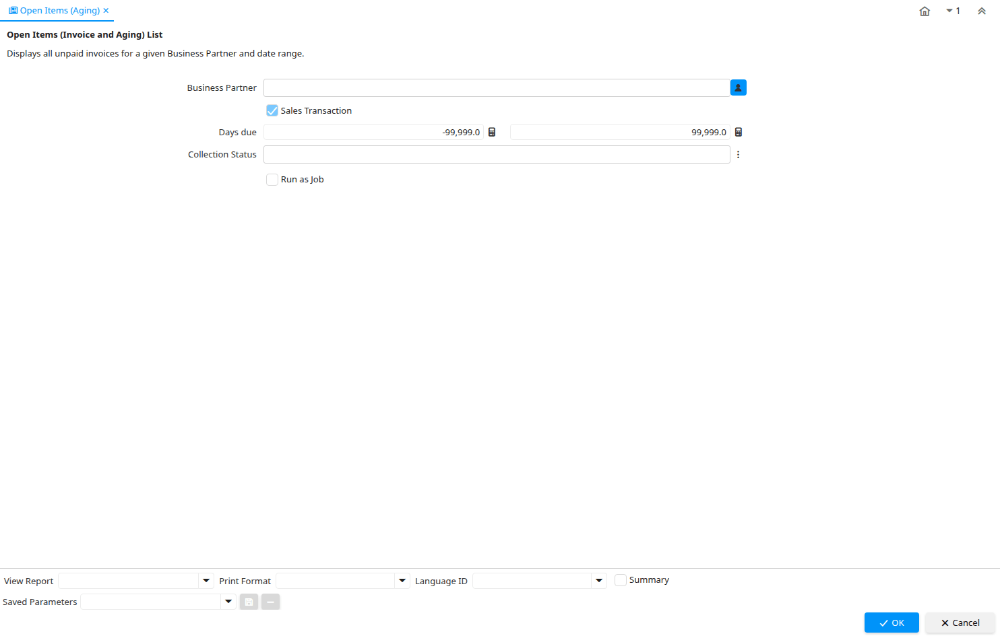

# Open Items (Aging)

Report ID 145

*03/01/2001 → 08/12/2023*

**Description:** Open Items (Invoice and Aging) List

**Comment/Help:** Displays all unpaid invoices for a given Business Partner and date range.

## Table: Report Parameters

| **Name** | **Description** | **Comment/Help** | **Technical Data** |
|---|---|---|---|
| Business Partner  | Identifies a Business Partner | A Business Partner is anyone with whom you transact.  This can include Vendor, Customer, Employee or Salesperson | C_BPartner_ID Chosen Multiple Selection Search |
| Sales Transaction | This is a Sales Transaction | The Sales Transaction checkbox indicates if this item is a Sales Transaction. | IsSOTrx Yes-No |
| Days due | Number of days due (negative: due in number of days) |  | DaysDue Number |
| Collection Status | Invoice Collection Status | Status of the invoice collection process | InvoiceCollectionType Chosen Multiple Selection List |

