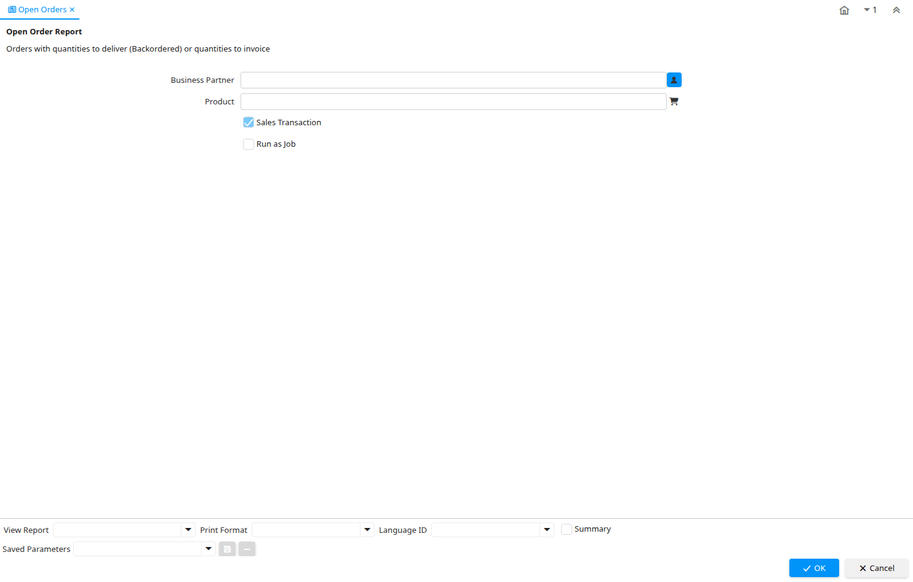

# Open Orders

Report ID 121

*26/04/2000 → 02/01/2000*

**Description:** Open Order Report

**Comment/Help:** Orders with quantities to deliver (Backordered) or quantities to invoice

## Table: Report Parameters

| **Name** | **Description** | **Comment/Help** | **Technical Data** |
|---|---|---|---|
| Business Partner  | Identifies a Business Partner | A Business Partner is anyone with whom you transact.  This can include Vendor, Customer, Employee or Salesperson | C_BPartner_ID Chosen Multiple Selection Search |
| Product | Product, Service, Item | Identifies an item which is either purchased or sold in this organization. | M_Product_ID Chosen Multiple Selection Search |
| Sales Transaction | This is a Sales Transaction | The Sales Transaction checkbox indicates if this item is a Sales Transaction. | IsSOTrx Yes-No |

