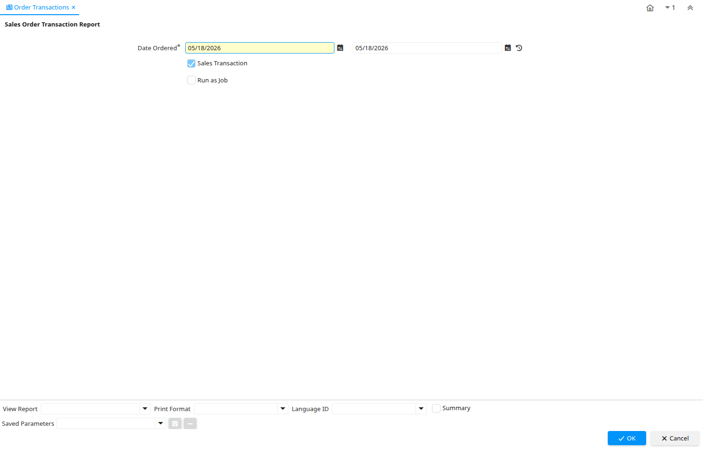

# Order Transactions

Report ID 53176

*15/06/2009 → 15/06/2009*

**Description:** Sales Order Transaction Report

## Table: Report Parameters

| **Name** | **Description** | **Comment/Help** | **Technical Data** |
|---|---|---|---|
| Date Ordered | Date of Order | Indicates the Date an item was ordered. | DateOrdered Date |
| Sales Transaction | This is a Sales Transaction | The Sales Transaction checkbox indicates if this item is a Sales Transaction. | IsSOTrx Yes-No |

