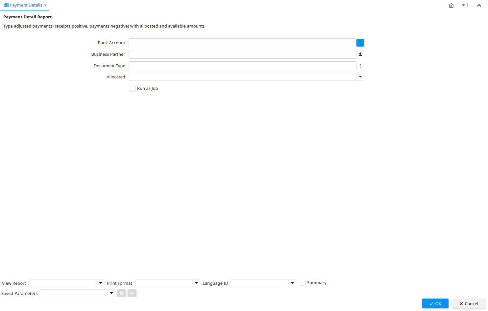

# Payment Details

Report ID 318

*07/02/2005 → 08/02/2005*

**Description:** Payment Detail Report

**Comment/Help:** Type adjusted payments (receipts positive, payments negative) with allocated and available amounts

## Table: Report Parameters

| **Name** | **Description** | **Comment/Help** | **Technical Data** |
|---|---|---|---|
| Bank Account | Account at the Bank | The Bank Account identifies an account at this Bank. | C_BankAccount_ID Chosen Multiple Selection Table |
| Business Partner | Identifies a Business Partner | A Business Partner is anyone with whom you transact.  This can include Vendor, Customer, Employee or Salesperson | C_BPartner_ID Chosen Multiple Selection Search |
| Document Type | Document type or rules | The Document Type determines document sequence and processing rules | C_DocType_ID Chosen Multiple Selection Table |
| Allocated | Indicates if the payment has been allocated | The Allocated checkbox indicates if a payment has been allocated or associated with an invoice or invoices. | IsAllocated List |

