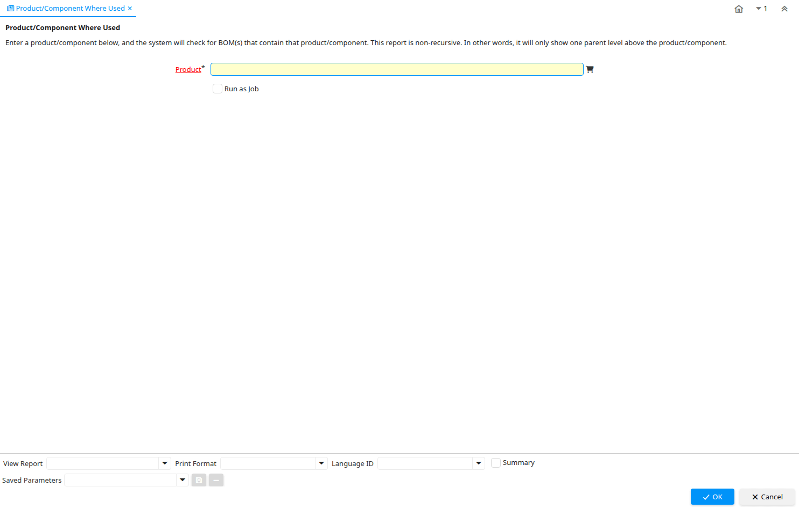

# Product/Component Where Used

Report ID 200036

*01/03/2013 → 01/03/2013*

**Description:** Product/Component Where Used

**Comment/Help:** Enter a product/component below, and the system will check for BOM(s) that contain that product/component.  This report is non-recursive.  In other words, it will only show one parent level above the product/component.

## Table: Report Parameters

| **Name** | **Description** | **Comment/Help** | **Technical Data** |
|---|---|---|---|
| Product | Please enter the product (component) you wish to search for |  | M_Product_ID Search |

