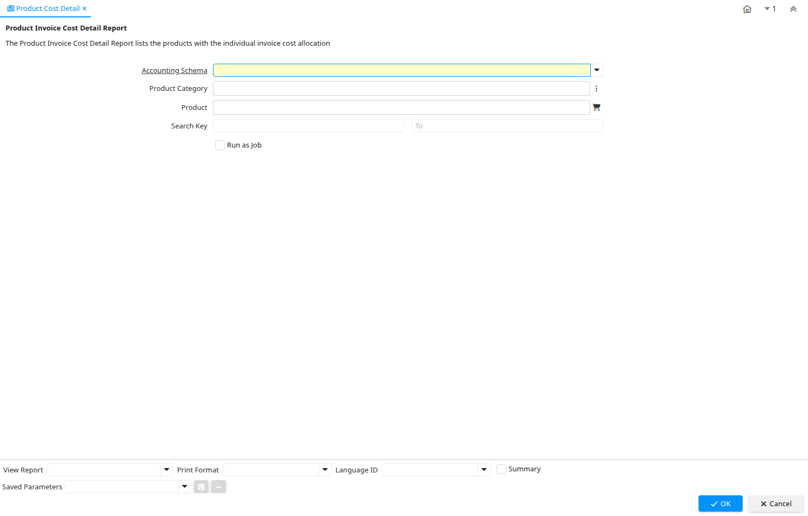

# Product Cost Detail

Report ID 331

*26/07/2005 → 26/07/2005*

**Description:** Product Invoice Cost Detail Report

**Comment/Help:** The Product Invoice Cost Detail Report lists the products with the individual invoice cost allocation

## Table: Report Parameters

| **Name** | **Description** | **Comment/Help** | **Technical Data** |
|---|---|---|---|
| Accounting Schema | Rules for accounting | An Accounting Schema defines the rules used in accounting such as costing method, currency and calendar | C_AcctSchema_ID Table Direct |
| Product Category | Category of a Product | Identifies the category which this product belongs to.  Product categories are used for pricing and selection. | M_Product_Category_ID Chosen Multiple Selection Table |
| Product | Product, Service, Item | Identifies an item which is either purchased or sold in this organization. | M_Product_ID Chosen Multiple Selection Search |
| Search Key | Search key for the record in the format required - must be unique | A search key allows you a fast method of finding a particular record. If you leave the search key empty, the system automatically creates a numeric number.  The document sequence used for this fallback number is defined in the "Maintain Sequence" window with the name "DocumentNo_&lt;TableName&gt;", where TableName is the actual name of the table (e.g. C_Order). | Value String |

