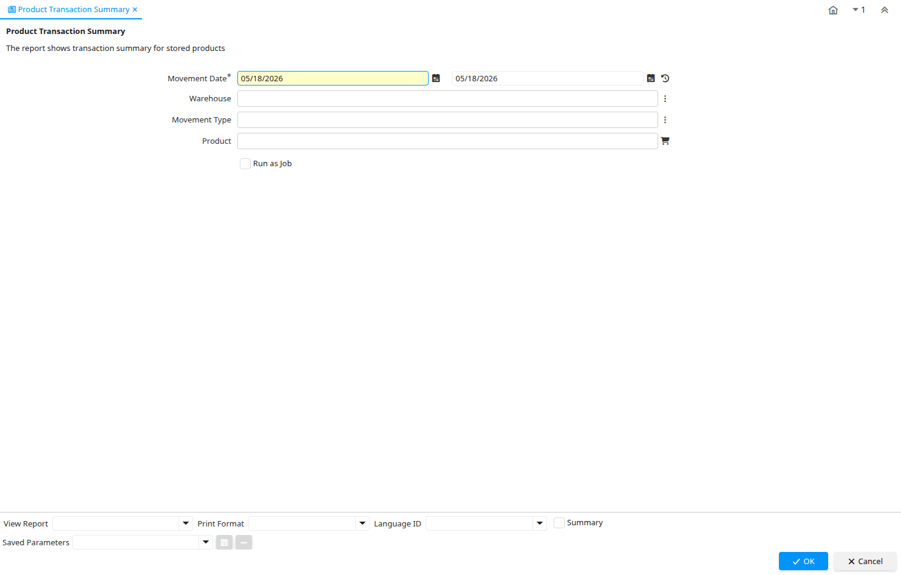

# Product Transaction Summary

Report ID 124

*11/05/2000 → 02/01/2000*

**Description:** Product Transaction Summary

**Comment/Help:** The report shows transaction summary for stored products

## Table: Report Parameters

| **Name** | **Description** | **Comment/Help** | **Technical Data** |
|---|---|---|---|
| Movement Date | Date a product was moved in or out of inventory | The Movement Date indicates the date that a product moved in or out of inventory.  This is the result of a shipment, receipt or inventory movement. | MovementDate Date |
| Warehouse | Storage Warehouse and Service Point | The Warehouse identifies a unique Warehouse where products are stored or Services are provided. | M_Warehouse_ID Chosen Multiple Selection Table |
| Movement Type | Method of moving the inventory | The Movement Type indicates the type of movement (in, out, to production, etc) | MovementType Chosen Multiple Selection List |
| Product | Product, Service, Item | Identifies an item which is either purchased or sold in this organization. | M_Product_ID Chosen Multiple Selection Search |

