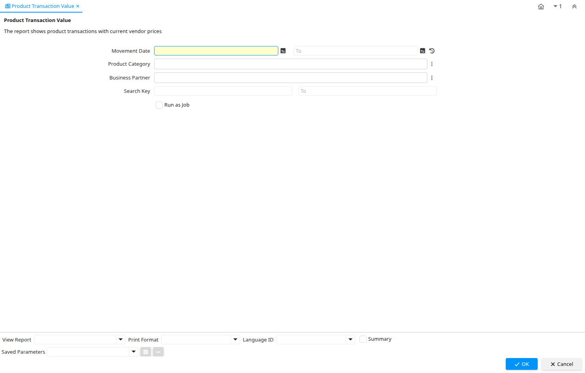

# Product Transaction Value

Report ID 161

*25/02/2001 → 02/01/2000*

**Description:** Product Transaction Value

**Comment/Help:** The report shows product transactions with current vendor prices

## Table: Report Parameters

| **Name** | **Description** | **Comment/Help** | **Technical Data** |
|---|---|---|---|
| Movement Date | Date a product was moved in or out of inventory | The Movement Date indicates the date that a product moved in or out of inventory.  This is the result of a shipment, receipt or inventory movement. | MovementDate Date |
| Product Category | Category of a Product | Identifies the category which this product belongs to.  Product categories are used for pricing and selection. | M_Product_Category_ID Chosen Multiple Selection Table |
| Business Partner  | Identifies a Business Partner | A Business Partner is anyone with whom you transact.  This can include Vendor, Customer, Employee or Salesperson | C_BPartner_ID Chosen Multiple Selection Table |
| Search Key | Search key for the record in the format required - must be unique | A search key allows you a fast method of finding a particular record. If you leave the search key empty, the system automatically creates a numeric number.  The document sequence used for this fallback number is defined in the "Maintain Sequence" window with the name "DocumentNo_&lt;TableName&gt;", where TableName is the actual name of the table (e.g. C_Order). | Value String |

