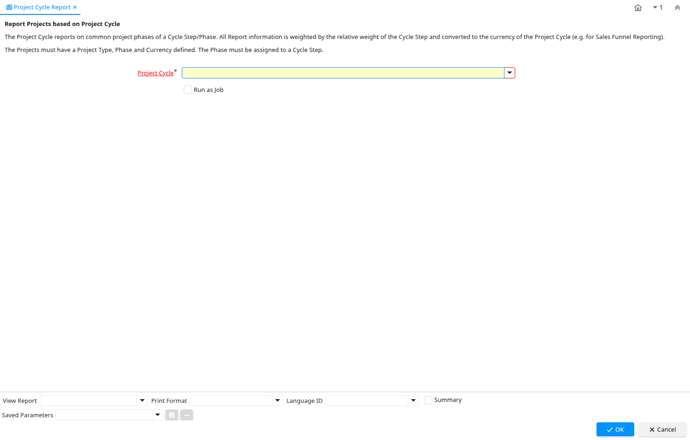

# Project Cycle Report

Report ID 218

*17/08/2003 → 02/01/2000*

**Description:** Report Projects based on Project Cycle

**Comment/Help:** The Project Cycle reports on common project phases of a Cycle Step/Phase. All Report information is weighted by the relative weight of the Cycle Step and converted to the currency of the Project Cycle (e.g. for Sales Funnel Reporting).&lt;p&gt;
The Projects must have a Project Type, Phase and Currency defined. The Phase must be assigned to a Cycle Step.

## Table: Report Parameters

| **Name** | **Description** | **Comment/Help** | **Technical Data** |
|---|---|---|---|
| Project Cycle | Identifier for this Project Reporting Cycle | Identifies a Project Cycle which can be made up of one or more cycle steps and cycle phases. | C_Cycle_ID Table Direct |

