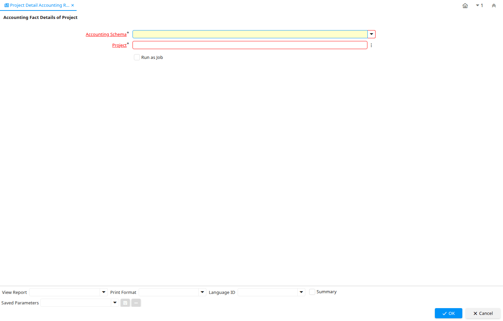

# Project Detail Accounting Report

Report ID 226

*02/09/2003 → 02/01/2000*

**Description:** Accounting Fact Details of Project

## Table: Report Parameters

| **Name** | **Description** | **Comment/Help** | **Technical Data** |
|---|---|---|---|
| Accounting Schema | Rules for accounting | An Accounting Schema defines the rules used in accounting such as costing method, currency and calendar | C_AcctSchema_ID Table Direct |
| Project | Financial Project | A Project allows you to track and control internal or external activities. | C_Project_ID Search |

