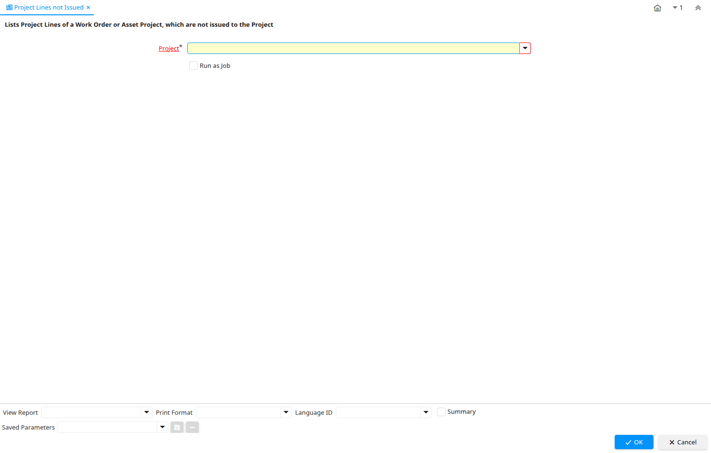

# Project Lines not Issued

Report ID 228

*04/09/2003 → 02/01/2000*

**Description:** Lists Project Lines of a Work Order or Asset Project, which are not issued to the Project

## Table: Report Parameters

| **Name** | **Description** | **Comment/Help** | **Technical Data** |
|---|---|---|---|
| Project | Financial Project | A Project allows you to track and control internal or external activities. | C_Project_ID Table Direct |

