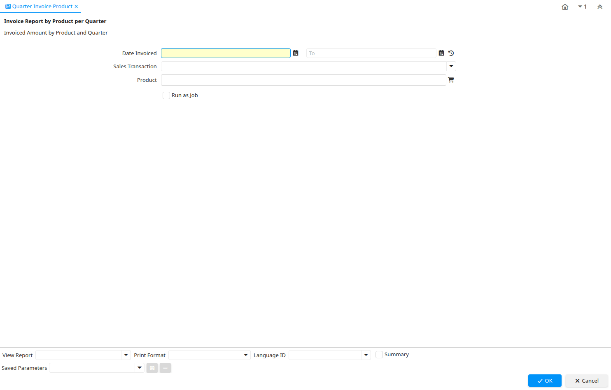

# Quarter Invoice Product

Report ID 341

*15/12/2005 → 02/12/2008*

**Description:** Invoice Report by Product per Quarter

**Comment/Help:** Invoiced Amount by Product and Quarter

## Table: Report Parameters

| **Name** | **Description** | **Comment/Help** | **Technical Data** |
|---|---|---|---|
| Date Invoiced | Date printed on Invoice | The Date Invoice indicates the date printed on the invoice. | DateInvoiced Date |
| Sales Transaction | This is a Sales Transaction | The Sales Transaction checkbox indicates if this item is a Sales Transaction. | IsSOTrx List |
| Product | Product, Service, Item | Identifies an item which is either purchased or sold in this organization. | M_Product_ID Chosen Multiple Selection Search |

