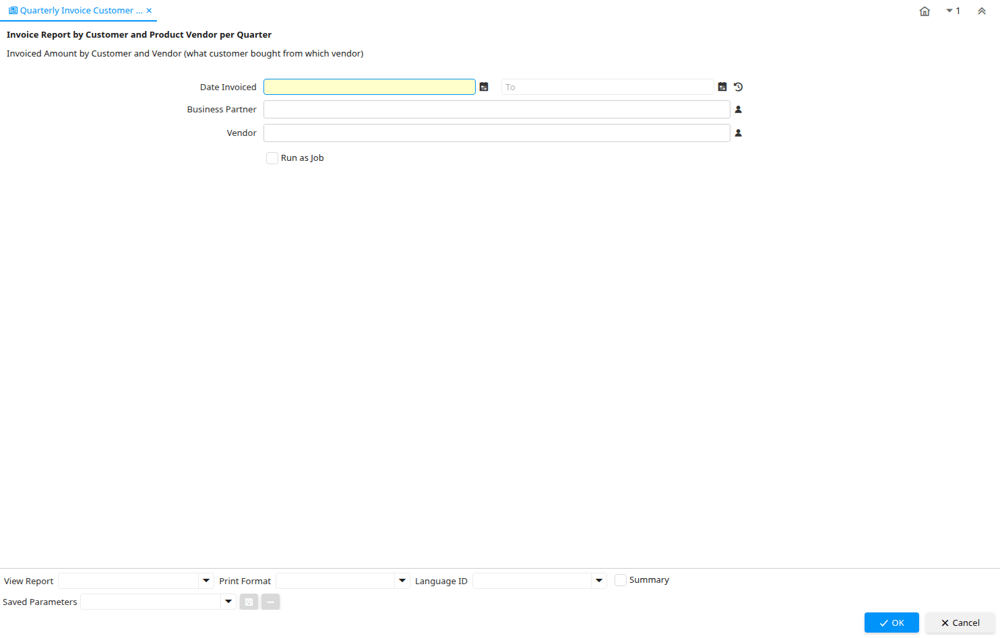

# Quarterly Invoice Customer by Vendor

Report ID 139

*04/12/2000 → 07/02/2005*

**Description:** Invoice Report by Customer and Product Vendor per Quarter

**Comment/Help:** Invoiced Amount by Customer and Vendor (what customer bought from which vendor)

## Table: Report Parameters

| **Name** | **Description** | **Comment/Help** | **Technical Data** |
|---|---|---|---|
| Date Invoiced | Date printed on Invoice | The Date Invoice indicates the date printed on the invoice. | DateInvoiced Date |
| Business Partner  | Identifies a Business Partner | A Business Partner is anyone with whom you transact.  This can include Vendor, Customer, Employee or Salesperson | C_BPartner_ID Chosen Multiple Selection Search |
| Vendor | The Vendor of the product/service |  | Vendor_ID Chosen Multiple Selection Search |

