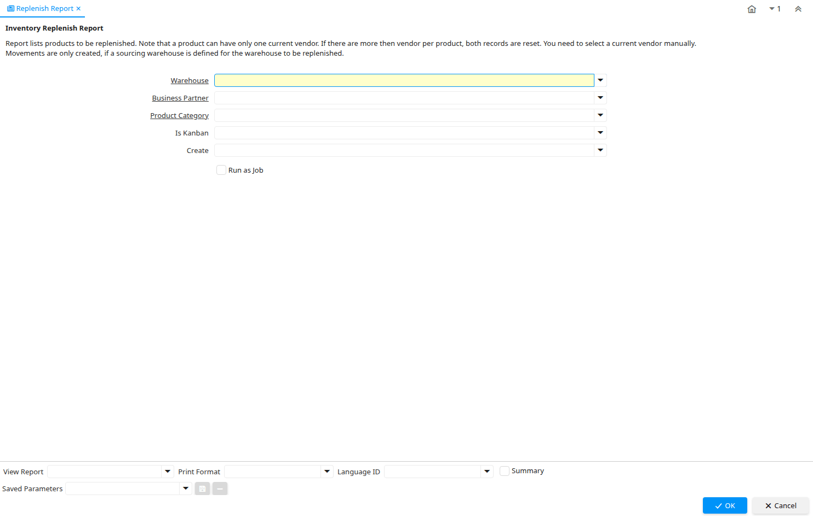

# Replenish Report

Report ID 53267

*27/07/2011 → 10/04/2023*

**Description:** Inventory Replenish Report

**Comment/Help:** Report lists products to be replenished. Note that a product can have only one current vendor. If there are more then vendor per product, both records are reset.  You need to select a current vendor manually.&lt;br&gt;
Movements are only created, if a sourcing warehouse is defined for the warehouse to be replenished.

**Classname:** `org.compiere.process.ReplenishReportProduction`

## Table: Report Parameters

| **Name** | **Description** | **Comment/Help** | **Technical Data** |
|---|---|---|---|
| Warehouse | Storage Warehouse and Service Point | The Warehouse identifies a unique Warehouse where products are stored or Services are provided. | M_Warehouse_ID Table Direct |
| Business Partner | Identifies a Business Partner | A Business Partner is anyone with whom you transact.  This can include Vendor, Customer, Employee or Salesperson | C_BPartner_ID Table |
| Product Category | Category of a Product | Identifies the category which this product belongs to.  Product categories are used for pricing and selection. | M_Product_Category_ID Table Direct |
| Is Kanban |  |  | IsKanban List |
| Create | Create from Replenishment |  | ReplenishmentCreate List |
| Document Type | Document type or rules | The Document Type determines document sequence and processing rules | C_DocType_ID Table Direct |

