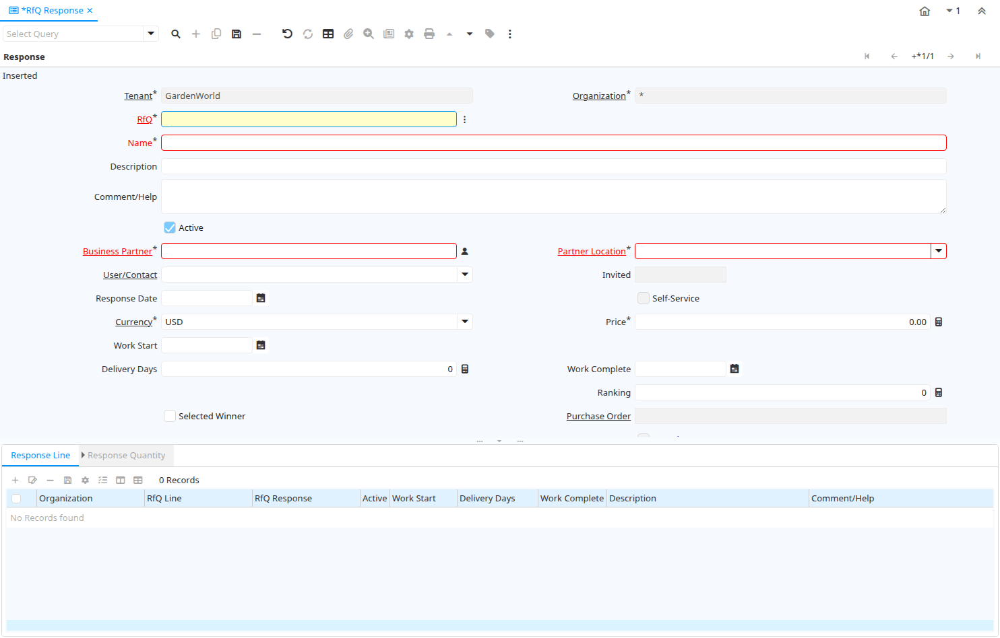

# RfQ Response

Report ID 264

*24/03/2004 → 02/01/2000*

**Description:** Detail RfQ Responses

**Comment/Help:** Lists detail Responses of active RfQs (not closed/processed) where the Response is marked as complete. 

## Table: Report Parameters

| **Name** | **Description** | **Comment/Help** | **Technical Data** |
|---|---|---|---|
| RfQ Topic | Topic for Request for Quotations | A Request for Quotation Topic allows you to maintain a subscriber list of potential Vendors to respond to RfQs | C_RfQ_Topic_ID Table Direct |
| RfQ | Request for Quotation | Request for Quotation to be sent out to vendors of a RfQ Topic. After Vendor selection, optionally create Sales Order or Quote for Customer as well as Purchase Order  for Vendor(s) | C_RfQ_ID Search |

