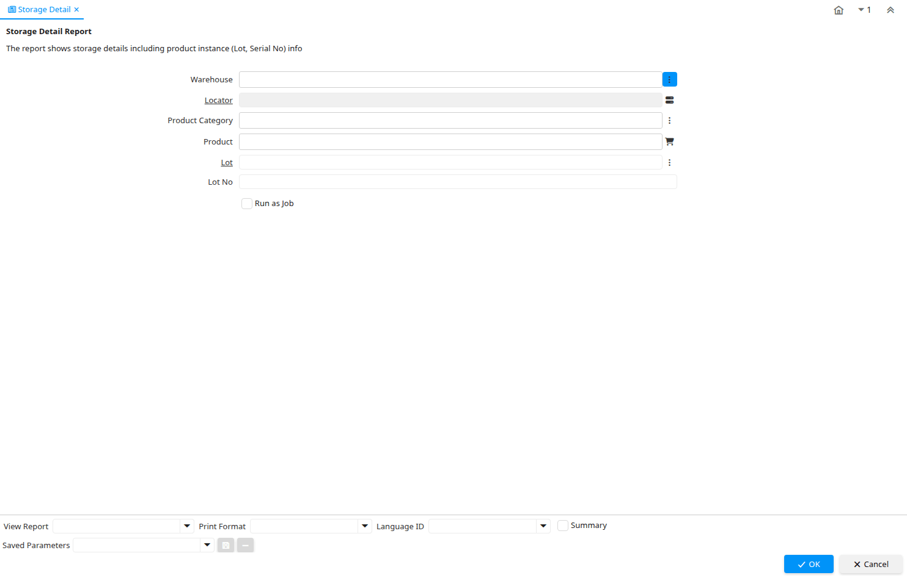

# Storage Detail

Report ID 236

*04/12/2003 → 02/01/2000*

**Description:** Storage Detail Report

**Comment/Help:** The report shows storage details including product instance (Lot, Serial No) info

## Table: Report Parameters

| **Name** | **Description** | **Comment/Help** | **Technical Data** |
|---|---|---|---|
| Warehouse | Storage Warehouse and Service Point | The Warehouse identifies a unique Warehouse where products are stored or Services are provided. | M_Warehouse_ID Chosen Multiple Selection Table |
| Locator | Warehouse Locator | The Locator indicates where in a Warehouse a product is located. | M_Locator_ID Locator (WH) |
| Product Category | Category of a Product | Identifies the category which this product belongs to.  Product categories are used for pricing and selection. | M_Product_Category_ID Chosen Multiple Selection Table |
| Product | Product, Service, Item | Identifies an item which is either purchased or sold in this organization. | M_Product_ID Chosen Multiple Selection Search |
| Lot | Product Lot Definition | The individual Lot of a Product | M_Lot_ID Search |
| Lot No | Lot number (alphanumeric) | The Lot Number indicates the specific lot that a product was part of. | Lot String |

