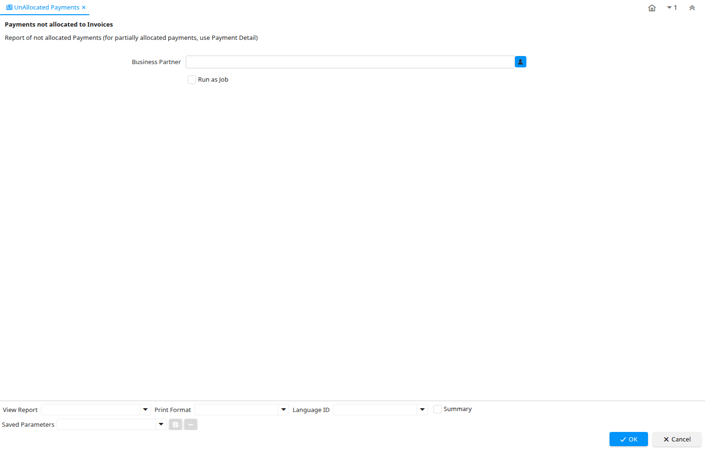

# UnAllocated Payments

Report ID 317

*27/01/2005 → 07/02/2005*

**Description:** Payments not allocated to Invoices

**Comment/Help:** Report of not allocated Payments (for partially allocated payments, use Payment Detail)

## Table: Report Parameters

| **Name** | **Description** | **Comment/Help** | **Technical Data** |
|---|---|---|---|
| Business Partner | Identifies a Business Partner | A Business Partner is anyone with whom you transact.  This can include Vendor, Customer, Employee or Salesperson | C_BPartner_ID Chosen Multiple Selection Search |

