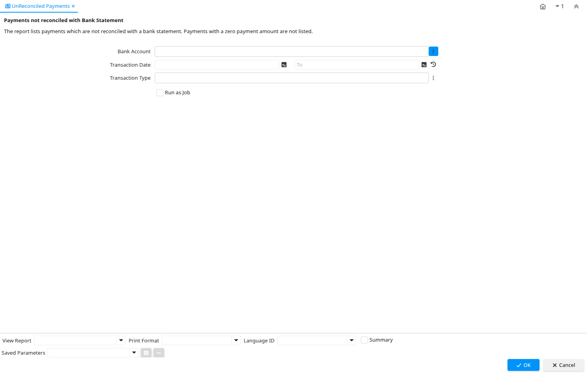

# UnReconciled Payments

Report ID 146

*03/01/2001 → 27/01/2005*

**Description:** Payments not reconciled with Bank Statement

**Comment/Help:** The report lists payments which are not reconciled with a bank statement. Payments with a zero payment amount are not listed.

## Table: Report Parameters

| **Name** | **Description** | **Comment/Help** | **Technical Data** |
|---|---|---|---|
| Bank Account | Account at the Bank | The Bank Account identifies an account at this Bank. | C_BankAccount_ID Chosen Multiple Selection Table |
| Transaction Date | Transaction Date | The Transaction Date indicates the date of the transaction. | DateTrx Date |
| Transaction Type | Type of credit card transaction | The Transaction Type indicates the type of transaction to be submitted to the Credit Card Company. | TrxType Chosen Multiple Selection List |

