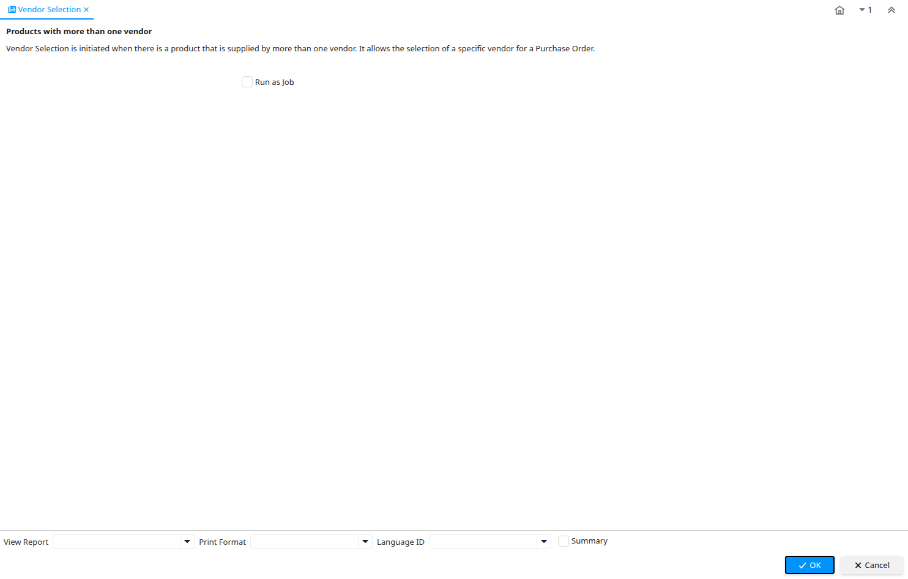

# Vendor Selection

Report ID 115

*22/03/2000 → 02/01/2000*

**Description:** Products with more than one vendor

**Comment/Help:** Vendor Selection is initiated when there is a product that is supplied by more than one vendor.  It allows the selection of a specific vendor for a Purchase Order.

