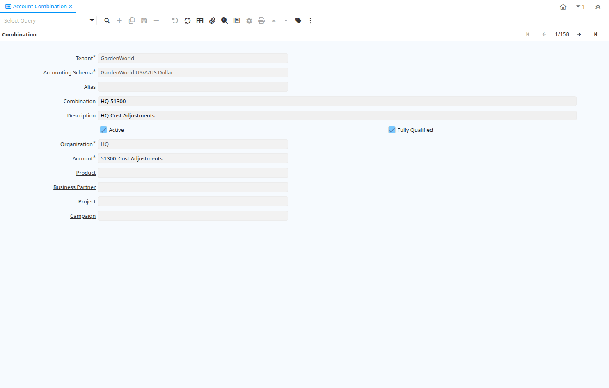

# Account Combination

Window ID 153

*26/09/1999 → 02/01/2000*

**Description:** Maintain Valid Account Combinations 

**Comment/Help:** The Account Combination Window defines and displays valid account combinations. 

## Tab: Combination

*Tab Level 0 · Created 26/09/1999 · Updated 02/01/2000*

**Description:** Valid Account Combinations

**Comment/Help:** The Account Combination Tab defines and displays valid account combination.  An Alias can be defined to facilitate document entry.

| **Name** | **Description** | **Comment/Help** | **Technical Data** |
|---|---|---|---|
| Tenant | Tenant for this installation. | A Tenant is a company or a legal entity. You cannot share data between Tenants. | C_ValidCombination.AD_Client_ID<small> numeric(10)   Table Direct</small> |
| Accounting Schema | Rules for accounting | An Accounting Schema defines the rules used in accounting such as costing method, currency and calendar | C_ValidCombination.C_AcctSchema_ID<small> numeric(10)   Table Direct</small> |
| Alias | Defines an alternate method of indicating an account combination. | The Alias field allows you to define a alternate method for referring to a full account combination.  For example, the Account Receivable Account for Garden World may be aliased as GW_AR. | C_ValidCombination.Alias<small> character varying(40)   String</small> |
| Combination | Unique combination of account elements | The Combination field defines the unique combination of element values which comprise this account. | C_ValidCombination.Combination<small> character varying(60)   String</small> |
| Description | Optional short description of the record | A description is limited to 255 characters. | C_ValidCombination.Description<small> character varying(255)   String</small> |
| Active | The record is active in the system | There are two methods of making records unavailable in the system: One is to delete the record, the other is to de-activate the record. A de-activated record is not available for selection, but available for reports. There are two reasons for de-activating and not deleting records: (1) The system requires the record for audit purposes. (2) The record is referenced by other records. E.g., you cannot delete a Business Partner, if there are invoices for this partner record existing. You de-activate the Business Partner and prevent that this record is used for future entries. | C_ValidCombination.IsActive<small> character(1)   Yes-No</small> |
| Fully Qualified | This account is fully qualified | The Fully Qualified check box indicates that all required elements for an account combination are present. | C_ValidCombination.IsFullyQualified<small> character(1)   Yes-No</small> |
| Organization | Organizational entity within tenant | An organization is a unit of your tenant or legal entity - examples are store, department. You can share data between organizations. | C_ValidCombination.AD_Org_ID<small> numeric(10)   Table Direct</small> |
| Trx Organization | Performing or initiating organization | The organization which performs or initiates this transaction (for another organization).  The owning Organization may not be the transaction organization in a service bureau environment, with centralized services, and inter-organization transactions. | C_ValidCombination.AD_OrgTrx_ID<small> numeric(10)   Table</small> |
| Account | Account used | The (natural) account used | C_ValidCombination.Account_ID<small> numeric(10)   Search</small> |
| Sub Account | Sub account for Element Value | The Element Value (e.g. Account) may have optional sub accounts for further detail. The sub account is dependent on the value of the account, so a further specification. If the sub-accounts are more or less the same, consider using another accounting dimension. | C_ValidCombination.C_SubAcct_ID<small> numeric(10)   Table Direct</small> |
| Activity | Business Activity | Activities indicate tasks that are performed and used to utilize Activity based Costing | C_ValidCombination.C_Activity_ID<small> numeric(10)   Table</small> |
| Product | Product, Service, Item | Identifies an item which is either purchased or sold in this organization. | C_ValidCombination.M_Product_ID<small> numeric(10)   Search</small> |
| Business Partner | Identifies a Business Partner | A Business Partner is anyone with whom you transact.  This can include Vendor, Customer, Employee or Salesperson | C_ValidCombination.C_BPartner_ID<small> numeric(10)   Search</small> |
| Project | Financial Project | A Project allows you to track and control internal or external activities. | C_ValidCombination.C_Project_ID<small> numeric(10)   Table</small> |
| Campaign | Marketing Campaign | The Campaign defines a unique marketing program.  Projects can be associated with a pre defined Marketing Campaign.  You can then report based on a specific Campaign. | C_ValidCombination.C_Campaign_ID<small> numeric(10)   Table</small> |
| Location From | Location that inventory was moved from | The Location From indicates the location that a product was moved from. | C_ValidCombination.C_LocFrom_ID<small> numeric(10)   Table</small> |
| Location To | Location that inventory was moved to | The Location To indicates the location that a product was moved to. | C_ValidCombination.C_LocTo_ID<small> numeric(10)   Table</small> |
| Sales Region | Sales coverage region | The Sales Region indicates a specific area of sales coverage. | C_ValidCombination.C_SalesRegion_ID<small> numeric(10)   Table</small> |
| User Element List 1 | User defined list element #1 | The user defined element displays the optional elements that have been defined for this account combination. | C_ValidCombination.User1_ID<small> numeric(10)   Search</small> |
| User Element List 2 | User defined list element #2 | The user defined element displays the optional elements that have been defined for this account combination. | C_ValidCombination.User2_ID<small> numeric(10)   Search</small> |
| User Column 1 | User defined accounting Element | A user defined accounting element refers to an iDempiere table. This allows to use any table content as an accounting dimension (e.g. Project Task).  Note that User Elements are optional and are populated from the context of the document (i.e. not requested) | C_ValidCombination.UserElement1_ID<small> numeric(10)   ID</small> |
| User Column 2 | User defined accounting Element | A user defined accounting element refers to an iDempiere table. This allows to use any table content as an accounting dimension (e.g. Project Task).  Note that User Elements are optional and are populated from the context of the document (i.e. not requested)  | C_ValidCombination.UserElement2_ID<small> numeric(10)   ID</small> |

