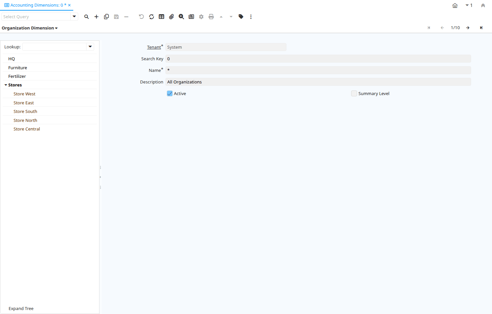

# Accounting Dimensions

Window ID 283

*16/06/2003 → 30/06/2021*

**Description:** Maintain Non-Account Dimension Trees

**Comment/Help:** Maintain Trees of non account segment trees.  Account segment trees (as well as user defined dimensions) are mainatained in the Account Element window. Please note that you will not be able to create new entities in this window if you have not default set for all manfatory values!

## Tab: Organization Dimension

*Tab Level 0 · Created 16/06/2003 · Updated 02/01/2000*

**Description:** Maintain Organizationt Accounting Dimension Tree

**Comment/Help:** Please note that you will not be able to create new entities in this window if you have not default set for all mandatory values!

| **Name** | **Description** | **Comment/Help** | **Technical Data** |
|---|---|---|---|
| Tenant | Tenant for this installation. | A Tenant is a company or a legal entity. You cannot share data between Tenants. | AD_Org.AD_Client_ID<small> numeric(10)   Table Direct</small> |
| Search Key | Search key for the record in the format required - must be unique | A search key allows you a fast method of finding a particular record. If you leave the search key empty, the system automatically creates a numeric number.  The document sequence used for this fallback number is defined in the "Maintain Sequence" window with the name "DocumentNo_&lt;TableName&gt;", where TableName is the actual name of the table (e.g. C_Order). | AD_Org.Value<small> character varying(40)   String</small> |
| Name | Alphanumeric identifier of the entity | The name of an entity (record) is used as an default search option in addition to the search key. The name is up to 60 characters in length. | AD_Org.Name<small> character varying(60)   String</small> |
| Description | Optional short description of the record | A description is limited to 255 characters. | AD_Org.Description<small> character varying(255)   String</small> |
| Active | The record is active in the system | There are two methods of making records unavailable in the system: One is to delete the record, the other is to de-activate the record. A de-activated record is not available for selection, but available for reports. There are two reasons for de-activating and not deleting records: (1) The system requires the record for audit purposes. (2) The record is referenced by other records. E.g., you cannot delete a Business Partner, if there are invoices for this partner record existing. You de-activate the Business Partner and prevent that this record is used for future entries. | AD_Org.IsActive<small> character(1)   Yes-No</small> |
| Summary Level | This is a summary entity | A summary entity represents a branch in a tree rather than an end-node. Summary entities are used for reporting and do not have own values. | AD_Org.IsSummary<small> character(1)   Yes-No</small> |

## Tab: Sales Region Dimension

*Tab Level 0 · Created 16/06/2003 · Updated 02/01/2000*

**Description:** Maintain Sales Region Accounting Dimension Tree

**Comment/Help:** Please note that you will not be able to create new entities in this window if you have not default set for all mandatory values!

| **Name** | **Description** | **Comment/Help** | **Technical Data** |
|---|---|---|---|
| Tenant | Tenant for this installation. | A Tenant is a company or a legal entity. You cannot share data between Tenants. | C_SalesRegion.AD_Client_ID<small> numeric(10)   Table Direct</small> |
| Organization | Organizational entity within tenant | An organization is a unit of your tenant or legal entity - examples are store, department. You can share data between organizations. | C_SalesRegion.AD_Org_ID<small> numeric(10)   Table Direct</small> |
| Search Key | Search key for the record in the format required - must be unique | A search key allows you a fast method of finding a particular record. If you leave the search key empty, the system automatically creates a numeric number.  The document sequence used for this fallback number is defined in the "Maintain Sequence" window with the name "DocumentNo_&lt;TableName&gt;", where TableName is the actual name of the table (e.g. C_Order). | C_SalesRegion.Value<small> character varying(40)   String</small> |
| Name | Alphanumeric identifier of the entity | The name of an entity (record) is used as an default search option in addition to the search key. The name is up to 60 characters in length. | C_SalesRegion.Name<small> character varying(60)   String</small> |
| Description | Optional short description of the record | A description is limited to 255 characters. | C_SalesRegion.Description<small> character varying(255)   String</small> |
| Active | The record is active in the system | There are two methods of making records unavailable in the system: One is to delete the record, the other is to de-activate the record. A de-activated record is not available for selection, but available for reports. There are two reasons for de-activating and not deleting records: (1) The system requires the record for audit purposes. (2) The record is referenced by other records. E.g., you cannot delete a Business Partner, if there are invoices for this partner record existing. You de-activate the Business Partner and prevent that this record is used for future entries. | C_SalesRegion.IsActive<small> character(1)   Yes-No</small> |
| Summary Level | This is a summary entity | A summary entity represents a branch in a tree rather than an end-node. Summary entities are used for reporting and do not have own values. | C_SalesRegion.IsSummary<small> character(1)   Yes-No</small> |

## Tab: Activity Dimension

*Tab Level 0 · Created 16/06/2003 · Updated 05/06/2013*

**Description:** Maintain Activity Accounting Dimension Tree

**Comment/Help:** Please note that you will not be able to create new entities in this window if you have not default set for all mandatory values!

| **Name** | **Description** | **Comment/Help** | **Technical Data** |
|---|---|---|---|
| Tenant | Tenant for this installation. | A Tenant is a company or a legal entity. You cannot share data between Tenants. | C_Activity.AD_Client_ID<small> numeric(10)   Table Direct</small> |
| Organization | Organizational entity within tenant | An organization is a unit of your tenant or legal entity - examples are store, department. You can share data between organizations. | C_Activity.AD_Org_ID<small> numeric(10)   Table Direct</small> |
| Search Key | Search key for the record in the format required - must be unique | A search key allows you a fast method of finding a particular record. If you leave the search key empty, the system automatically creates a numeric number.  The document sequence used for this fallback number is defined in the "Maintain Sequence" window with the name "DocumentNo_&lt;TableName&gt;", where TableName is the actual name of the table (e.g. C_Order). | C_Activity.Value<small> character varying(40)   String</small> |
| Name | Alphanumeric identifier of the entity | The name of an entity (record) is used as an default search option in addition to the search key. The name is up to 60 characters in length. | C_Activity.Name<small> character varying(60)   String</small> |
| Description | Optional short description of the record | A description is limited to 255 characters. | C_Activity.Description<small> character varying(255)   String</small> |
| Active | The record is active in the system | There are two methods of making records unavailable in the system: One is to delete the record, the other is to de-activate the record. A de-activated record is not available for selection, but available for reports. There are two reasons for de-activating and not deleting records: (1) The system requires the record for audit purposes. (2) The record is referenced by other records. E.g., you cannot delete a Business Partner, if there are invoices for this partner record existing. You de-activate the Business Partner and prevent that this record is used for future entries. | C_Activity.IsActive<small> character(1)   Yes-No</small> |
| Summary Level | This is a summary entity | A summary entity represents a branch in a tree rather than an end-node. Summary entities are used for reporting and do not have own values. | C_Activity.IsSummary<small> character(1)   Yes-No</small> |

## Tab: Project Dimension

*Tab Level 0 · Created 16/06/2003 · Updated 02/01/2000*

**Description:** Maintain Project Accounting Dimension Tree

**Comment/Help:** Please note that you will not be able to create new entities in this window if you have not default set for all mandatory values!

| **Name** | **Description** | **Comment/Help** | **Technical Data** |
|---|---|---|---|
| Tenant | Tenant for this installation. | A Tenant is a company or a legal entity. You cannot share data between Tenants. | C_Project.AD_Client_ID<small> numeric(10)   Table Direct</small> |
| Organization | Organizational entity within tenant | An organization is a unit of your tenant or legal entity - examples are store, department. You can share data between organizations. | C_Project.AD_Org_ID<small> numeric(10)   Table Direct</small> |
| Search Key | Search key for the record in the format required - must be unique | A search key allows you a fast method of finding a particular record. If you leave the search key empty, the system automatically creates a numeric number.  The document sequence used for this fallback number is defined in the "Maintain Sequence" window with the name "DocumentNo_&lt;TableName&gt;", where TableName is the actual name of the table (e.g. C_Order). | C_Project.Value<small> character varying(40)   String</small> |
| Name | Alphanumeric identifier of the entity | The name of an entity (record) is used as an default search option in addition to the search key. The name is up to 60 characters in length. | C_Project.Name<small> character varying(60)   String</small> |
| Description | Optional short description of the record | A description is limited to 255 characters. | C_Project.Description<small> character varying(255)   Text</small> |
| Active | The record is active in the system | There are two methods of making records unavailable in the system: One is to delete the record, the other is to de-activate the record. A de-activated record is not available for selection, but available for reports. There are two reasons for de-activating and not deleting records: (1) The system requires the record for audit purposes. (2) The record is referenced by other records. E.g., you cannot delete a Business Partner, if there are invoices for this partner record existing. You de-activate the Business Partner and prevent that this record is used for future entries. | C_Project.IsActive<small> character(1)   Yes-No</small> |
| Summary Level | This is a summary entity | A summary entity represents a branch in a tree rather than an end-node. Summary entities are used for reporting and do not have own values. | C_Project.IsSummary<small> character(1)   Yes-No</small> |
| Set Project Type | Set Project Type and for Service Projects copy Phases and Tasks of Project Type into Project |   | C_Project.C_ProjectType_ID<small> numeric(10)   Button</small> |

## Tab: Business Partner Dimension

*Tab Level 0 · Created 16/06/2003 · Updated 02/01/2000*

**Description:** Maintain Business Partner Accounting Dimension Tree

**Comment/Help:** Please note that you will not be able to create new entities in this window if you have not default set for all mandatory values!

| **Name** | **Description** | **Comment/Help** | **Technical Data** |
|---|---|---|---|
| Tenant | Tenant for this installation. | A Tenant is a company or a legal entity. You cannot share data between Tenants. | C_BPartner.AD_Client_ID<small> numeric(10)   Table Direct</small> |
| Organization | Organizational entity within tenant | An organization is a unit of your tenant or legal entity - examples are store, department. You can share data between organizations. | C_BPartner.AD_Org_ID<small> numeric(10)   Table Direct</small> |
| Search Key | Search key for the record in the format required - must be unique | A search key allows you a fast method of finding a particular record. If you leave the search key empty, the system automatically creates a numeric number.  The document sequence used for this fallback number is defined in the "Maintain Sequence" window with the name "DocumentNo_&lt;TableName&gt;", where TableName is the actual name of the table (e.g. C_Order). | C_BPartner.Value<small> character varying(40)   String</small> |
| Name | Alphanumeric identifier of the entity | The name of an entity (record) is used as an default search option in addition to the search key. The name is up to 60 characters in length. | C_BPartner.Name<small> character varying(120)   String</small> |
| Description | Optional short description of the record | A description is limited to 255 characters. | C_BPartner.Description<small> character varying(255)   String</small> |
| Active | The record is active in the system | There are two methods of making records unavailable in the system: One is to delete the record, the other is to de-activate the record. A de-activated record is not available for selection, but available for reports. There are two reasons for de-activating and not deleting records: (1) The system requires the record for audit purposes. (2) The record is referenced by other records. E.g., you cannot delete a Business Partner, if there are invoices for this partner record existing. You de-activate the Business Partner and prevent that this record is used for future entries. | C_BPartner.IsActive<small> character(1)   Yes-No</small> |
| Summary Level | This is a summary entity | A summary entity represents a branch in a tree rather than an end-node. Summary entities are used for reporting and do not have own values. | C_BPartner.IsSummary<small> character(1)   Yes-No</small> |
| Business Partner Group | Business Partner Group | The Business Partner Group provides a method of defining defaults to be used for individual Business Partners. | C_BPartner.C_BP_Group_ID<small> numeric(10)   Table Direct</small> |
| Open Balance | Total Open Balance Amount in primary Accounting Currency | The Total Open Balance Amount is the calculated open item amount for Customer and Vendor activity.  If the Balance is below zero, we owe the Business Partner.  The amount is used for Credit Management. Invoices and Payment Allocations determine the Open Balance (i.e. not Orders or Payments). | C_BPartner.TotalOpenBalance<small> numeric   Amount</small> |

## Tab: Product Dimension

*Tab Level 0 · Created 16/06/2003 · Updated 02/01/2000*

**Description:** Maintain Product Accounting Dimension Tree

**Comment/Help:** Please note that you will not be able to create new entities in this window if you have not default set for all mandatory values!

| **Name** | **Description** | **Comment/Help** | **Technical Data** |
|---|---|---|---|
| Tenant | Tenant for this installation. | A Tenant is a company or a legal entity. You cannot share data between Tenants. | M_Product.AD_Client_ID<small> numeric(10)   Table Direct</small> |
| Organization | Organizational entity within tenant | An organization is a unit of your tenant or legal entity - examples are store, department. You can share data between organizations. | M_Product.AD_Org_ID<small> numeric(10)   Table Direct</small> |
| Search Key | Search key for the record in the format required - must be unique | A search key allows you a fast method of finding a particular record. If you leave the search key empty, the system automatically creates a numeric number.  The document sequence used for this fallback number is defined in the "Maintain Sequence" window with the name "DocumentNo_&lt;TableName&gt;", where TableName is the actual name of the table (e.g. C_Order). | M_Product.Value<small> character varying(510)   String</small> |
| Name | Alphanumeric identifier of the entity | The name of an entity (record) is used as an default search option in addition to the search key. The name is up to 60 characters in length. | M_Product.Name<small> character varying(255)   String</small> |
| Description | Optional short description of the record | A description is limited to 255 characters. | M_Product.Description<small> character varying(255)   String</small> |
| Active | The record is active in the system | There are two methods of making records unavailable in the system: One is to delete the record, the other is to de-activate the record. A de-activated record is not available for selection, but available for reports. There are two reasons for de-activating and not deleting records: (1) The system requires the record for audit purposes. (2) The record is referenced by other records. E.g., you cannot delete a Business Partner, if there are invoices for this partner record existing. You de-activate the Business Partner and prevent that this record is used for future entries. | M_Product.IsActive<small> character(1)   Yes-No</small> |
| Summary Level | This is a summary entity | A summary entity represents a branch in a tree rather than an end-node. Summary entities are used for reporting and do not have own values. | M_Product.IsSummary<small> character(1)   Yes-No</small> |
| Product Category | Category of a Product | Identifies the category which this product belongs to.  Product categories are used for pricing and selection. | M_Product.M_Product_Category_ID<small> numeric(10)   Table Direct</small> |

## Tab: Campaign Dimension

*Tab Level 0 · Created 19/06/2003 · Updated 02/01/2000*

**Description:** Maintain Marketing Campaign Accounting Dimension Tree

**Comment/Help:** Please note that you will not be able to create new entities in this window if you have not default set for all mandatory values!

| **Name** | **Description** | **Comment/Help** | **Technical Data** |
|---|---|---|---|
| Tenant | Tenant for this installation. | A Tenant is a company or a legal entity. You cannot share data between Tenants. | C_Campaign.AD_Client_ID<small> numeric(10)   Table Direct</small> |
| Organization | Organizational entity within tenant | An organization is a unit of your tenant or legal entity - examples are store, department. You can share data between organizations. | C_Campaign.AD_Org_ID<small> numeric(10)   Table Direct</small> |
| Search Key | Search key for the record in the format required - must be unique | A search key allows you a fast method of finding a particular record. If you leave the search key empty, the system automatically creates a numeric number.  The document sequence used for this fallback number is defined in the "Maintain Sequence" window with the name "DocumentNo_&lt;TableName&gt;", where TableName is the actual name of the table (e.g. C_Order). | C_Campaign.Value<small> character varying(40)   String</small> |
| Name | Alphanumeric identifier of the entity | The name of an entity (record) is used as an default search option in addition to the search key. The name is up to 60 characters in length. | C_Campaign.Name<small> character varying(60)   String</small> |
| Description | Optional short description of the record | A description is limited to 255 characters. | C_Campaign.Description<small> character varying(255)   String</small> |
| Active | The record is active in the system | There are two methods of making records unavailable in the system: One is to delete the record, the other is to de-activate the record. A de-activated record is not available for selection, but available for reports. There are two reasons for de-activating and not deleting records: (1) The system requires the record for audit purposes. (2) The record is referenced by other records. E.g., you cannot delete a Business Partner, if there are invoices for this partner record existing. You de-activate the Business Partner and prevent that this record is used for future entries. | C_Campaign.IsActive<small> character(1)   Yes-No</small> |
| Summary Level | This is a summary entity | A summary entity represents a branch in a tree rather than an end-node. Summary entities are used for reporting and do not have own values. | C_Campaign.IsSummary<small> character(1)   Yes-No</small> |
| Channel | Sales Channel | The Sales Channel identifies a channel (or method) of sales generation. | C_Campaign.C_Channel_ID<small> numeric(10)   Table Direct</small> |

