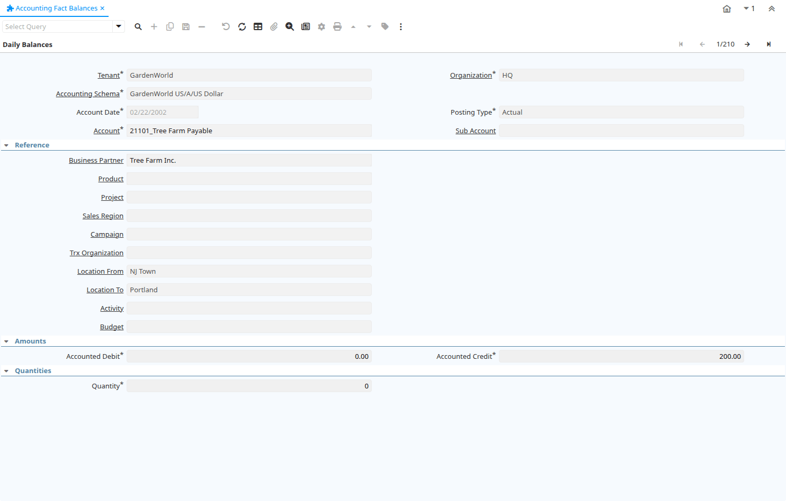

# Accounting Fact Balances

Window ID 255

*18/04/2003 → 09/02/2005*

**Description:** Query Accounting Daily Balances

**Comment/Help:** Query daily account balances

## Tab: Daily Balances

*Tab Level 0 · Created 18/04/2003 · Updated 02/01/2000*

**Description:** View daily accounting balances

| **Name** | **Description** | **Comment/Help** | **Technical Data** |
|---|---|---|---|
| Tenant | Tenant for this installation. | A Tenant is a company or a legal entity. You cannot share data between Tenants. | Fact_Acct_Balance.AD_Client_ID<small> numeric(10)   Table Direct</small> |
| Organization | Organizational entity within tenant | An organization is a unit of your tenant or legal entity - examples are store, department. You can share data between organizations. | Fact_Acct_Balance.AD_Org_ID<small> numeric(10)   Table Direct</small> |
| Accounting Schema | Rules for accounting | An Accounting Schema defines the rules used in accounting such as costing method, currency and calendar | Fact_Acct_Balance.C_AcctSchema_ID<small> numeric(10)   Table Direct</small> |
| Account Date | Accounting Date | The Accounting Date indicates the date to be used on the General Ledger account entries generated from this document. It is also used for any currency conversion. | Fact_Acct_Balance.DateAcct<small> timestamp without time zone   Date</small> |
| Posting Type | The type of posted amount for the transaction | The Posting Type indicates the type of amount (Actual, Budget, Reservation, Commitment, Statistical) the transaction. | Fact_Acct_Balance.PostingType<small> character(1)   List</small> |
| Account | Account used | The (natural) account used | Fact_Acct_Balance.Account_ID<small> numeric(10)   Search</small> |
| Sub Account | Sub account for Element Value | The Element Value (e.g. Account) may have optional sub accounts for further detail. The sub account is dependent on the value of the account, so a further specification. If the sub-accounts are more or less the same, consider using another accounting dimension. | Fact_Acct_Balance.C_SubAcct_ID<small> numeric   Table Direct</small> |
| Business Partner | Identifies a Business Partner | A Business Partner is anyone with whom you transact.  This can include Vendor, Customer, Employee or Salesperson | Fact_Acct_Balance.C_BPartner_ID<small> numeric(10)   Search</small> |
| Product | Product, Service, Item | Identifies an item which is either purchased or sold in this organization. | Fact_Acct_Balance.M_Product_ID<small> numeric(10)   Search</small> |
| Project | Financial Project | A Project allows you to track and control internal or external activities. | Fact_Acct_Balance.C_Project_ID<small> numeric(10)   Table Direct</small> |
| Sales Region | Sales coverage region | The Sales Region indicates a specific area of sales coverage. | Fact_Acct_Balance.C_SalesRegion_ID<small> numeric(10)   Table Direct</small> |
| Campaign | Marketing Campaign | The Campaign defines a unique marketing program.  Projects can be associated with a pre defined Marketing Campaign.  You can then report based on a specific Campaign. | Fact_Acct_Balance.C_Campaign_ID<small> numeric(10)   Table Direct</small> |
| Trx Organization | Performing or initiating organization | The organization which performs or initiates this transaction (for another organization).  The owning Organization may not be the transaction organization in a service bureau environment, with centralized services, and inter-organization transactions. | Fact_Acct_Balance.AD_OrgTrx_ID<small> numeric(10)   Table</small> |
| Location From | Location that inventory was moved from | The Location From indicates the location that a product was moved from. | Fact_Acct_Balance.C_LocFrom_ID<small> numeric(10)   Table</small> |
| Location To | Location that inventory was moved to | The Location To indicates the location that a product was moved to. | Fact_Acct_Balance.C_LocTo_ID<small> numeric(10)   Table</small> |
| Activity | Business Activity | Activities indicate tasks that are performed and used to utilize Activity based Costing | Fact_Acct_Balance.C_Activity_ID<small> numeric(10)   Table Direct</small> |
| User Element List 1 | User defined list element #1 | The user defined element displays the optional elements that have been defined for this account combination. | Fact_Acct_Balance.User1_ID<small> numeric(10)   Search</small> |
| User Element List 2 | User defined list element #2 | The user defined element displays the optional elements that have been defined for this account combination. | Fact_Acct_Balance.User2_ID<small> numeric(10)   Search</small> |
| User Column 1 | User defined accounting Element | A user defined accounting element refers to an iDempiere table. This allows to use any table content as an accounting dimension (e.g. Project Task).  Note that User Elements are optional and are populated from the context of the document (i.e. not requested) | Fact_Acct_Balance.UserElement1_ID<small> numeric(10)   ID</small> |
| User Column 2 | User defined accounting Element | A user defined accounting element refers to an iDempiere table. This allows to use any table content as an accounting dimension (e.g. Project Task).  Note that User Elements are optional and are populated from the context of the document (i.e. not requested)  | Fact_Acct_Balance.UserElement2_ID<small> numeric(10)   ID</small> |
| Budget | General Ledger Budget | The General Ledger Budget identifies a user defined budget.  These can be used in reporting as a comparison against your actual amounts. | Fact_Acct_Balance.GL_Budget_ID<small> numeric(10)   Table Direct</small> |
| Accounted Debit | Accounted Debit Amount | The Account Debit Amount indicates the transaction amount converted to this organization's accounting currency | Fact_Acct_Balance.AmtAcctDr<small> numeric   Amount</small> |
| Accounted Credit | Accounted Credit Amount | The Account Credit Amount indicates the transaction amount converted to this organization's accounting currency | Fact_Acct_Balance.AmtAcctCr<small> numeric   Amount</small> |
| Quantity | Quantity | The Quantity indicates the number of a specific product or item for this document. | Fact_Acct_Balance.Qty<small> numeric   Quantity</small> |

