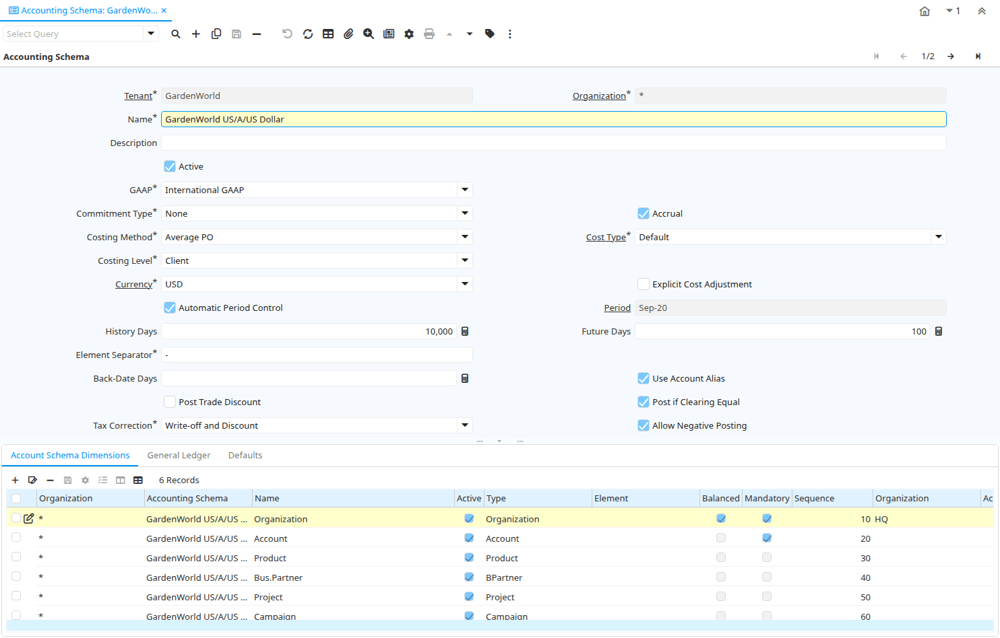

# Accounting Schema

Window ID 125

*11/06/1999 → 02/01/2000*

**Description:** Maintain Accounting Schema - For changes to become effective you must re-login

**Comment/Help:** The Accounting Schema Window defines an accounting method and the elements that will comprise an account structure. Create and activate elements for detailed accounting for Business Partners, Products, Locations, etc.
Review and change the GL and Default accounts. The actual accounts used in transactions depend on the executing organization; Most of the information is derived from the context.

## Tab: Accounting Schema

*Tab Level 0 · Created 23/09/1999 · Updated 10/03/2022*

**Description:** Define your Account Schema Structure

**Comment/Help:** The Accounting Schema Tab defines the controls used for accounting.  You can define multiple accounting schema per tenant (for parallel accounting).  
Postings are generated for an accounting schema, if the schema is valid and you have defined GL and Default accounts and after completion of the Add / Copy Accounts process.

| **Name** | **Description** | **Comment/Help** | **Technical Data** |
|---|---|---|---|
| Tenant | Tenant for this installation. | A Tenant is a company or a legal entity. You cannot share data between Tenants. | C_AcctSchema.AD_Client_ID<small> numeric(10)   Table Direct</small> |
| Organization | Organizational entity within tenant | An organization is a unit of your tenant or legal entity - examples are store, department. You can share data between organizations. | C_AcctSchema.AD_Org_ID<small> numeric(10)   Table Direct</small> |
| Name | Alphanumeric identifier of the entity | The name of an entity (record) is used as an default search option in addition to the search key. The name is up to 60 characters in length. | C_AcctSchema.Name<small> character varying(60)   String</small> |
| Description | Optional short description of the record | A description is limited to 255 characters. | C_AcctSchema.Description<small> character varying(255)   String</small> |
| Active | The record is active in the system | There are two methods of making records unavailable in the system: One is to delete the record, the other is to de-activate the record. A de-activated record is not available for selection, but available for reports. There are two reasons for de-activating and not deleting records: (1) The system requires the record for audit purposes. (2) The record is referenced by other records. E.g., you cannot delete a Business Partner, if there are invoices for this partner record existing. You de-activate the Business Partner and prevent that this record is used for future entries. | C_AcctSchema.IsActive<small> character(1)   Yes-No</small> |
| GAAP | Generally Accepted Accounting Principles | The GAAP identifies the account principles that this accounting schema will adhere to. | C_AcctSchema.GAAP<small> character(2)   List</small> |
| Commitment Type | Create Commitment and/or Reservations for Budget Control | The Posting Type Commitments is created when posting Purchase Orders; The Posting Type Reservation is created when posting Requisitions.  This is used for budgetary control. | C_AcctSchema.CommitmentType<small> character(1)   List</small> |
| Accrual | Indicates if Accrual or Cash Based accounting will be used | The Accrual checkbox indicates if this accounting schema will use accrual based account or cash based accounting.  The Accrual method recognizes revenue when the product or service is delivered.  Cash based method recognizes income when then payment is received. | C_AcctSchema.IsAccrual<small> character(1)   Yes-No</small> |
| Costing Method | Indicates how Costs will be calculated | The Costing Method indicates how costs will be calculated (Standard, Average, Lifo, FiFo).  The default costing method is defined on accounting schema level and can be optionally overwritten in the product category.  The costing method cannot conflict with the Material Movement Policy (defined on Product Category). | C_AcctSchema.CostingMethod<small> character(1)   List</small> |
| Cost Type | Type of Cost (e.g. Current, Plan, Future) | You can define multiple cost types. A cost type selected in an Accounting Schema is used for accounting. | C_AcctSchema.M_CostType_ID<small> numeric(10)   Table Direct</small> |
| Costing Level | The lowest level to accumulate Costing Information | If you want to maintain different costs per organization (warehouse) or per Batch/Lot, you need to make sure that you define the costs for each of the organizations or batch/lot. The Costing Level is defined per Accounting Schema and can be overwritten by Product Category and Accounting Schema. | C_AcctSchema.CostingLevel<small> character(1)   List</small> |
| Currency | The Currency for this record | Indicates the Currency to be used when processing or reporting on this record | C_AcctSchema.C_Currency_ID<small> numeric(10)   Table Direct</small> |
| Explicit Cost Adjustment | Post the cost adjustment explicitly | If selected, landed costs are posted to the account in the line and then this posting is reversed by the postings to the cost adjustment accounts.  If not selected, it is directly posted to the cost adjustment accounts. | C_AcctSchema.IsExplicitCostAdjustment<small> character(1)   Yes-No</small> |
| Automatic Period Control | If selected, the periods are automatically opened and closed | In the Automatic Period Control, periods are opened and closed based on the current date.  If the Manual alternative is activated, you have to open and close periods explicitly. | C_AcctSchema.AutoPeriodControl<small> character(1)   Yes-No</small> |
| Period | Period of the Calendar | The Period indicates an exclusive range of dates for a calendar. | C_AcctSchema.C_Period_ID<small> numeric(10)   Table Direct</small> |
| History Days | Number of days to be able to post in the past (based on system date) | If Automatic Period Control is enabled, the current period is calculated based on the system date and you can always post to all days in the current period.  History Days enable to post to previous periods.  E.g. today is May 15th and History Days is set to 30, you can post back to April 15th | C_AcctSchema.Period_OpenHistory<small> numeric(10)   Integer</small> |
| Future Days | Number of days to be able to post to a future date (based on system date) | If Automatic Period Control is enabled, the current period is calculated based on the system date and you can always post to all days in the current period.  Future Days enable to post to future periods. E.g. today is Apr 15th and Future Days is set to 30, you can post up to May 15th | C_AcctSchema.Period_OpenFuture<small> numeric(10)   Integer</small> |
| Element Separator | Element Separator | The Element Separator defines the delimiter printed between elements of the structure | C_AcctSchema.Separator<small> character(1)   String</small> |
| Back-Date Days | Number of days to be able to post a back-date transaction (based on system date) |  | C_AcctSchema.BackDateDay<small> numeric(10)   Integer</small> |
| Use Account Alias | Ability to select (partial) account combinations by an Alias | The Alias checkbox indicates that account combination can be selected using a user defined alias or short key. | C_AcctSchema.HasAlias<small> character(1)   Yes-No</small> |
| Post Trade Discount | Generate postings for trade discounts | If the invoice is based on an item with a list price, the amount based on the list price and the discount is posted instead of the net amount. Example: Quantity 10 - List Price: 20 - Actual Price: 17 If selected for a sales invoice 200 is posted to Product Revenue and 30 to Discount Granted - rather than 170 to Product Revenue. The same applies to vendor invoices. | C_AcctSchema.IsTradeDiscountPosted<small> character(1)   Yes-No</small> |
| Post if Clearing Equal | This flag controls if Adempiere must post when clearing (transit) and final accounts are the same |  | C_AcctSchema.IsPostIfClearingEqual<small> character(1)   Yes-No</small> |
| Tax Correction | Type of Tax Correction | Determines if/when tax is corrected. Discount could be agreed or granted underpayments; Write-off may be partial or complete write-off. | C_AcctSchema.TaxCorrectionType<small> character(1)   List</small> |
| Allow Negative Posting | Allow to post negative accounting values |  | C_AcctSchema.IsAllowNegativePosting<small> character(1)   Yes-No</small> |
| Only Organization | Create posting entries only for this organization | When you have multiple accounting schema, you may want to restrict the generation of postings entries for the additional accounting schema (i.e. not for the primary).  Example: You have a US and a FR organization. The primary accounting schema is in USD, the second in EUR.  If for the EUR accounting schema, you select the FR organizations, you would not create accounting entries for the transactions of the US organization in EUR. | C_AcctSchema.AD_OrgOnly_ID<small> numeric(10)   Table</small> |
| Create GL/Default | Copy matching account element values from existing Accounting Schema | Create the GL and Default accounts for this accounting schema and copy matching account element values. | C_AcctSchema.Processing<small> character(1)   Button</small> |
| Start Date | First effective day (inclusive) | The Start Date indicates the first or starting date | C_AcctSchema.StartDate<small> timestamp without time zone   Date</small> |
| End Date | Last effective date (inclusive) | The End Date indicates the last date in this range. | C_AcctSchema.EndDate<small> timestamp without time zone   Date</small> |

## Tab: › Account Schema Dimensions

*Tab Level 1 · Created 05/10/1999 · Updated 24/02/2018*

**Description:** Define the dimensions of your Account Key

**Comment/Help:** The Account Schema Dimensions Tab defines the dimensions that comprise the account key. A name is defined which will display in documents.  Also the order of the dimensions and if they are balanced and mandatory are indicated.

| **Name** | **Description** | **Comment/Help** | **Technical Data** |
|---|---|---|---|
| Tenant | Tenant for this installation. | A Tenant is a company or a legal entity. You cannot share data between Tenants. | C_AcctSchema_Element.AD_Client_ID<small> numeric(10)   Table Direct</small> |
| Organization | Organizational entity within tenant | An organization is a unit of your tenant or legal entity - examples are store, department. You can share data between organizations. | C_AcctSchema_Element.AD_Org_ID<small> numeric(10)   Table Direct</small> |
| Accounting Schema | Rules for accounting | An Accounting Schema defines the rules used in accounting such as costing method, currency and calendar | C_AcctSchema_Element.C_AcctSchema_ID<small> numeric(10)   Table Direct</small> |
| Name | Alphanumeric identifier of the entity | The name of an entity (record) is used as an default search option in addition to the search key. The name is up to 60 characters in length. | C_AcctSchema_Element.Name<small> character varying(60)   String</small> |
| Active | The record is active in the system | There are two methods of making records unavailable in the system: One is to delete the record, the other is to de-activate the record. A de-activated record is not available for selection, but available for reports. There are two reasons for de-activating and not deleting records: (1) The system requires the record for audit purposes. (2) The record is referenced by other records. E.g., you cannot delete a Business Partner, if there are invoices for this partner record existing. You de-activate the Business Partner and prevent that this record is used for future entries. | C_AcctSchema_Element.IsActive<small> character(1)   Yes-No</small> |
| Type | Element Type (account or user defined) | The Element Type indicates if this element is the Account element or is a User Defined element.   | C_AcctSchema_Element.ElementType<small> character(2)   List</small> |
| Element | Accounting Element | The Account Element uniquely identifies an Account Type.  These are commonly known as a Chart of Accounts. | C_AcctSchema_Element.C_Element_ID<small> numeric(10)   Table Direct</small> |
| Balanced |  |  | C_AcctSchema_Element.IsBalanced<small> character(1)   Yes-No</small> |
| Mandatory | Data entry is required in this column | The field must have a value for the record to be saved to the database. | C_AcctSchema_Element.IsMandatory<small> character(1)   Yes-No</small> |
| Sequence | Method of ordering records; lowest number comes first | The Sequence indicates the order of records | C_AcctSchema_Element.SeqNo<small> numeric(10)   Integer</small> |
| Organization | Organizational entity within tenant | An organization is a unit of your tenant or legal entity - examples are store, department. | C_AcctSchema_Element.Org_ID<small> numeric(10)   Table</small> |
| Account Element | Account Element | Account Elements can be natural accounts or user defined values. | C_AcctSchema_Element.C_ElementValue_ID<small> numeric(10)   Search</small> |
| Product | Product, Service, Item | Identifies an item which is either purchased or sold in this organization. | C_AcctSchema_Element.M_Product_ID<small> numeric(10)   Search</small> |
| Business Partner | Identifies a Business Partner | A Business Partner is anyone with whom you transact.  This can include Vendor, Customer, Employee or Salesperson | C_AcctSchema_Element.C_BPartner_ID<small> numeric(10)   Search</small> |
| Address | Location or Address | The Location / Address field defines the location of an entity. | C_AcctSchema_Element.C_Location_ID<small> numeric(10)   Location (Address)</small> |
| Sales Region | Sales coverage region | The Sales Region indicates a specific area of sales coverage. | C_AcctSchema_Element.C_SalesRegion_ID<small> numeric(10)   Table Direct</small> |
| Project | Financial Project | A Project allows you to track and control internal or external activities. | C_AcctSchema_Element.C_Project_ID<small> numeric(10)   Search</small> |
| Campaign | Marketing Campaign | The Campaign defines a unique marketing program.  Projects can be associated with a pre defined Marketing Campaign.  You can then report based on a specific Campaign. | C_AcctSchema_Element.C_Campaign_ID<small> numeric(10)   Table Direct</small> |
| Activity | Business Activity | Activities indicate tasks that are performed and used to utilize Activity based Costing | C_AcctSchema_Element.C_Activity_ID<small> numeric(10)   Table Direct</small> |
| Column | Column in the table | Link to the database column of the table | C_AcctSchema_Element.AD_Column_ID<small> numeric(10)   Table Direct</small> |
| Charge | Additional document charges | The Charge indicates a type of Charge (Handling, Shipping, Restocking) | C_AcctSchema_Element.C_Charge_ID<small> numeric(10)   Table Direct</small> |
| Asset | Asset used internally or by customers | An asset is either created by purchasing or by delivering a product.  An asset can be used internally or be a customer asset. | C_AcctSchema_Element.A_Asset_ID<small> numeric(10)   Search</small> |
| Warehouse | Storage Warehouse and Service Point | The Warehouse identifies a unique Warehouse where products are stored or Services are provided. | C_AcctSchema_Element.M_Warehouse_ID<small> numeric(10)   Table Direct</small> |
| Column 2 | Column in the table | Link to the database column of the table | C_AcctSchema_Element.AD_Column2_ID<small> numeric(10)   Table</small> |
| Employee | Identifies a Business Partner | A Business Partner is anyone with whom you transact.  This can include Vendor, Customer, Employee or Salesperson | C_AcctSchema_Element.C_Employee_ID<small> numeric(10)   Search</small> |
| Department |  |  | C_AcctSchema_Element.C_Department_ID<small> numeric(10)   Table Direct</small> |
| Cost Center |  |  | C_AcctSchema_Element.C_CostCenter_ID<small> numeric(10)   Table Direct</small> |
| Attribute Set Instance | Attribute Set Instance | The values of the actual Attribute Instances. | C_AcctSchema_Element.M_AttributeSetInstance_ID<small> numeric(10)   Table Direct</small> |

## Tab: › General Ledger

*Tab Level 1 · Created 23/09/1999 · Updated 24/02/2018*

**Description:** Accounts for GL

**Comment/Help:** The General Ledger Tab defines error and balance handling to use as well as  the necessary accounts for posting to General Ledger.  

| **Name** | **Description** | **Comment/Help** | **Technical Data** |
|---|---|---|---|
| Tenant | Tenant for this installation. | A Tenant is a company or a legal entity. You cannot share data between Tenants. | C_AcctSchema_GL.AD_Client_ID<small> numeric(10)   Table Direct</small> |
| Organization | Organizational entity within tenant | An organization is a unit of your tenant or legal entity - examples are store, department. You can share data between organizations. | C_AcctSchema_GL.AD_Org_ID<small> numeric(10)   Table Direct</small> |
| Accounting Schema | Rules for accounting | An Accounting Schema defines the rules used in accounting such as costing method, currency and calendar | C_AcctSchema_GL.C_AcctSchema_ID<small> numeric(10)   Table Direct</small> |
| Active | The record is active in the system | There are two methods of making records unavailable in the system: One is to delete the record, the other is to de-activate the record. A de-activated record is not available for selection, but available for reports. There are two reasons for de-activating and not deleting records: (1) The system requires the record for audit purposes. (2) The record is referenced by other records. E.g., you cannot delete a Business Partner, if there are invoices for this partner record existing. You de-activate the Business Partner and prevent that this record is used for future entries. | C_AcctSchema_GL.IsActive<small> character(1)   Yes-No</small> |
| Use Suspense Balancing |  |  | C_AcctSchema_GL.UseSuspenseBalancing<small> character(1)   Yes-No</small> |
| Suspense Balancing Acct |  |  | C_AcctSchema_GL.SuspenseBalancing_Acct<small> numeric(10)   Account</small> |
| Use Currency Balancing |  |  | C_AcctSchema_GL.UseCurrencyBalancing<small> character(1)   Yes-No</small> |
| Currency Balancing Acct | Account used when a currency is out of balance | The Currency Balancing Account indicates the account to used when a currency is out of balance (generally due to rounding) | C_AcctSchema_GL.CurrencyBalancing_Acct<small> numeric(10)   Account</small> |
| Intercompany Due To Acct | Intercompany Due To / Payable Account | The Intercompany Due To Account indicates the account that represents money owed to other organizations. | C_AcctSchema_GL.IntercompanyDueTo_Acct<small> numeric(10)   Account</small> |
| Intercompany Due From Acct | Intercompany Due From / Receivables Account | The Intercompany Due From account indicates the account that represents money owed to this organization from other organizations. | C_AcctSchema_GL.IntercompanyDueFrom_Acct<small> numeric(10)   Account</small> |
| PPV Offset | Purchase Price Variance Offset Account | Offset account for standard costing purchase price variances. The counter account is Product PPV. | C_AcctSchema_GL.PPVOffset_Acct<small> numeric(10)   Account</small> |
| Commitment Offset | Budgetary Commitment Offset Account | The Commitment Offset Account is used for posting Commitments and Reservations.  It is usually an off-balance sheet and gain-and-loss account. | C_AcctSchema_GL.CommitmentOffset_Acct<small> numeric(10)   Account</small> |
| Commitment Offset Sales | Budgetary Commitment Offset Account for Sales | The Commitment Offset Account is used for posting Commitments Sales and Reservations.  It is usually an off-balance sheet and gain-and-loss account. | C_AcctSchema_GL.CommitmentOffsetSales_Acct<small> numeric(10)   Account</small> |

## Tab: › Defaults

*Tab Level 1 · Created 19/12/1999 · Updated 02/01/2000*

**Description:** Default Accounts

**Comment/Help:** The Defaults Tab displays the Default accounts for an Accounting Schema.  These values will display when a new document is opened.  The user can override these defaults within the document.

| **Name** | **Description** | **Comment/Help** | **Technical Data** |
|---|---|---|---|
| Tenant | Tenant for this installation. | A Tenant is a company or a legal entity. You cannot share data between Tenants. | C_AcctSchema_Default.AD_Client_ID<small> numeric(10)   Table Direct</small> |
| Organization | Organizational entity within tenant | An organization is a unit of your tenant or legal entity - examples are store, department. You can share data between organizations. | C_AcctSchema_Default.AD_Org_ID<small> numeric(10)   Table Direct</small> |
| Accounting Schema | Rules for accounting | An Accounting Schema defines the rules used in accounting such as costing method, currency and calendar | C_AcctSchema_Default.C_AcctSchema_ID<small> numeric(10)   Table Direct</small> |
| Unrealized Gain Acct | Unrealized Gain Account for currency revaluation | The Unrealized Gain Account indicates the account to be used when recording gains achieved from currency revaluation that have yet to be realized. | C_AcctSchema_Default.UnrealizedGain_Acct<small> numeric(10)   Account</small> |
| Unrealized Loss Acct | Unrealized Loss Account for currency revaluation | The Unrealized Loss Account indicates the account to be used when recording losses incurred from currency revaluation that have yet to be realized. | C_AcctSchema_Default.UnrealizedLoss_Acct<small> numeric(10)   Account</small> |
| Realized Gain Acct | Realized Gain Account | The Realized Gain Account indicates the account to be used when recording gains achieved from currency revaluation that have been realized. | C_AcctSchema_Default.RealizedGain_Acct<small> numeric(10)   Account</small> |
| Realized Loss Acct | Realized Loss Account | The Realized Loss Account indicates the account to be used when recording losses incurred from currency revaluation that have yet to be realized. | C_AcctSchema_Default.RealizedLoss_Acct<small> numeric(10)   Account</small> |
| Not-invoiced Receipts | Account for not-invoiced Material Receipts | The Not Invoiced Receipts account indicates the account used for recording receipts for materials that have not yet been invoiced. | C_AcctSchema_Default.NotInvoicedReceipts_Acct<small> numeric(10)   Account</small> |
| Unearned Revenue | Account for unearned revenue | The Unearned Revenue indicates the account used for recording invoices sent for products or services not yet delivered.  It is used in revenue recognition | C_AcctSchema_Default.UnEarnedRevenue_Acct<small> numeric(10)   Account</small> |
| Payment Discount Expense | Payment Discount Expense Account | Indicates the account to be charged for payment discount expenses. | C_AcctSchema_Default.PayDiscount_Exp_Acct<small> numeric(10)   Account</small> |
| Payment Discount Revenue | Payment Discount Revenue Account | Indicates the account to be charged for payment discount revenues. | C_AcctSchema_Default.PayDiscount_Rev_Acct<small> numeric(10)   Account</small> |
| Write-off | Account for Receivables write-off | The Write Off Account identifies the account to book write off transactions to. | C_AcctSchema_Default.WriteOff_Acct<small> numeric(10)   Account</small> |
| Customer Receivables | Account for Customer Receivables | The Customer Receivables Accounts indicates the account to be used for recording transaction for customers receivables. | C_AcctSchema_Default.C_Receivable_Acct<small> numeric(10)   Account</small> |
| Vendor Liability | Account for Vendor Liability | The Vendor Liability account indicates the account used for recording transactions for vendor liabilities | C_AcctSchema_Default.V_Liability_Acct<small> numeric(10)   Account</small> |
| Customer Prepayment | Account for customer prepayments | The Customer Prepayment account indicates the account to be used for recording prepayments from a customer. | C_AcctSchema_Default.C_Prepayment_Acct<small> numeric(10)   Account</small> |
| Vendor Prepayment | Account for Vendor Prepayments | The Vendor Prepayment Account indicates the account used to record prepayments from a vendor. | C_AcctSchema_Default.V_Prepayment_Acct<small> numeric(10)   Account</small> |
| Product Asset | Account for Product Asset (Inventory) | The Product Asset Account indicates the account used for valuing this a product in inventory. | C_AcctSchema_Default.P_Asset_Acct<small> numeric(10)   Account</small> |
| Product Expense | Account for Product Expense | The Product Expense Account indicates the account used to record expenses associated with this product. | C_AcctSchema_Default.P_Expense_Acct<small> numeric(10)   Account</small> |
| Cost Adjustment | Product Cost Adjustment Account | Account used for posting product cost adjustments (e.g. landed costs) | C_AcctSchema_Default.P_CostAdjustment_Acct<small> numeric(10)   Account</small> |
| Inventory Clearing | Product Inventory Clearing Account | Account used for posting matched product (item) expenses (e.g. AP Invoice, Invoice Match).  You would use a different account then Product Expense, if you want to differentiate service related costs from item related costs. The balance on the clearing account should be zero and accounts for the timing difference between invoice receipt and matching. | C_AcctSchema_Default.P_InventoryClearing_Acct<small> numeric(10)   Account</small> |
| Product COGS | Account for Cost of Goods Sold | The Product COGS Account indicates the account used when recording costs associated with this product. | C_AcctSchema_Default.P_COGS_Acct<small> numeric(10)   Account</small> |
| Product Revenue | Account for Product Revenue (Sales Account) | The Product Revenue Account indicates the account used for recording sales revenue for this product. | C_AcctSchema_Default.P_Revenue_Acct<small> numeric(10)   Account</small> |
| Purchase Price Variance | Difference between Standard Cost and Purchase Price (PPV) | The Purchase Price Variance is used in Standard Costing. It reflects the difference between the Standard Cost and the Purchase Order Price. | C_AcctSchema_Default.P_PurchasePriceVariance_Acct<small> numeric(10)   Account</small> |
| Invoice Price Variance | Difference between Costs and Invoice Price (IPV) | The Invoice Price Variance is used reflects the difference between the current Costs and the Invoice Price. | C_AcctSchema_Default.P_InvoicePriceVariance_Acct<small> numeric(10)   Account</small> |
| Trade Discount Received | Trade Discount Receivable Account | The Trade Discount Receivables Account indicates the account for received trade discounts in vendor invoices | C_AcctSchema_Default.P_TradeDiscountRec_Acct<small> numeric(10)   Account</small> |
| Trade Discount Granted | Trade Discount Granted Account | The Trade Discount Granted Account indicates the account for granted trade discount in sales invoices | C_AcctSchema_Default.P_TradeDiscountGrant_Acct<small> numeric(10)   Account</small> |
| Rate Variance | The Rate Variance account is the account used Manufacturing Order | The Rate Variance is used in Standard Costing. It reflects the difference between the Standard Cost Rates and  The Cost Rates of Manufacturing Order.  If you change the Standard Rates then this variance is generate. | C_AcctSchema_Default.P_RateVariance_Acct<small> numeric(10)   Account</small> |
| Average Cost Variance | Average Cost Variance | The Average Cost Variance is used in weighted average costing to reflect differences when posting costs for negative inventory. | C_AcctSchema_Default.P_AverageCostVariance_Acct<small> numeric(10)   Account</small> |
| Landed Cost Clearing | Product Landed Cost Clearing Account | Account used for posting of estimated and actual landed cost amount.  The balance on the clearing account should be zero and accounts for the timing difference between material receipt and landed cost invoice. | C_AcctSchema_Default.P_LandedCostClearing_Acct<small> numeric(10)   Account</small> |
| Warehouse Differences | Warehouse Differences Account | The Warehouse Differences Account indicates the account used recording differences identified during inventory counts. | C_AcctSchema_Default.W_Differences_Acct<small> numeric(10)   Account</small> |
| Bank Asset | Bank Asset Account | The Bank Asset Account identifies the account to be used for booking changes to the balance in this bank account | C_AcctSchema_Default.B_Asset_Acct<small> numeric(10)   Account</small> |
| Bank In Transit | Bank In Transit Account | The Bank in Transit Account identifies the account to be used for funds which are in transit. | C_AcctSchema_Default.B_InTransit_Acct<small> numeric(10)   Account</small> |
| Payment Selection | AP Payment Selection Clearing Account |  | C_AcctSchema_Default.B_PaymentSelect_Acct<small> numeric(10)   Account</small> |
| Unallocated Cash | Unallocated Cash Clearing Account | Receipts not allocated to Invoices | C_AcctSchema_Default.B_UnallocatedCash_Acct<small> numeric(10)   Account</small> |
| Bank Interest Expense | Bank Interest Expense Account | The Bank Interest Expense Account identifies the account to be used for recording interest expenses. | C_AcctSchema_Default.B_InterestExp_Acct<small> numeric(10)   Account</small> |
| Bank Interest Revenue | Bank Interest Revenue Account | The Bank Interest Revenue Account identifies the account to be used for recording interest revenue from this Bank. | C_AcctSchema_Default.B_InterestRev_Acct<small> numeric(10)   Account</small> |
| Tax Due | Account for Tax you have to pay | The Tax Due Account indicates the account used to record taxes that you are liable to pay. | C_AcctSchema_Default.T_Due_Acct<small> numeric(10)   Account</small> |
| Tax Credit | Account for Tax you can reclaim | The Tax Credit Account indicates the account used to record taxes that can be reclaimed | C_AcctSchema_Default.T_Credit_Acct<small> numeric(10)   Account</small> |
| Tax Expense | Account for paid tax you cannot reclaim | The Tax Expense Account indicates the account used to record the taxes that have been paid that cannot be reclaimed. | C_AcctSchema_Default.T_Expense_Acct<small> numeric(10)   Account</small> |
| Charge Account | Charge Account | The Charge Account identifies the account to use when recording charges | C_AcctSchema_Default.Ch_Expense_Acct<small> numeric(10)   Account</small> |
| Project Asset | Project Asset Account | The Project Asset account is the account used as the final asset account in capital projects | C_AcctSchema_Default.PJ_Asset_Acct<small> numeric(10)   Account</small> |
| Work In Progress | Account for Work in Progress | The Work in Process account is the account used in capital projects until the project is completed | C_AcctSchema_Default.PJ_WIP_Acct<small> numeric(10)   Account</small> |
| Add or Copy Accounts | Add missing Accounts - or Copy&amp;Overwrite Accounts (DANGEROUS!!) | Either add missing accounts - or copy and overwrite all default accounts.  If you copy and overwrite the current default values, you may have to repeat previous updates (e.g. set the bank account asset accounts, ...).  If no Accounting Schema is selected all Accounting Schemas will be updated / inserted. | C_AcctSchema_Default.Processing<small> character(1)   Button</small> |

