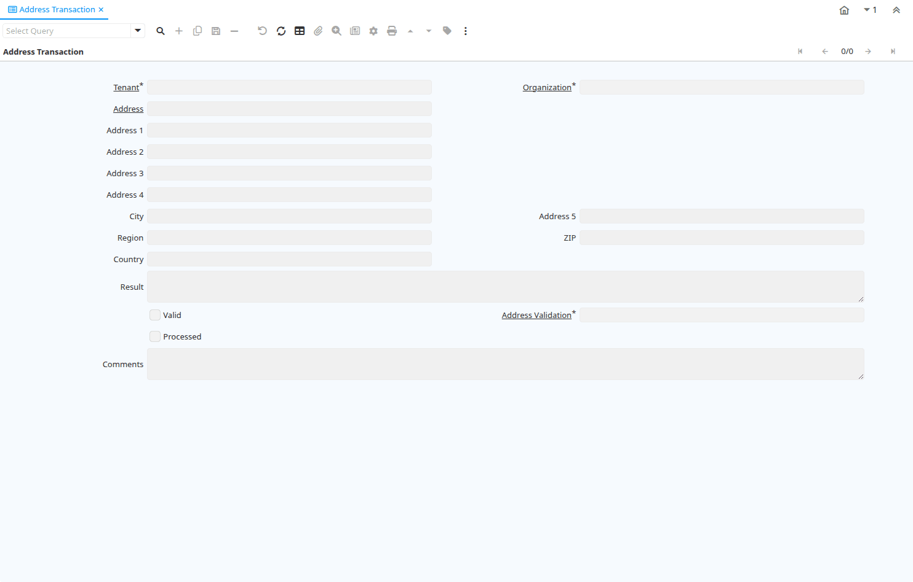

# Address Transaction

Window ID 200048

*19/08/2013 → 19/08/2013*

## Tab: Address Transaction

*Tab Level 0 · Created 19/08/2013 · Updated 19/08/2013*

| **Name** | **Description** | **Comment/Help** | **Technical Data** |
|---|---|---|---|
| Tenant | Tenant for this installation. | A Tenant is a company or a legal entity. You cannot share data between Tenants. | C_AddressTransaction.AD_Client_ID<small> numeric(10)   Table Direct</small> |
| Organization | Organizational entity within tenant | An organization is a unit of your tenant or legal entity - examples are store, department. You can share data between organizations. | C_AddressTransaction.AD_Org_ID<small> numeric(10)   Table Direct</small> |
| Address | Location or Address | The Location / Address field defines the location of an entity. | C_AddressTransaction.C_Location_ID<small> numeric(10)   Location (Address)</small> |
| Address 1 | Address line 1 for this location | The Address 1 identifies the address for an entity's location | C_AddressTransaction.Address1<small> character varying(60)   String</small> |
| Address 2 | Address line 2 for this location | The Address 2 provides additional address information for an entity.  It can be used for building location, apartment number or similar information. | C_AddressTransaction.Address2<small> character varying(60)   String</small> |
| Address 3 | Address Line 3 for the location | The Address 2 provides additional address information for an entity.  It can be used for building location, apartment number or similar information. | C_AddressTransaction.Address3<small> character varying(60)   String</small> |
| Address 4 | Address Line 4 for the location | The Address 4 provides additional address information for an entity.  It can be used for building location, apartment number or similar information. | C_AddressTransaction.Address4<small> character varying(60)   String</small> |
| City | Identifies a City | The City identifies a unique City for this Country or Region. | C_AddressTransaction.City<small> character varying(60)   String</small> |
| Address 5 | Address Line 5 for the location | The Address 5 provides additional address information for an entity.  It can be used for building location, apartment number or similar information. | C_AddressTransaction.Address5<small> character varying(60)   String</small> |
| Region |  |  | C_AddressTransaction.Region<small> character varying(60)   String</small> |
| ZIP | Postal code | The Postal Code or ZIP identifies the postal code for this entity's address. | C_AddressTransaction.Postal<small> character varying(10)   String</small> |
| Country |  |  | C_AddressTransaction.Country<small> character varying(60)   String</small> |
| Result | Result of the action taken | The Result indicates the result of any action taken on this request. | C_AddressTransaction.Result<small> character varying(2000)   Text</small> |
| Valid | Element is valid | The element passed the validation check | C_AddressTransaction.IsValid<small> character(1)   Yes-No</small> |
| Address Validation |  |  | C_AddressTransaction.C_AddressValidation_ID<small> numeric(10)   Table Direct</small> |
| Processed | The document has been processed | The Processed checkbox indicates that a document has been processed. | C_AddressTransaction.Processed<small> character(1)   Yes-No</small> |
| Comments | Comments or additional information | The Comments field allows for free form entry of additional information. | C_AddressTransaction.Comments<small> character varying(2000)   Text</small> |

