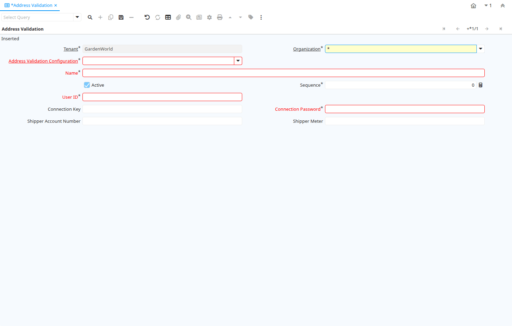

# Address Validation

Window ID 200047

*19/08/2013 → 19/08/2013*

## Tab: Address Validation

*Tab Level 0 · Created 19/08/2013 · Updated 19/08/2013*

| **Name** | **Description** | **Comment/Help** | **Technical Data** |
|---|---|---|---|
| Tenant | Tenant for this installation. | A Tenant is a company or a legal entity. You cannot share data between Tenants. | C_AddressValidation.AD_Client_ID<small> numeric(10)   Table Direct</small> |
| Organization | Organizational entity within tenant | An organization is a unit of your tenant or legal entity - examples are store, department. You can share data between organizations. | C_AddressValidation.AD_Org_ID<small> numeric(10)   Table Direct</small> |
| Address Validation Configuration |  |  | C_AddressValidation.C_AddressValidationCfg_ID<small> numeric(10)   Table Direct</small> |
| Name | Alphanumeric identifier of the entity | The name of an entity (record) is used as an default search option in addition to the search key. The name is up to 60 characters in length. | C_AddressValidation.Name<small> character varying(60)   String</small> |
| Active | The record is active in the system | There are two methods of making records unavailable in the system: One is to delete the record, the other is to de-activate the record. A de-activated record is not available for selection, but available for reports. There are two reasons for de-activating and not deleting records: (1) The system requires the record for audit purposes. (2) The record is referenced by other records. E.g., you cannot delete a Business Partner, if there are invoices for this partner record existing. You de-activate the Business Partner and prevent that this record is used for future entries. | C_AddressValidation.IsActive<small> character(1)   Yes-No</small> |
| Sequence | Method of ordering records; lowest number comes first | The Sequence indicates the order of records | C_AddressValidation.SeqNo<small> numeric(10)   Integer</small> |
| User ID | User ID or account number | The User ID identifies a user and allows access to records or processes. | C_AddressValidation.UserID<small> character varying(60)   String</small> |
| Connection Key |  |  | C_AddressValidation.ConnectionKey<small> character varying(60)   String</small> |
| Connection Password |  |  | C_AddressValidation.ConnectionPassword<small> character varying(60)   String</small> |
| Shipper Account Number |  |  | C_AddressValidation.ShipperAccount<small> character varying(40)   String</small> |
| Shipper Meter |  |  | C_AddressValidation.ShipperMeter<small> character varying(255)   String</small> |

