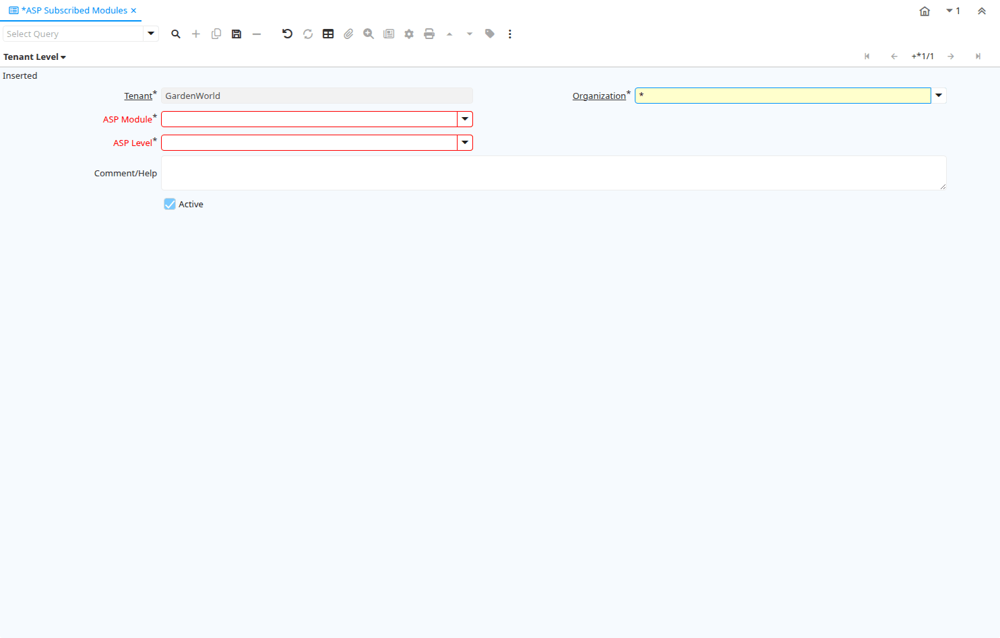

# ASP Subscribed Modules

Window ID 53016

*09/01/2008 → 19/09/2012*

## Tab: Tenant Level

*Tab Level 0 · Created 09/01/2008 · Updated 10/03/2022*

| **Name** | **Description** | **Comment/Help** | **Technical Data** |
|---|---|---|---|
| Tenant | Tenant for this installation. | A Tenant is a company or a legal entity. You cannot share data between Tenants. | ASP_ClientLevel.AD_Client_ID<small> numeric(10)   Table Direct</small> |
| Organization | Organizational entity within tenant | An organization is a unit of your tenant or legal entity - examples are store, department. You can share data between organizations. | ASP_ClientLevel.AD_Org_ID<small> numeric(10)   Table Direct</small> |
| ASP Module |  |  | ASP_ClientLevel.ASP_Module_ID<small> numeric(10)   Table Direct</small> |
| ASP Level |  |  | ASP_ClientLevel.ASP_Level_ID<small> numeric(10)   Table Direct</small> |
| Comment/Help | Comment or Hint | The Help field contains a hint, comment or help about the use of this item. | ASP_ClientLevel.Help<small> character varying(2000)   Text</small> |
| Active | The record is active in the system | There are two methods of making records unavailable in the system: One is to delete the record, the other is to de-activate the record. A de-activated record is not available for selection, but available for reports. There are two reasons for de-activating and not deleting records: (1) The system requires the record for audit purposes. (2) The record is referenced by other records. E.g., you cannot delete a Business Partner, if there are invoices for this partner record existing. You de-activate the Business Partner and prevent that this record is used for future entries. | ASP_ClientLevel.IsActive<small> character(1)   Yes-No</small> |

## Tab: Exceptions

*Tab Level 0 · Created 09/01/2008 · Updated 06/08/2013*

| **Name** | **Description** | **Comment/Help** | **Technical Data** |
|---|---|---|---|
| Tenant | Tenant for this installation. | A Tenant is a company or a legal entity. You cannot share data between Tenants. | ASP_ClientException.AD_Client_ID<small> numeric(10)   Table Direct</small> |
| Organization | Organizational entity within tenant | An organization is a unit of your tenant or legal entity - examples are store, department. You can share data between organizations. | ASP_ClientException.AD_Org_ID<small> numeric(10)   Table Direct</small> |
| Window | Data entry or display window | The Window field identifies a unique Window in the system. | ASP_ClientException.AD_Window_ID<small> numeric(10)   Search</small> |
| Tab | Tab within a Window | The Tab indicates a tab that displays within a window. | ASP_ClientException.AD_Tab_ID<small> numeric(10)   Search</small> |
| Field | Field on a database table | The Field identifies a field on a database table. | ASP_ClientException.AD_Field_ID<small> numeric(10)   Search</small> |
| Process | Process or Report | The Process field identifies a unique Process or Report in the system. | ASP_ClientException.AD_Process_ID<small> numeric(10)   Table Direct</small> |
| Process Parameter |  |  | ASP_ClientException.AD_Process_Para_ID<small> numeric(10)   Search</small> |
| Special Form | Special Form | The Special Form field identifies a unique Special Form in the system. | ASP_ClientException.AD_Form_ID<small> numeric(10)   Table Direct</small> |
| OS Task | Operation System Task | The Task field identifies a Operation System Task in the system. | ASP_ClientException.AD_Task_ID<small> numeric(10)   Table Direct</small> |
| Workflow | Workflow or combination of tasks | The Workflow field identifies a unique Workflow in the system. | ASP_ClientException.AD_Workflow_ID<small> numeric(10)   Table Direct</small> |
| ASP Status |  |  | ASP_ClientException.ASP_Status<small> character(1)   List</small> |
| Active | The record is active in the system | There are two methods of making records unavailable in the system: One is to delete the record, the other is to de-activate the record. A de-activated record is not available for selection, but available for reports. There are two reasons for de-activating and not deleting records: (1) The system requires the record for audit purposes. (2) The record is referenced by other records. E.g., you cannot delete a Business Partner, if there are invoices for this partner record existing. You de-activate the Business Partner and prevent that this record is used for future entries. | ASP_ClientException.IsActive<small> character(1)   Yes-No</small> |

