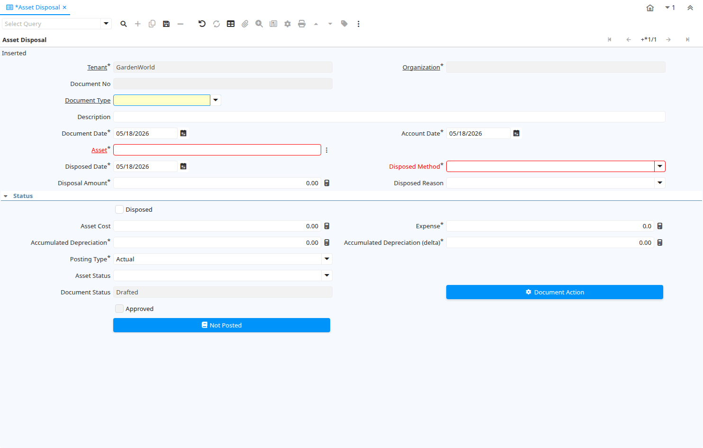

# Asset Disposal

Window ID 53114

*17/06/2010 → 24/03/2013*

**Description:** Dispose of Assets

## Tab: Asset Disposal

*Tab Level 0 · Created 17/06/2010 · Updated 26/06/2013*

**Description:** Process the Disposal

| **Name** | **Description** | **Comment/Help** | **Technical Data** |
|---|---|---|---|
| Tenant | Tenant for this installation. | A Tenant is a company or a legal entity. You cannot share data between Tenants. | A_Asset_Disposed.AD_Client_ID<small> numeric(10)   Table Direct</small> |
| Organization | Organizational entity within tenant | An organization is a unit of your tenant or legal entity - examples are store, department. You can share data between organizations. | A_Asset_Disposed.AD_Org_ID<small> numeric(10)   Table Direct</small> |
| Document No | Document sequence number of the document | The document number is usually automatically generated by the system and determined by the document type of the document. If the document is not saved, the preliminary number is displayed in "&lt;&gt;".  If the document type of your document has no automatic document sequence defined, the field is empty if you create a new document. This is for documents which usually have an external number (like vendor invoice).  If you leave the field empty, the system will generate a document number for you. The document sequence used for this fallback number is defined in the "Maintain Sequence" window with the name "DocumentNo_&lt;TableName&gt;", where TableName is the actual name of the table (e.g. C_Order). | A_Asset_Disposed.DocumentNo<small> character varying(30)   String</small> |
| Document Type | Document type or rules | The Document Type determines document sequence and processing rules | A_Asset_Disposed.C_DocType_ID<small> numeric(10)   Table Direct</small> |
| Description | Optional short description of the record | A description is limited to 255 characters. | A_Asset_Disposed.Description<small> character varying(255)   String</small> |
| Document Date | Date of the Document | The Document Date indicates the date the document was generated.  It may or may not be the same as the accounting date. | A_Asset_Disposed.DateDoc<small> timestamp without time zone   Date</small> |
| Account Date | Accounting Date | The Accounting Date indicates the date to be used on the General Ledger account entries generated from this document. It is also used for any currency conversion. | A_Asset_Disposed.DateAcct<small> timestamp without time zone   Date</small> |
| Asset | Asset used internally or by customers | An asset is either created by purchasing or by delivering a product.  An asset can be used internally or be a customer asset. | A_Asset_Disposed.A_Asset_ID<small> numeric(10)   Search</small> |
| Disposed Date |  |  | A_Asset_Disposed.A_Disposed_Date<small> timestamp without time zone   Date</small> |
| Disposed Method |  |  | A_Asset_Disposed.A_Disposed_Method<small> character varying(2)   List</small> |
| Disposal Amount |  |  | A_Asset_Disposed.A_Disposal_Amt<small> numeric   Amount</small> |
| Disposed Reason |  |  | A_Asset_Disposed.A_Disposed_Reason<small> character varying(10)   List</small> |
| Disposed | The asset is disposed | The asset is no longer used and disposed | A_Asset_Disposed.IsDisposed<small> character(1)   Yes-No</small> |
| Asset Cost |  |  | A_Asset_Disposed.A_Asset_Cost<small> numeric   Amount</small> |
| Expense |  |  | A_Asset_Disposed.Expense<small> numeric   Number</small> |
| Accumulated Depreciation |  |  | A_Asset_Disposed.A_Accumulated_Depr<small> numeric   Amount</small> |
| Accumulated Depreciation (delta) |  |  | A_Asset_Disposed.A_Accumulated_Depr_Delta<small> numeric   Amount</small> |
| Posting Type | The type of posted amount for the transaction | The Posting Type indicates the type of amount (Actual, Budget, Reservation, Commitment, Statistical) the transaction. | A_Asset_Disposed.PostingType<small> character(1)   List</small> |
| Asset Status |  |  | A_Asset_Disposed.A_Asset_Status<small> character varying(2)   List</small> |
| Document Status | The current status of the document | The Document Status indicates the status of a document at this time.  If you want to change the document status, use the Document Action field | A_Asset_Disposed.DocStatus<small> character varying(2)   List</small> |
| Asset Disposed Process |  |  | A_Asset_Disposed.DocAction<small> character(2)   Button</small> |
| Approved | Indicates if this document requires approval | The Approved checkbox indicates if this document requires approval before it can be processed. | A_Asset_Disposed.IsApproved<small> character(1)   Yes-No</small> |
| Posted | Posting status | The Posted field indicates the status of the Generation of General Ledger Accounting Lines  | A_Asset_Disposed.Posted<small> character(1)   Button</small> |
| Cost Center |  |  | A_Asset_Disposed.C_CostCenter_ID<small> numeric(10)   Table Direct</small> |
| Department |  |  | A_Asset_Disposed.C_Department_ID<small> numeric(10)   Table Direct</small> |

