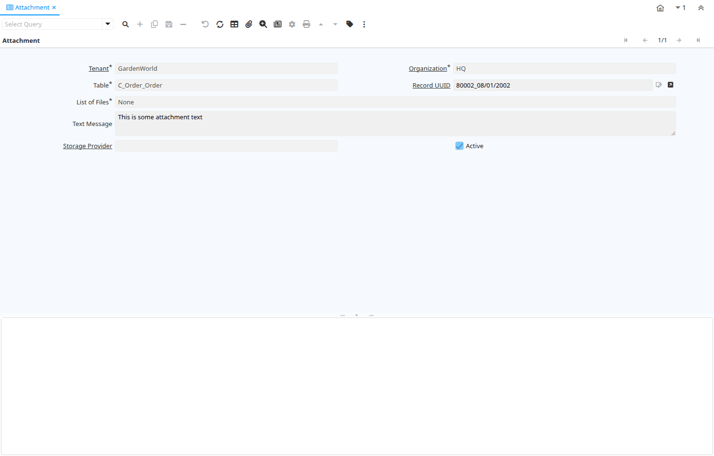

# Attachment

Window ID 128

*29/06/1999 → 02/01/2000*

**Description:** Maintain Attachments

**Comment/Help:** For System Maintenance Only.  The Maintain Attachments window is used for diagnostic purposes to display the attributes of an attachment.

## Tab: Attachment

*Tab Level 0 · Created 09/08/1999 · Updated 02/01/2000*

**Description:** Attachment

**Comment/Help:** The Attachment tab displays the attributes of an attachment.

| **Name** | **Description** | **Comment/Help** | **Technical Data** |
|---|---|---|---|
| Tenant | Tenant for this installation. | A Tenant is a company or a legal entity. You cannot share data between Tenants. | AD_Attachment.AD_Client_ID<small> numeric(10)   Table Direct</small> |
| Organization | Organizational entity within tenant | An organization is a unit of your tenant or legal entity - examples are store, department. You can share data between organizations. | AD_Attachment.AD_Org_ID<small> numeric(10)   Table Direct</small> |
| Table | Database Table information | The Database Table provides the information of the table definition | AD_Attachment.AD_Table_ID<small> numeric(10)   Table Direct</small> |
| Record UUID |  |  | AD_Attachment.Record_UU<small> uuid   Record UUID</small> |
| Record ID | Direct internal record ID | The Record ID is the internal unique identifier of a record. Please note that zooming to the record may not be successful for Orders, Invoices and Shipment/Receipts as sometimes the Sales Order type is not known. | AD_Attachment.Record_ID<small> numeric(10)   Record ID</small> |
| List of Files | Where to find the list of files on this attachment | Where to find the list of files on this attachment, it can be ZIP, XML or in Attachment File | AD_Attachment.Title<small> character varying(60)   List</small> |
| Text Message | Text Message |  | AD_Attachment.TextMsg<small> character varying(2000)   Text</small> |
| Storage Provider |  |  | AD_Attachment.AD_StorageProvider_ID<small> numeric(10)   Table Direct</small> |
| Active | The record is active in the system | There are two methods of making records unavailable in the system: One is to delete the record, the other is to de-activate the record. A de-activated record is not available for selection, but available for reports. There are two reasons for de-activating and not deleting records: (1) The system requires the record for audit purposes. (2) The record is referenced by other records. E.g., you cannot delete a Business Partner, if there are invoices for this partner record existing. You de-activate the Business Partner and prevent that this record is used for future entries. | AD_Attachment.IsActive<small> character(1)   Yes-No</small> |

## Tab: › Attachment File

*Tab Level 1 · Created 31/07/2025 · Updated 25/12/2025*

| **Name** | **Description** | **Comment/Help** | **Technical Data** |
|---|---|---|---|
| Tenant | Tenant for this installation. | A Tenant is a company or a legal entity. You cannot share data between Tenants. | AD_AttachmentFile.AD_Client_ID<small> numeric(10)   Search</small> |
| Organization | Organizational entity within tenant | An organization is a unit of your tenant or legal entity - examples are store, department. You can share data between organizations. | AD_AttachmentFile.AD_Org_ID<small> numeric(10)   Table Direct</small> |
| Attachment | Attachment for the document | Attachment can be of any document/file type and can be attached to any record in the system. | AD_AttachmentFile.AD_Attachment_ID<small> numeric(10)   Search</small> |
| Sequence | Method of ordering records; lowest number comes first | The Sequence indicates the order of records | AD_AttachmentFile.SeqNo<small> numeric(10)   Integer</small> |
| File Name | Name of the local file or URL | Name of a file in the local directory space - or URL (file://.., http://.., ftp://..) | AD_AttachmentFile.FileName<small> character varying(1000)   String</small> |
| File Size | Size of the File in bytes |  | AD_AttachmentFile.FileSize<small> numeric   Number</small> |
| SHA256 Checksum |  |  | AD_AttachmentFile.SHA256Checksum<small> character varying(64)   String</small> |
| MIME Type |  |  | AD_AttachmentFile.MIMEType<small> character varying(1000)   String</small> |
| File Path | Path where the file can be found |  | AD_AttachmentFile.FilePath<small> character varying(4000)   String</small> |
| Active | The record is active in the system | There are two methods of making records unavailable in the system: One is to delete the record, the other is to de-activate the record. A de-activated record is not available for selection, but available for reports. There are two reasons for de-activating and not deleting records: (1) The system requires the record for audit purposes. (2) The record is referenced by other records. E.g., you cannot delete a Business Partner, if there are invoices for this partner record existing. You de-activate the Business Partner and prevent that this record is used for future entries. | AD_AttachmentFile.IsActive<small> character(1)   Yes-No</small> |

