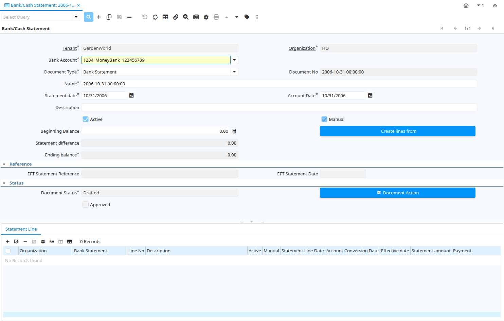

# Bank/Cash Statement

Window ID 194

*18/12/2000 → 26/06/2013*

**Description:** Process Bank Statements

**Comment/Help:** The Process Bank Statements window allows you to reconcile your Bank Statements.  You can either enter the line items from the statement in the Statement Line tab or select the 'Create From' button to automatically generate the statement from all unreconciled payments to this bank account.  Once you have completed reconciling, select the 'Process Statement' button to mark the payments as reconciled and update the appropriate GL accounts.

## Tab: Bank/Cash Statement

*Tab Level 0 · Created 18/12/2000 · Updated 26/06/2013*

**Description:** Bank/Cash Statement

**Comment/Help:** The Bank/Cash Statement Tab defines the Bank/Cash Statement to be reconciled.

| **Name** | **Description** | **Comment/Help** | **Technical Data** |
|---|---|---|---|
| Tenant | Tenant for this installation. | A Tenant is a company or a legal entity. You cannot share data between Tenants. | C_BankStatement.AD_Client_ID<small> numeric(10)   Table Direct</small> |
| Organization | Organizational entity within tenant | An organization is a unit of your tenant or legal entity - examples are store, department. You can share data between organizations. | C_BankStatement.AD_Org_ID<small> numeric(10)   Table Direct</small> |
| Bank Account | Account at the Bank | The Bank Account identifies an account at this Bank. | C_BankStatement.C_BankAccount_ID<small> numeric(10)   Table Direct</small> |
| Document Type | Document type or rules | The Document Type determines document sequence and processing rules | C_BankStatement.C_DocType_ID<small> numeric(10)   Table Direct</small> |
| Document No | Document sequence number of the document | The document number is usually automatically generated by the system and determined by the document type of the document. If the document is not saved, the preliminary number is displayed in "&lt;&gt;".  If the document type of your document has no automatic document sequence defined, the field is empty if you create a new document. This is for documents which usually have an external number (like vendor invoice).  If you leave the field empty, the system will generate a document number for you. The document sequence used for this fallback number is defined in the "Maintain Sequence" window with the name "DocumentNo_&lt;TableName&gt;", where TableName is the actual name of the table (e.g. C_Order). | C_BankStatement.DocumentNo<small> character varying(60)   String</small> |
| Name | Alphanumeric identifier of the entity | The name of an entity (record) is used as an default search option in addition to the search key. The name is up to 60 characters in length. | C_BankStatement.Name<small> character varying(60)   String</small> |
| Statement date | Date of the statement | The Statement Date field defines the date of the statement. | C_BankStatement.StatementDate<small> timestamp without time zone   Date</small> |
| Account Date | Accounting Date | The Accounting Date indicates the date to be used on the General Ledger account entries generated from this document. It is also used for any currency conversion. | C_BankStatement.DateAcct<small> timestamp without time zone   Date</small> |
| Description | Optional short description of the record | A description is limited to 255 characters. | C_BankStatement.Description<small> character varying(255)   String</small> |
| Active | The record is active in the system | There are two methods of making records unavailable in the system: One is to delete the record, the other is to de-activate the record. A de-activated record is not available for selection, but available for reports. There are two reasons for de-activating and not deleting records: (1) The system requires the record for audit purposes. (2) The record is referenced by other records. E.g., you cannot delete a Business Partner, if there are invoices for this partner record existing. You de-activate the Business Partner and prevent that this record is used for future entries. | C_BankStatement.IsActive<small> character(1)   Yes-No</small> |
| Manual | This is a manual process | The Manual check box indicates if the process will done manually. | C_BankStatement.IsManual<small> character(1)   Yes-No</small> |
| Beginning Balance | Balance prior to any transactions | The Beginning Balance is the balance prior to making any adjustments for payments or disbursements. | C_BankStatement.BeginningBalance<small> numeric   Amount</small> |
| Create lines from | Process which will generate a new document lines based on an existing document | The Create From process will create a new document based on information in an existing document selected by the user. | C_BankStatement.CreateFrom<small> character(1)   Button</small> |
| Bank Statement Create From Batch |  |  | C_BankStatement.CreateFromBatch<small> character(1)   Button</small> |
| Statement difference | Difference between statement ending balance and actual ending balance | The Statement Difference reflects the difference between the Statement Ending Balance and the Actual Ending Balance. | C_BankStatement.StatementDifference<small> numeric   Amount</small> |
| Match Bank Statement | Match Bank Statement Info to Business Partners, Invoices and Payments |  | C_BankStatement.MatchStatement<small> character(1)   Button</small> |
| Copy Lines | Copy Lines from other bank statement |  | C_BankStatement.CopyFrom<small> character(1)   Button</small> |
| Ending balance | Ending  or closing balance | The Ending Balance is the result of adjusting the Beginning Balance by any payments or disbursements. | C_BankStatement.EndingBalance<small> numeric   Amount</small> |
| EFT Statement Reference | Electronic Funds Transfer Statement Reference | Information from EFT media | C_BankStatement.EftStatementReference<small> character varying(60)   String</small> |
| EFT Statement Date | Electronic Funds Transfer Statement Date | Information from EFT media | C_BankStatement.EftStatementDate<small> timestamp without time zone   Date</small> |
| Document Status | The current status of the document | The Document Status indicates the status of a document at this time.  If you want to change the document status, use the Document Action field | C_BankStatement.DocStatus<small> character(2)   List</small> |
| Process Statement |  |  | C_BankStatement.DocAction<small> character(2)   Button</small> |
| Approved | Indicates if this document requires approval | The Approved checkbox indicates if this document requires approval before it can be processed. | C_BankStatement.IsApproved<small> character(1)   Yes-No</small> |
| Posted | Posting status | The Posted field indicates the status of the Generation of General Ledger Accounting Lines  | C_BankStatement.Posted<small> character(1)   Button</small> |

## Tab: › Statement Line

*Tab Level 1 · Created 18/12/2000 · Updated 16/03/2021*

**Description:** Statement Line

**Comment/Help:** The Statement Line Tab defines the individual line items on the Bank Statement.  They can be entered manually or generated from payments entered.
&lt;br&gt;For Posting, the bank account organization is used, if it is not a charge.

| **Name** | **Description** | **Comment/Help** | **Technical Data** |
|---|---|---|---|
| Tenant | Tenant for this installation. | A Tenant is a company or a legal entity. You cannot share data between Tenants. | C_BankStatementLine.AD_Client_ID<small> numeric(10)   Table Direct</small> |
| Organization | Organizational entity within tenant | An organization is a unit of your tenant or legal entity - examples are store, department. You can share data between organizations. | C_BankStatementLine.AD_Org_ID<small> numeric(10)   Table Direct</small> |
| Bank Statement | Bank Statement of account | The Bank Statement identifies a unique Bank Statement for a defined time period.  The statement defines all transactions that occurred | C_BankStatementLine.C_BankStatement_ID<small> numeric(10)   Search</small> |
| Line No | Unique line for this document | Indicates the unique line for a document.  It will also control the display order of the lines within a document. | C_BankStatementLine.Line<small> numeric(10)   Integer</small> |
| Description | Optional short description of the record | A description is limited to 255 characters. | C_BankStatementLine.Description<small> character varying(1000)   String</small> |
| Active | The record is active in the system | There are two methods of making records unavailable in the system: One is to delete the record, the other is to de-activate the record. A de-activated record is not available for selection, but available for reports. There are two reasons for de-activating and not deleting records: (1) The system requires the record for audit purposes. (2) The record is referenced by other records. E.g., you cannot delete a Business Partner, if there are invoices for this partner record existing. You de-activate the Business Partner and prevent that this record is used for future entries. | C_BankStatementLine.IsActive<small> character(1)   Yes-No</small> |
| Manual | This is a manual process | The Manual check box indicates if the process will done manually. | C_BankStatementLine.IsManual<small> character(1)   Yes-No</small> |
| Statement Line Date | Date of the Statement Line |  | C_BankStatementLine.StatementLineDate<small> timestamp without time zone   Date</small> |
| Account Conversion Date | Accounting Conversion Date | The Accounting Date indicates the date to be used on the General Ledger account entries generated from this document. It is also used for any currency conversion. The Accounting Date on Bank/Cash Statement Line is used for currency conversion and reporting purposes, the accounting is posted using the header date account. | C_BankStatementLine.DateAcct<small> timestamp without time zone   Date</small> |
| Effective date | Date when money is available | The Effective Date indicates the date that money is available from the bank. | C_BankStatementLine.ValutaDate<small> timestamp without time zone   Date</small> |
| Currency | The Currency for this record | Indicates the Currency to be used when processing or reporting on this record | C_BankStatementLine.C_Currency_ID<small> numeric(10)   Table Direct</small> |
| Statement amount | Statement Amount | The Statement Amount indicates the amount of a single statement line. | C_BankStatementLine.StmtAmt<small> numeric   Amount</small> |
| Payment | Payment identifier | The Payment is a unique identifier of this payment. | C_BankStatementLine.C_Payment_ID<small> numeric(10)   Search</small> |
| Transaction Amount | Amount of a transaction | The Transaction Amount indicates the amount for a single transaction. | C_BankStatementLine.TrxAmt<small> numeric   Amount</small> |
| Deposit Batch |  |  | C_BankStatementLine.C_DepositBatch_ID<small> numeric(10)   Search</small> |
| Charge amount | Charge Amount | The Charge Amount indicates the amount for an additional charge. | C_BankStatementLine.ChargeAmt<small> numeric   Amount</small> |
| Charge | Additional document charges | The Charge indicates a type of Charge (Handling, Shipping, Restocking) | C_BankStatementLine.C_Charge_ID<small> numeric(10)   Table Direct</small> |
| Interest Amount | Interest Amount | The Interest Amount indicates any interest charged or received on a Bank Statement. | C_BankStatementLine.InterestAmt<small> numeric   Amount</small> |
| Reference No | Your customer or vendor number at the Business Partner's site | The reference number can be printed on orders and invoices to allow your business partner to faster identify your records. | C_BankStatementLine.ReferenceNo<small> character varying(255)   String</small> |
| Memo | Memo Text |  | C_BankStatementLine.Memo<small> character varying(4000)   String</small> |
| Match Bank Statement | Match Bank Statement Info to Business Partners, Invoices and Payments |  | C_BankStatementLine.MatchStatement<small> character(1)   Button</small> |
| Create Payment | Create Payment from Bank Statement Info |  | C_BankStatementLine.CreatePayment<small> character(1)   Button</small> |
| Business Partner | Identifies a Business Partner | A Business Partner is anyone with whom you transact.  This can include Vendor, Customer, Employee or Salesperson | C_BankStatementLine.C_BPartner_ID<small> numeric(10)   Search</small> |
| Invoice | Invoice Identifier | The Invoice Document. | C_BankStatementLine.C_Invoice_ID<small> numeric(10)   Search</small> |
| EFT Trx ID | Electronic Funds Transfer Transaction ID | Information from EFT media | C_BankStatementLine.EftTrxID<small> character varying(40)   String</small> |
| EFT Trx Type | Electronic Funds Transfer Transaction Type | Information from EFT media | C_BankStatementLine.EftTrxType<small> character varying(255)   String</small> |
| EFT Check No | Electronic Funds Transfer Check No | Information from EFT media | C_BankStatementLine.EftCheckNo<small> character varying(20)   String</small> |
| EFT Reference | Electronic Funds Transfer Reference | Information from EFT media | C_BankStatementLine.EftReference<small> character varying(255)   String</small> |
| EFT Memo | Electronic Funds Transfer Memo | Information from EFT media | C_BankStatementLine.EftMemo<small> character varying(4000)   String</small> |
| EFT Payee | Electronic Funds Transfer Payee information | Information from EFT media | C_BankStatementLine.EftPayee<small> character varying(255)   String</small> |
| EFT Payee Account | Electronic Funds Transfer Payee Account Information | Information from EFT media | C_BankStatementLine.EftPayeeAccount<small> character varying(40)   String</small> |
| EFT Statement Line Date | Electronic Funds Transfer Statement Line Date | Information from EFT media | C_BankStatementLine.EftStatementLineDate<small> timestamp without time zone   Date</small> |
| EFT Effective Date | Electronic Funds Transfer Valuta (effective) Date | Information from EFT media | C_BankStatementLine.EftValutaDate<small> timestamp without time zone   Date</small> |
| EFT Currency | Electronic Funds Transfer Currency | Information from EFT media | C_BankStatementLine.EftCurrency<small> character varying(20)   String</small> |
| EFT Amount | Electronic Funds Transfer Amount |  | C_BankStatementLine.EftAmt<small> numeric   Amount</small> |

