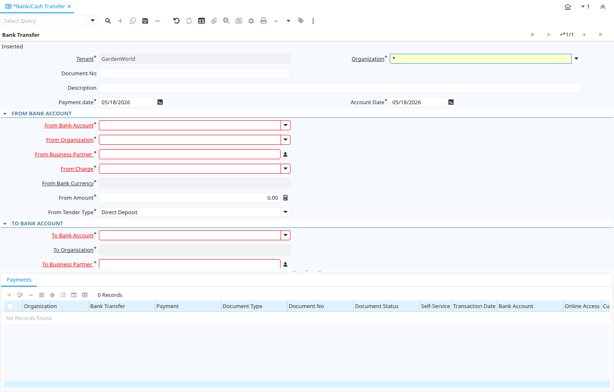

# Bank/Cash Transfer

Window ID 200105

*03/04/2022 → 04/07/2025*

**Description:** Manage Bank Transfer

## Tab: Bank Transfer

*Tab Level 0 · Created 03/04/2022 · Updated 03/04/2022*

| **Name** | **Description** | **Comment/Help** | **Technical Data** |
|---|---|---|---|
| Tenant | Tenant for this installation. | A Tenant is a company or a legal entity. You cannot share data between Tenants. | C_BankTransfer.AD_Client_ID<small> numeric(10)   Table Direct</small> |
| Organization | Organizational entity within tenant | An organization is a unit of your tenant or legal entity - examples are store, department. You can share data between organizations. | C_BankTransfer.AD_Org_ID<small> numeric(10)   Table Direct</small> |
| Document No | Document sequence number of the document | The document number is usually automatically generated by the system and determined by the document type of the document. If the document is not saved, the preliminary number is displayed in "&lt;&gt;".  If the document type of your document has no automatic document sequence defined, the field is empty if you create a new document. This is for documents which usually have an external number (like vendor invoice).  If you leave the field empty, the system will generate a document number for you. The document sequence used for this fallback number is defined in the "Maintain Sequence" window with the name "DocumentNo_&lt;TableName&gt;", where TableName is the actual name of the table (e.g. C_Order). | C_BankTransfer.DocumentNo<small> character varying(30)   String</small> |
| Description | Optional short description of the record | A description is limited to 255 characters. | C_BankTransfer.Description<small> character varying(255)   String</small> |
| Payment date | Date Payment made | The Payment Date indicates the date the payment was made. | C_BankTransfer.PayDate<small> timestamp without time zone   Date</small> |
| Account Date | Accounting Date | The Accounting Date indicates the date to be used on the General Ledger account entries generated from this document. It is also used for any currency conversion. | C_BankTransfer.DateAcct<small> timestamp without time zone   Date</small> |
| From Bank Account |  |  | C_BankTransfer.From_C_BankAccount_ID<small> numeric(10)   Table</small> |
| From Organization |  |  | C_BankTransfer.From_AD_Org_ID<small> numeric(10)   Table</small> |
| From Business Partner  | Identifies a Business Partner | A Business Partner is anyone with whom you transact.  This can include Vendor, Customer, Employee or Salesperson | C_BankTransfer.From_C_BPartner_ID<small> numeric(10)   Search</small> |
| From Charge |  |  | C_BankTransfer.From_C_Charge_ID<small> numeric(10)   Table</small> |
| From Bank Currency |  |  | C_BankTransfer.From_C_Currency_ID<small> numeric(10)   Table</small> |
| From Amount |  |  | C_BankTransfer.From_Amt<small> numeric   Amount</small> |
| From Tender Type |  |  | C_BankTransfer.From_TenderType<small> character(1)   List</small> |
| To Bank Account |  |  | C_BankTransfer.To_C_BankAccount_ID<small> numeric(10)   Table</small> |
| To Organization |  |  | C_BankTransfer.To_AD_Org_ID<small> numeric(10)   Table</small> |
| To Business Partner  | Identifies a Business Partner | A Business Partner is anyone with whom you transact.  This can include Vendor, Customer, Employee or Salesperson | C_BankTransfer.To_C_BPartner_ID<small> numeric(10)   Search</small> |
| To Charge |  |  | C_BankTransfer.To_C_Charge_ID<small> numeric(10)   Table</small> |
| To Bank Currency |  |  | C_BankTransfer.To_C_Currency_ID<small> numeric(10)   Table</small> |
| Currency Type | Currency Conversion Rate Type | The Currency Conversion Rate Type lets you define different type of rates, e.g. Spot, Corporate and/or Sell/Buy rates. | C_BankTransfer.C_ConversionType_ID<small> numeric(10)   Table Direct</small> |
| Override Currency Conversion Rate | Override Currency Conversion Rate |  | C_BankTransfer.IsOverrideCurrencyRate<small> character(1)   Yes-No</small> |
| Rate | Rate or Tax or Exchange | The Rate indicates the percentage to be multiplied by the source to arrive at the tax or exchange amount. | C_BankTransfer.Rate<small> numeric   Number</small> |
| To Amount |  |  | C_BankTransfer.To_Amt<small> numeric   Amount</small> |
| To Tender Type |  |  | C_BankTransfer.To_TenderType<small> character(1)   List</small> |
| Document Status | The current status of the document | The Document Status indicates the status of a document at this time.  If you want to change the document status, use the Document Action field | C_BankTransfer.DocStatus<small> character(2)   List</small> |
| Process Bank Transfer |  |  | C_BankTransfer.DocAction<small> character(2)   Button</small> |
| Processed | The document has been processed | The Processed checkbox indicates that a document has been processed. | C_BankTransfer.Processed<small> character(1)   Yes-No</small> |

## Tab: › Payments

*Tab Level 1 · Created 03/04/2022 · Updated 03/04/2022*

| **Name** | **Description** | **Comment/Help** | **Technical Data** |
|---|---|---|---|
| Tenant | Tenant for this installation. | A Tenant is a company or a legal entity. You cannot share data between Tenants. | C_Payment.AD_Client_ID<small> numeric(10)   Table Direct</small> |
| Organization | Organizational entity within tenant | An organization is a unit of your tenant or legal entity - examples are store, department. You can share data between organizations. | C_Payment.AD_Org_ID<small> numeric(10)   Table Direct</small> |
| Bank Transfer | Bank Transfer |  | C_Payment.C_BankTransfer_ID<small> numeric(10)   Search</small> |
| Payment | Payment identifier | The Payment is a unique identifier of this payment. | C_Payment.C_Payment_ID<small> numeric(10)   ID</small> |
| Document Type | Document type or rules | The Document Type determines document sequence and processing rules | C_Payment.C_DocType_ID<small> numeric(10)   Table Direct</small> |
| Document No | Document sequence number of the document | The document number is usually automatically generated by the system and determined by the document type of the document. If the document is not saved, the preliminary number is displayed in "&lt;&gt;".  If the document type of your document has no automatic document sequence defined, the field is empty if you create a new document. This is for documents which usually have an external number (like vendor invoice).  If you leave the field empty, the system will generate a document number for you. The document sequence used for this fallback number is defined in the "Maintain Sequence" window with the name "DocumentNo_&lt;TableName&gt;", where TableName is the actual name of the table (e.g. C_Order). | C_Payment.DocumentNo<small> character varying(30)   String</small> |
| Document Status | The current status of the document | The Document Status indicates the status of a document at this time.  If you want to change the document status, use the Document Action field | C_Payment.DocStatus<small> character(2)   List</small> |
| Self-Service | This is a Self-Service entry or this entry can be changed via Self-Service | Self-Service allows users to enter data or update their data.  The flag indicates, that this record was entered or created via Self-Service or that the user can change it via the Self-Service functionality. | C_Payment.IsSelfService<small> character(1)   Yes-No</small> |
| Transaction Date | Transaction Date | The Transaction Date indicates the date of the transaction. | C_Payment.DateTrx<small> timestamp without time zone   Date</small> |
| Bank Account | Account at the Bank | The Bank Account identifies an account at this Bank. | C_Payment.C_BankAccount_ID<small> numeric(10)   Table Direct</small> |
| Online Access | Can be accessed online  | The Online Access check box indicates if the application can be accessed via the web.  | C_Payment.IsOnline<small> character(1)   Yes-No</small> |
| Currency | The Currency for this record | Indicates the Currency to be used when processing or reporting on this record | C_Payment.C_Currency_ID<small> numeric(10)   Table Direct</small> |
| Payment amount | Amount being paid | Indicates the amount this payment is for.  The payment amount can be for single or multiple invoices or a partial payment for an invoice. | C_Payment.PayAmt<small> numeric   Amount</small> |
| Currency Type | Currency Conversion Rate Type | The Currency Conversion Rate Type lets you define different type of rates, e.g. Spot, Corporate and/or Sell/Buy rates. | C_Payment.C_ConversionType_ID<small> numeric(10)   Table Direct</small> |
| Override Currency Conversion Rate | Override Currency Conversion Rate |  | C_Payment.IsOverrideCurrencyRate<small> character(1)   Yes-No</small> |
| Rate | Currency Conversion Rate | The Currency Conversion Rate indicates the rate to use when converting the source currency to the accounting currency | C_Payment.CurrencyRate<small> numeric   Number</small> |
| Converted Amount | Converted Amount | The Converted Amount is the result of multiplying the Source Amount by the Conversion Rate for this target currency. | C_Payment.ConvertedAmt<small> numeric   Amount</small> |
| Discount Amount | Calculated amount of discount | The Discount Amount indicates the discount amount for a document or line. | C_Payment.DiscountAmt<small> numeric   Amount</small> |
| Write-off Amount | Amount to write-off | The Write Off Amount indicates the amount to be written off as uncollectible. | C_Payment.WriteOffAmt<small> numeric   Amount</small> |
| Tender type | Method of Payment | The Tender Type indicates the method of payment (ACH or Direct Deposit, Credit Card, Check, Direct Debit) | C_Payment.TenderType<small> character(1)   List</small> |
| Prepayment | The Payment/Receipt is a Prepayment | Payments not allocated to an invoice with a charge are posted to Unallocated Payments. When setting this flag, the payment is posted to the Customer or Vendor Prepayment account. | C_Payment.IsPrepayment<small> character(1)   Yes-No</small> |
| Delayed Capture | Charge after Shipment | Delayed Capture is required, if you ship products.  The first credit card transaction is the Authorization, the second is the actual transaction after the shipment of the product. | C_Payment.IsDelayedCapture<small> character(1)   Yes-No</small> |
| Invoice | Invoice Identifier | The Invoice Document. | C_Payment.C_Invoice_ID<small> numeric(10)   Search</small> |
| Charge | Additional document charges | The Charge indicates a type of Charge (Handling, Shipping, Restocking) | C_Payment.C_Charge_ID<small> numeric(10)   Table Direct</small> |

