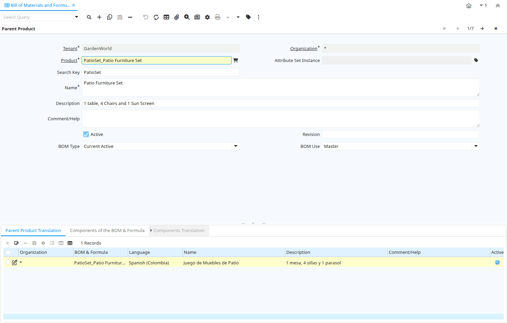

# Bill of Materials and Formula

Window ID 53006

*17/12/2007 → 08/12/2023*

**Description:** Maintain Product Bill of Materials &amp; Formula

**Comment/Help:** It is a list of all the subassemblies, intermediates, parts and raw material that go into a parent assembly showing the quantity of each required to make an assembly. There are a variety of display formats of bill of material, including single level bill of material, indented bill of material, modular (planning), costed bill of material, etc. May also be called "formula", "recipe", "ingredients list" in certain industries.
It answers the question, what are the components of the product?

## Tab: Parent Product

*Tab Level 0 · Created 17/12/2007 · Updated 17/12/2007*

**Description:** Define the Parent Product to this BOM &amp; Formula

**Comment/Help:** Define the Parent Product to this BOM &amp; Formula

| **Name** | **Description** | **Comment/Help** | **Technical Data** |
|---|---|---|---|
| Tenant | Tenant for this installation. | A Tenant is a company or a legal entity. You cannot share data between Tenants. | PP_Product_BOM.AD_Client_ID<small> numeric(10)   Table Direct</small> |
| Organization | Organizational entity within tenant | An organization is a unit of your tenant or legal entity - examples are store, department. You can share data between organizations. | PP_Product_BOM.AD_Org_ID<small> numeric(10)   Table Direct</small> |
| Product | Product, Service, Item | Identifies an item which is either purchased or sold in this organization. | PP_Product_BOM.M_Product_ID<small> numeric(10)   Search</small> |
| Attribute Set Instance | Product Attribute Set Instance | The values of the actual Product Attribute Instances.  The product level attributes are defined on Product level. | PP_Product_BOM.M_AttributeSetInstance_ID<small> numeric(10)   Product Attribute</small> |
| Search Key | Search key for the record in the format required - must be unique | A search key allows you a fast method of finding a particular record. If you leave the search key empty, the system automatically creates a numeric number.  The document sequence used for this fallback number is defined in the "Maintain Sequence" window with the name "DocumentNo_&lt;TableName&gt;", where TableName is the actual name of the table (e.g. C_Order). | PP_Product_BOM.Value<small> character varying(80)   String</small> |
| Name | Alphanumeric identifier of the entity | The name of an entity (record) is used as an default search option in addition to the search key. The name is up to 60 characters in length. | PP_Product_BOM.Name<small> character varying(60)   Text</small> |
| Description | Optional short description of the record | A description is limited to 255 characters. | PP_Product_BOM.Description<small> character varying(255)   String</small> |
| Comment/Help | Comment or Hint | The Help field contains a hint, comment or help about the use of this item. | PP_Product_BOM.Help<small> character varying(2000)   Text</small> |
| Active | The record is active in the system | There are two methods of making records unavailable in the system: One is to delete the record, the other is to de-activate the record. A de-activated record is not available for selection, but available for reports. There are two reasons for de-activating and not deleting records: (1) The system requires the record for audit purposes. (2) The record is referenced by other records. E.g., you cannot delete a Business Partner, if there are invoices for this partner record existing. You de-activate the Business Partner and prevent that this record is used for future entries. | PP_Product_BOM.IsActive<small> character(1)   Yes-No</small> |
| Revision |  |  | PP_Product_BOM.Revision<small> character varying(10)   String</small> |
| BOM Type | Type of BOM | The type of Bills of Materials determines the state | PP_Product_BOM.BOMType<small> character(1)   List</small> |
| BOM Use | The use of the Bill of Material | By default the Master BOM is used, if the alternatives are not defined | PP_Product_BOM.BOMUse<small> character(1)   List</small> |
| Copy BOM Lines From | Copy BOM Lines from an existing BOM | Copy BOM Lines from an existing BOM. The BOM being copied to, must not have any existing BOM Lines. | PP_Product_BOM.CopyFrom<small> character(1)   Button</small> |

## Tab: › Parent Product Translation

*Tab Level 1 · Created 18/04/2009 · Updated 27/10/2024*

| **Name** | **Description** | **Comment/Help** | **Technical Data** |
|---|---|---|---|
| Tenant | Tenant for this installation. | A Tenant is a company or a legal entity. You cannot share data between Tenants. | PP_Product_BOM_Trl.AD_Client_ID<small> numeric(10)   Table Direct</small> |
| Organization | Organizational entity within tenant | An organization is a unit of your tenant or legal entity - examples are store, department. You can share data between organizations. | PP_Product_BOM_Trl.AD_Org_ID<small> numeric(10)   Table Direct</small> |
| BOM &amp; Formula | BOM &amp; Formula |  | PP_Product_BOM_Trl.PP_Product_BOM_ID<small> numeric(10)   Table Direct</small> |
| Language | Language for this entity | The Language identifies the language to use for display and formatting | PP_Product_BOM_Trl.AD_Language<small> character varying(6)   Table</small> |
| Name | Alphanumeric identifier of the entity | The name of an entity (record) is used as an default search option in addition to the search key. The name is up to 60 characters in length. | PP_Product_BOM_Trl.Name<small> character varying(60)   String</small> |
| Description | Optional short description of the record | A description is limited to 255 characters. | PP_Product_BOM_Trl.Description<small> character varying(255)   String</small> |
| Comment/Help | Comment or Hint | The Help field contains a hint, comment or help about the use of this item. | PP_Product_BOM_Trl.Help<small> character varying(2000)   Text</small> |
| Active | The record is active in the system | There are two methods of making records unavailable in the system: One is to delete the record, the other is to de-activate the record. A de-activated record is not available for selection, but available for reports. There are two reasons for de-activating and not deleting records: (1) The system requires the record for audit purposes. (2) The record is referenced by other records. E.g., you cannot delete a Business Partner, if there are invoices for this partner record existing. You de-activate the Business Partner and prevent that this record is used for future entries. | PP_Product_BOM_Trl.IsActive<small> character(1)   Yes-No</small> |
| Translated | This column is translated | The Translated checkbox indicates if this column is translated. | PP_Product_BOM_Trl.IsTranslated<small> character(1)   Yes-No</small> |

## Tab: › Components of the BOM &amp; Formula

*Tab Level 1 · Created 17/12/2007 · Updated 21/04/2009*

**Description:** Components of the BOM &amp; Formula

**Comment/Help:** The information relative to every component that will be used in the BOM &amp; Formula of the finished product.

| **Name** | **Description** | **Comment/Help** | **Technical Data** |
|---|---|---|---|
| Line No | Unique line for this document | Indicates the unique line for a document.  It will also control the display order of the lines within a document. | PP_Product_BOMLine.Line<small> numeric(10)   Integer</small> |
| BOM &amp; Formula | BOM &amp; Formula |  | PP_Product_BOMLine.PP_Product_BOM_ID<small> numeric(10)   Search</small> |
| Product | Product, Service, Item | Identifies an item which is either purchased or sold in this organization. | PP_Product_BOMLine.M_Product_ID<small> numeric(10)   Search</small> |
| Attribute Set Instance | Product Attribute Set Instance | The values of the actual Product Attribute Instances.  The product level attributes are defined on Product level. | PP_Product_BOMLine.M_AttributeSetInstance_ID<small> numeric(10)   Product Attribute</small> |
| Component Type | Component Type for a Bill of Material or Formula | The Component Type can be:  1.- By Product: Define a By Product as Component into BOM 2.- Component: Define a normal Component into BOM  3.- Option: Define an Option for Product Configure BOM 4.- Phantom: Define a Phantom as Component into BOM 5.- Packing: Define a Packing as Component into BOM 6.- Planning : Define Planning as Component into BOM 7.- Tools: Define Tools as Component into BOM 8.- Variant: Define Variant  for Product Configure BOM  | PP_Product_BOMLine.ComponentType<small> character(2)   List</small> |
| Description | Optional short description of the record | A description is limited to 255 characters. | PP_Product_BOMLine.Description<small> character varying(255)   String</small> |
| Comment/Help | Comment or Hint | The Help field contains a hint, comment or help about the use of this item. | PP_Product_BOMLine.Help<small> character varying(2000)   Text</small> |
| Active | The record is active in the system | There are two methods of making records unavailable in the system: One is to delete the record, the other is to de-activate the record. A de-activated record is not available for selection, but available for reports. There are two reasons for de-activating and not deleting records: (1) The system requires the record for audit purposes. (2) The record is referenced by other records. E.g., you cannot delete a Business Partner, if there are invoices for this partner record existing. You de-activate the Business Partner and prevent that this record is used for future entries. | PP_Product_BOMLine.IsActive<small> character(1)   Yes-No</small> |
| Quantity | Indicate the Quantity use in this BOM | Exist two way the add a component to a BOM or Formula:  1.- Adding a Component based in quantity to use in this BOM 2.- Adding a Component based in % to use the Order Quantity of Manufacturing Order in this Formula.  | PP_Product_BOMLine.QtyBOM<small> numeric   Number</small> |
| Feature | Indicated the Feature for Product Configure | Indicated the Feature for Product Configure | PP_Product_BOMLine.Feature<small> character varying(30)   String</small> |

## Tab: › › Components Translation

*Tab Level 2 · Created 21/04/2009 · Updated 27/10/2024*

**Description:** BOM &amp; Formula Line Translation

| **Name** | **Description** | **Comment/Help** | **Technical Data** |
|---|---|---|---|
| Tenant | Tenant for this installation. | A Tenant is a company or a legal entity. You cannot share data between Tenants. | PP_Product_BOMLine_Trl.AD_Client_ID<small> numeric(10)   Table Direct</small> |
| Organization | Organizational entity within tenant | An organization is a unit of your tenant or legal entity - examples are store, department. You can share data between organizations. | PP_Product_BOMLine_Trl.AD_Org_ID<small> numeric(10)   Table Direct</small> |
| BOM Line | BOM Line | The BOM Line is a unique identifier for a BOM line in an BOM. | PP_Product_BOMLine_Trl.PP_Product_BOMLine_ID<small> numeric(10)   Table Direct</small> |
| Language | Language for this entity | The Language identifies the language to use for display and formatting | PP_Product_BOMLine_Trl.AD_Language<small> character varying(6)   Table</small> |
| Description | Optional short description of the record | A description is limited to 255 characters. | PP_Product_BOMLine_Trl.Description<small> character varying(255)   String</small> |
| Comment/Help | Comment or Hint | The Help field contains a hint, comment or help about the use of this item. | PP_Product_BOMLine_Trl.Help<small> character varying(2000)   Text</small> |
| Active | The record is active in the system | There are two methods of making records unavailable in the system: One is to delete the record, the other is to de-activate the record. A de-activated record is not available for selection, but available for reports. There are two reasons for de-activating and not deleting records: (1) The system requires the record for audit purposes. (2) The record is referenced by other records. E.g., you cannot delete a Business Partner, if there are invoices for this partner record existing. You de-activate the Business Partner and prevent that this record is used for future entries. | PP_Product_BOMLine_Trl.IsActive<small> character(1)   Yes-No</small> |
| Translated | This column is translated | The Translated checkbox indicates if this column is translated. | PP_Product_BOMLine_Trl.IsTranslated<small> character(1)   Yes-No</small> |

