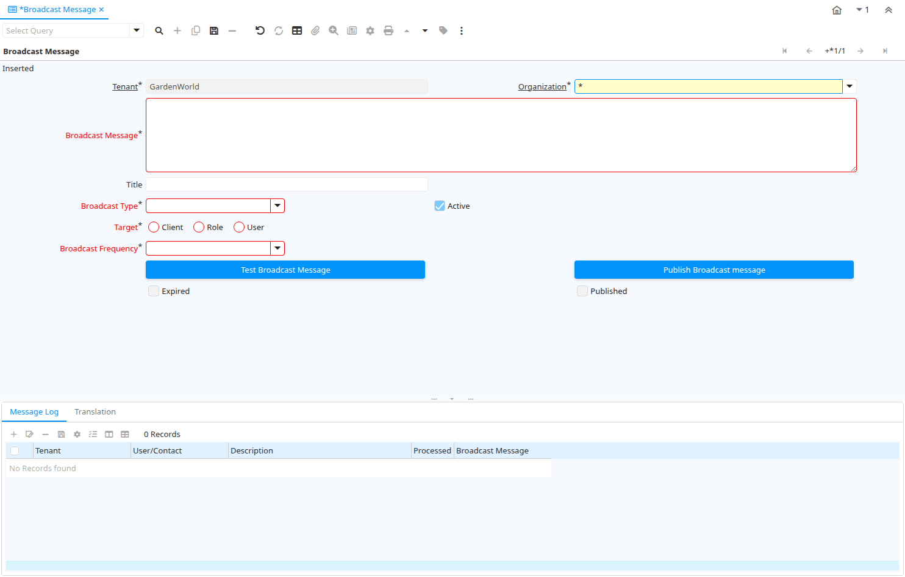

# Broadcast Message

Window ID 200023

*24/11/2012 → 02/12/2012*

**Description:** Broadcast Message

**Comment/Help:** Window allows to enter broadcast messages

## Tab: Broadcast Message

*Tab Level 0 · Created 24/11/2012 · Updated 17/04/2013*

**Description:** Broadcast Message

| **Name** | **Description** | **Comment/Help** | **Technical Data** |
|---|---|---|---|
| Tenant | Tenant for this installation. | A Tenant is a company or a legal entity. You cannot share data between Tenants. | AD_BroadcastMessage.AD_Client_ID<small> numeric(10)   Table Direct</small> |
| Organization | Organizational entity within tenant | An organization is a unit of your tenant or legal entity - examples are store, department. You can share data between organizations. | AD_BroadcastMessage.AD_Org_ID<small> numeric(10)   Table Direct</small> |
| Broadcast Message | Broadcast Message |  | AD_BroadcastMessage.BroadcastMessage<small> text   Text Long</small> |
| Title | Name this entity is referred to as | The Title indicates the name that an entity is referred to as. | AD_BroadcastMessage.Title<small> character varying(60)   String</small> |
| Broadcast Type | Type of Broadcast |  | AD_BroadcastMessage.BroadcastType<small> character varying(32)   List</small> |
| Active | The record is active in the system | There are two methods of making records unavailable in the system: One is to delete the record, the other is to de-activate the record. A de-activated record is not available for selection, but available for reports. There are two reasons for de-activating and not deleting records: (1) The system requires the record for audit purposes. (2) The record is referenced by other records. E.g., you cannot delete a Business Partner, if there are invoices for this partner record existing. You de-activate the Business Partner and prevent that this record is used for future entries. | AD_BroadcastMessage.IsActive<small> character(1)   Yes-No</small> |
| Target | Target tenant |  | AD_BroadcastMessage.Target<small> character varying(60)   Radio Group List</small> |
| Role | Responsibility Role | The Role determines security and access a user who has this Role will have in the System. | AD_BroadcastMessage.AD_Role_ID<small> numeric(10)   Table Direct</small> |
| User/Contact | User within the system - Internal or Business Partner Contact | The User identifies a unique user in the system. This could be an internal user or a business partner contact | AD_BroadcastMessage.AD_User_ID<small> numeric(10)   Table Direct</small> |
| Broadcast Frequency | How Many Times Message Should be Broadcasted |  | AD_BroadcastMessage.BroadcastFrequency<small> character varying(60)   List</small> |
| Expire On | Expire On |  | AD_BroadcastMessage.Expiration<small> timestamp without time zone   Date+Time</small> |
| Test Broadcast Message | Test and verify message before broadcasting |  | AD_BroadcastMessage.TestMessage<small> character(1)   Button</small> |
| Publish Broadcast message | Publish Broadcast message | Selecting ok will publish message.  Do you want to publish message? | AD_BroadcastMessage.Publish<small> character(1)   Button</small> |
| Expire Broadcast Message | Expire Broadcast Message | Selecting OK will expire current message. Do you want to expire message? | AD_BroadcastMessage.ExpireNow<small> character(1)   Button</small> |
| Expired |  |  | AD_BroadcastMessage.Expired<small> character(1)   Yes-No</small> |
| Published | The Topic is published and can be viewed | If not selected, the Topic is not visible to the general public. | AD_BroadcastMessage.IsPublished<small> character(1)   Yes-No</small> |

## Tab: › Message Log

*Tab Level 1 · Created 24/11/2012 · Updated 25/11/2012*

| **Name** | **Description** | **Comment/Help** | **Technical Data** |
|---|---|---|---|
| Tenant | Tenant for this installation. | A Tenant is a company or a legal entity. You cannot share data between Tenants. | AD_Note.AD_Client_ID<small> numeric(10)   Table Direct</small> |
| Organization | Organizational entity within tenant | An organization is a unit of your tenant or legal entity - examples are store, department. You can share data between organizations. | AD_Note.AD_Org_ID<small> numeric(10)   Table Direct</small> |
| Message | System Message | Information and Error messages | AD_Note.AD_Message_ID<small> numeric(10)   Search</small> |
| User/Contact | User within the system - Internal or Business Partner Contact | The User identifies a unique user in the system. This could be an internal user or a business partner contact | AD_Note.AD_User_ID<small> numeric(10)   Table Direct</small> |
| Workflow Activity | Workflow Activity | The Workflow Activity is the actual Workflow Node in a Workflow Process instance | AD_Note.AD_WF_Activity_ID<small> numeric(10)   Search</small> |
| Table | Database Table information | The Database Table provides the information of the table definition | AD_Note.AD_Table_ID<small> numeric(10)   Table Direct</small> |
| Record ID | Direct internal record ID | The Record ID is the internal unique identifier of a record. Please note that zooming to the record may not be successful for Orders, Invoices and Shipment/Receipts as sometimes the Sales Order type is not known. | AD_Note.Record_ID<small> numeric(10)   Record ID</small> |
| Reference | Reference for this record | The Reference displays the source document number. | AD_Note.Reference<small> character varying(255)   String</small> |
| Text Message | Text Message |  | AD_Note.TextMsg<small> character varying(2000)   Text</small> |
| Description | Optional short description of the record | A description is limited to 255 characters. | AD_Note.Description<small> character varying(255)   String</small> |
| Broadcast Message | Broadcast Message |  | AD_Note.AD_BroadcastMessage_ID<small> numeric(10)   Table Direct</small> |
| Delete Notices | Delete all Notices |  | AD_Note.Processing<small> character(1)   Button</small> |
| Processed | The document has been processed | The Processed checkbox indicates that a document has been processed. | AD_Note.Processed<small> character(1)   Yes-No</small> |

## Tab: › Translation

*Tab Level 1 · Created 21/03/2014 · Updated 27/10/2024*

| **Name** | **Description** | **Comment/Help** | **Technical Data** |
|---|---|---|---|
| Tenant | Tenant for this installation. | A Tenant is a company or a legal entity. You cannot share data between Tenants. | AD_BroadcastMessage_Trl.AD_Client_ID<small> numeric(10)   Table Direct</small> |
| Organization | Organizational entity within tenant | An organization is a unit of your tenant or legal entity - examples are store, department. You can share data between organizations. | AD_BroadcastMessage_Trl.AD_Org_ID<small> numeric(10)   Table Direct</small> |
| Broadcast Message | Broadcast Message |  | AD_BroadcastMessage_Trl.AD_BroadcastMessage_ID<small> numeric(10)   Search</small> |
| Language | Language for this entity | The Language identifies the language to use for display and formatting | AD_BroadcastMessage_Trl.AD_Language<small> character varying(6)   Table</small> |
| Active | The record is active in the system | There are two methods of making records unavailable in the system: One is to delete the record, the other is to de-activate the record. A de-activated record is not available for selection, but available for reports. There are two reasons for de-activating and not deleting records: (1) The system requires the record for audit purposes. (2) The record is referenced by other records. E.g., you cannot delete a Business Partner, if there are invoices for this partner record existing. You de-activate the Business Partner and prevent that this record is used for future entries. | AD_BroadcastMessage_Trl.IsActive<small> character(1)   Yes-No</small> |
| Translated | This column is translated | The Translated checkbox indicates if this column is translated. | AD_BroadcastMessage_Trl.IsTranslated<small> character(1)   Yes-No</small> |
| Title | Name this entity is referred to as | The Title indicates the name that an entity is referred to as. | AD_BroadcastMessage_Trl.Title<small> character varying(60)   String</small> |
| Broadcast Message | Broadcast Message |  | AD_BroadcastMessage_Trl.BroadcastMessage<small> text   Text Long</small> |

