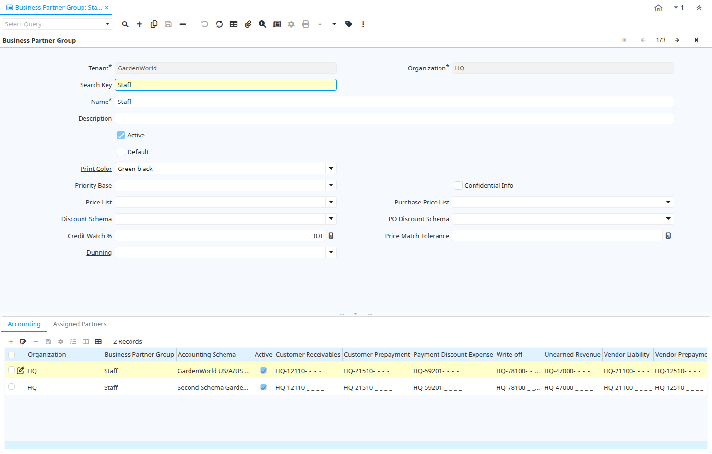

# Business Partner Group

Window ID 192

*17/12/2000 → 02/01/2000*

**Description:** Maintain Business Partner Groups

**Comment/Help:** The Business Partner Group window allows you to define the accounting parameters at a group level.  If you define the accounting parameters for a group any Business Partner entered using this group will have these accounting parameters automatically populated.  You can then make any modifications necessary at the Business Partner level.

## Tab: Business Partner Group

*Tab Level 0 · Created 17/12/2000 · Updated 02/01/2000*

**Description:** Business Partner Groups for Reporting Accounting Defaults

**Comment/Help:** The Business Partner Group Tab allow for the association of business partners for reporting and accounting defaults.

| **Name** | **Description** | **Comment/Help** | **Technical Data** |
|---|---|---|---|
| Tenant | Tenant for this installation. | A Tenant is a company or a legal entity. You cannot share data between Tenants. | C_BP_Group.AD_Client_ID<small> numeric(10)   Table Direct</small> |
| Organization | Organizational entity within tenant | An organization is a unit of your tenant or legal entity - examples are store, department. You can share data between organizations. | C_BP_Group.AD_Org_ID<small> numeric(10)   Table Direct</small> |
| Search Key | Search key for the record in the format required - must be unique | A search key allows you a fast method of finding a particular record. If you leave the search key empty, the system automatically creates a numeric number.  The document sequence used for this fallback number is defined in the "Maintain Sequence" window with the name "DocumentNo_&lt;TableName&gt;", where TableName is the actual name of the table (e.g. C_Order). | C_BP_Group.Value<small> character varying(40)   String</small> |
| Name | Alphanumeric identifier of the entity | The name of an entity (record) is used as an default search option in addition to the search key. The name is up to 60 characters in length. | C_BP_Group.Name<small> character varying(60)   String</small> |
| Description | Optional short description of the record | A description is limited to 255 characters. | C_BP_Group.Description<small> character varying(255)   String</small> |
| Active | The record is active in the system | There are two methods of making records unavailable in the system: One is to delete the record, the other is to de-activate the record. A de-activated record is not available for selection, but available for reports. There are two reasons for de-activating and not deleting records: (1) The system requires the record for audit purposes. (2) The record is referenced by other records. E.g., you cannot delete a Business Partner, if there are invoices for this partner record existing. You de-activate the Business Partner and prevent that this record is used for future entries. | C_BP_Group.IsActive<small> character(1)   Yes-No</small> |
| Default | Default value | The Default Checkbox indicates if this record will be used as a default value. | C_BP_Group.IsDefault<small> character(1)   Yes-No</small> |
| Print Color | Color used for printing and display | Colors used for printing and display | C_BP_Group.AD_PrintColor_ID<small> numeric(10)   Table Direct</small> |
| Priority Base | Base of Priority | When deriving the Priority from Importance, the Base is "added" to the User Importance. | C_BP_Group.PriorityBase<small> character(1)   List</small> |
| Confidential Info | Can enter confidential information | When entering/updating Requests over the web, the user can mark his info as confidential | C_BP_Group.IsConfidentialInfo<small> character(1)   Yes-No</small> |
| Price List | Unique identifier of a Price List | Price Lists are used to determine the pricing, margin and cost of items purchased or sold. | C_BP_Group.M_PriceList_ID<small> numeric(10)   Table Direct</small> |
| Purchase Price List | Price List used by this Business Partner | Identifies the price list used by a Vendor for products purchased by this organization. | C_BP_Group.PO_PriceList_ID<small> numeric(10)   Table</small> |
| Discount Schema | Schema to calculate the trade discount percentage | After calculation of the (standard) price, the trade discount percentage is calculated and applied resulting in the final price. | C_BP_Group.M_DiscountSchema_ID<small> numeric(10)   Table</small> |
| PO Discount Schema | Schema to calculate the purchase trade discount percentage |  | C_BP_Group.PO_DiscountSchema_ID<small> numeric(10)   Table</small> |
| Credit Watch % | Credit Watch - Percent of Credit Limit when OK switches to Watch | If iDempiere maintains credit status, the status "Credit OK" is moved to "Credit Watch" if the credit available reaches the percent entered.  If not defined, 90% is used. | C_BP_Group.CreditWatchPercent<small> numeric   Number</small> |
| Price Match Tolerance | PO-Invoice Match Price Tolerance in percent of the purchase price | Tolerance in Percent of matching the purchase order price to the invoice price.  The difference is posted as Invoice Price Tolerance for Standard Costing.  If defined, the PO-Invoice match must be explicitly approved, if the matching difference is greater then the tolerance.&lt;br&gt; Example: if the purchase price is $100 and the tolerance is 1 (percent), the invoice price must be between $99 and 101 to be automatically approved. | C_BP_Group.PriceMatchTolerance<small> numeric   Number</small> |
| Dunning | Dunning Rules for overdue invoices | The Dunning indicates the rules and method of dunning for past due payments. | C_BP_Group.C_Dunning_ID<small> numeric(10)   Table Direct</small> |

## Tab: › Accounting

*Tab Level 1 · Created 17/12/2000 · Updated 05/03/2013*

**Description:** Define Accounting

**Comment/Help:** The Accounting Tab defines the default accounts for any business partner that references this group.  These default values can be modified for each business partner if required.

| **Name** | **Description** | **Comment/Help** | **Technical Data** |
|---|---|---|---|
| Tenant | Tenant for this installation. | A Tenant is a company or a legal entity. You cannot share data between Tenants. | C_BP_Group_Acct.AD_Client_ID<small> numeric(10)   Table Direct</small> |
| Organization | Organizational entity within tenant | An organization is a unit of your tenant or legal entity - examples are store, department. You can share data between organizations. | C_BP_Group_Acct.AD_Org_ID<small> numeric(10)   Table Direct</small> |
| Business Partner Group | Business Partner Group | The Business Partner Group provides a method of defining defaults to be used for individual Business Partners. | C_BP_Group_Acct.C_BP_Group_ID<small> numeric(10)   Table Direct</small> |
| Accounting Schema | Rules for accounting | An Accounting Schema defines the rules used in accounting such as costing method, currency and calendar | C_BP_Group_Acct.C_AcctSchema_ID<small> numeric(10)   Table Direct</small> |
| Active | The record is active in the system | There are two methods of making records unavailable in the system: One is to delete the record, the other is to de-activate the record. A de-activated record is not available for selection, but available for reports. There are two reasons for de-activating and not deleting records: (1) The system requires the record for audit purposes. (2) The record is referenced by other records. E.g., you cannot delete a Business Partner, if there are invoices for this partner record existing. You de-activate the Business Partner and prevent that this record is used for future entries. | C_BP_Group_Acct.IsActive<small> character(1)   Yes-No</small> |
| Not-invoiced Receipts | Account for not-invoiced Material Receipts | The Not Invoiced Receipts account indicates the account used for recording receipts for materials that have not yet been invoiced. | C_BP_Group_Acct.NotInvoicedReceipts_Acct<small> numeric(10)   Account</small> |
| Unearned Revenue | Account for unearned revenue | The Unearned Revenue indicates the account used for recording invoices sent for products or services not yet delivered.  It is used in revenue recognition | C_BP_Group_Acct.UnEarnedRevenue_Acct<small> numeric(10)   Account</small> |
| Payment Discount Expense | Payment Discount Expense Account | Indicates the account to be charged for payment discount expenses. | C_BP_Group_Acct.PayDiscount_Exp_Acct<small> numeric(10)   Account</small> |
| Payment Discount Revenue | Payment Discount Revenue Account | Indicates the account to be charged for payment discount revenues. | C_BP_Group_Acct.PayDiscount_Rev_Acct<small> numeric(10)   Account</small> |
| Write-off | Account for Receivables write-off | The Write Off Account identifies the account to book write off transactions to. | C_BP_Group_Acct.WriteOff_Acct<small> numeric(10)   Account</small> |
| Customer Prepayment | Account for customer prepayments | The Customer Prepayment account indicates the account to be used for recording prepayments from a customer. | C_BP_Group_Acct.C_Prepayment_Acct<small> numeric(10)   Account</small> |
| Vendor Liability | Account for Vendor Liability | The Vendor Liability account indicates the account used for recording transactions for vendor liabilities | C_BP_Group_Acct.V_Liability_Acct<small> numeric(10)   Account</small> |
| Customer Receivables | Account for Customer Receivables | The Customer Receivables Accounts indicates the account to be used for recording transaction for customers receivables. | C_BP_Group_Acct.C_Receivable_Acct<small> numeric(10)   Account</small> |
| Vendor Prepayment | Account for Vendor Prepayments | The Vendor Prepayment Account indicates the account used to record prepayments from a vendor. | C_BP_Group_Acct.V_Prepayment_Acct<small> numeric(10)   Account</small> |
| Copy Accounts | Copy and overwrite Accounts to Business Partners of this group | If you copy and overwrite the current default values, you may have to repeat previous updates (e.g. set the receivebles account, ...) | C_BP_Group_Acct.Processing<small> character(1)   Button</small> |

## Tab: › Assigned Partners

*Tab Level 1 · Created 19/12/2005 · Updated 19/12/2005*

**Description:** Business Partners in Group

| **Name** | **Description** | **Comment/Help** | **Technical Data** |
|---|---|---|---|
| Tenant | Tenant for this installation. | A Tenant is a company or a legal entity. You cannot share data between Tenants. | C_BPartner.AD_Client_ID<small> numeric(10)   Table Direct</small> |
| Organization | Organizational entity within tenant | An organization is a unit of your tenant or legal entity - examples are store, department. You can share data between organizations. | C_BPartner.AD_Org_ID<small> numeric(10)   Table Direct</small> |
| Business Partner Group | Business Partner Group | The Business Partner Group provides a method of defining defaults to be used for individual Business Partners. | C_BPartner.C_BP_Group_ID<small> numeric(10)   Table Direct</small> |
| Search Key | Search key for the record in the format required - must be unique | A search key allows you a fast method of finding a particular record. If you leave the search key empty, the system automatically creates a numeric number.  The document sequence used for this fallback number is defined in the "Maintain Sequence" window with the name "DocumentNo_&lt;TableName&gt;", where TableName is the actual name of the table (e.g. C_Order). | C_BPartner.Value<small> character varying(40)   String</small> |
| Greeting | Greeting to print on correspondence | The Greeting identifies the greeting to print on correspondence. | C_BPartner.C_Greeting_ID<small> numeric(10)   Table Direct</small> |
| Name | Alphanumeric identifier of the entity | The name of an entity (record) is used as an default search option in addition to the search key. The name is up to 60 characters in length. | C_BPartner.Name<small> character varying(120)   String</small> |
| Name 2 | Additional Name |  | C_BPartner.Name2<small> character varying(60)   String</small> |
| Description | Optional short description of the record | A description is limited to 255 characters. | C_BPartner.Description<small> character varying(255)   String</small> |
| Active | The record is active in the system | There are two methods of making records unavailable in the system: One is to delete the record, the other is to de-activate the record. A de-activated record is not available for selection, but available for reports. There are two reasons for de-activating and not deleting records: (1) The system requires the record for audit purposes. (2) The record is referenced by other records. E.g., you cannot delete a Business Partner, if there are invoices for this partner record existing. You de-activate the Business Partner and prevent that this record is used for future entries. | C_BPartner.IsActive<small> character(1)   Yes-No</small> |
| Summary Level | This is a summary entity | A summary entity represents a branch in a tree rather than an end-node. Summary entities are used for reporting and do not have own values. | C_BPartner.IsSummary<small> character(1)   Yes-No</small> |
| Credit Status | Business Partner Credit Status | Credit Management is inactive if Credit Status is No Credit Check, Credit Stop or if the Credit Limit is 0. If active, the status is set automatically set to Credit Hold, if the Total Open Balance (including Vendor activities)  is higher then the Credit Limit. It is set to Credit Watch, if above 90% of the Credit Limit and Credit OK otherwise. | C_BPartner.SOCreditStatus<small> character(1)   List</small> |
| Open Balance | Total Open Balance Amount in primary Accounting Currency | The Total Open Balance Amount is the calculated open item amount for Customer and Vendor activity.  If the Balance is below zero, we owe the Business Partner.  The amount is used for Credit Management. Invoices and Payment Allocations determine the Open Balance (i.e. not Orders or Payments). | C_BPartner.TotalOpenBalance<small> numeric   Amount</small> |
| Tax ID | Tax Identification | The Tax ID field identifies the legal Identification number of this Entity. | C_BPartner.TaxID<small> character varying(20)   String</small> |
| SO Tax exempt | Business partner is exempt from tax on sales | If a business partner is exempt from tax on sales, the exempt tax rate is used. For this, you need to set up a tax rate with a 0% rate and indicate that this is your tax exempt rate.  This is required for tax reporting, so that you can track tax exempt transactions. | C_BPartner.IsTaxExempt<small> character(1)   Yes-No</small> |
| D-U-N-S | Dun &amp; Bradstreet Number | Used for EDI - For details see   www.dnb.com/dunsno/list.htm | C_BPartner.DUNS<small> character varying(11)   String</small> |
| Reference No | Your customer or vendor number at the Business Partner's site | The reference number can be printed on orders and invoices to allow your business partner to faster identify your records. | C_BPartner.ReferenceNo<small> character varying(40)   String</small> |
| NAICS/SIC | Standard Industry Code or its successor NAIC - http://www.osha.gov/oshstats/sicser.html | The NAICS/SIC identifies either of these codes that may be applicable to this Business Partner. | C_BPartner.NAICS<small> character varying(6)   String</small> |
| Rating | Classification or Importance | The Rating is used to differentiate the importance | C_BPartner.Rating<small> character(1)   String</small> |
| URL | Full URL address - e.g. http://www.idempiere.org | The URL defines an fully qualified web address like http://www.idempiere.org | C_BPartner.URL<small> character varying(120)   URL</small> |
| Language | Language for this Business Partner if Multi-Language enabled | The Language identifies the language to use for display and formatting documents. It requires, that on Tenant level, Multi-Lingual documents are selected and that you have created/loaded the language. | C_BPartner.AD_Language<small> character varying(6)   Table</small> |
| Prospect | Indicates this is a Prospect | The Prospect checkbox indicates an entity that is an active prospect. | C_BPartner.IsProspect<small> character(1)   Yes-No</small> |
| Potential Life Time Value | Total Revenue expected | The Potential Life Time Value is the anticipated revenue in primary accounting currency to be generated by the Business Partner. | C_BPartner.PotentialLifeTimeValue<small> numeric   Amount</small> |
| Actual Life Time Value | Actual Life Time Revenue | The Actual Life Time Value is the recorded revenue in primary accounting currency generated by the Business Partner. | C_BPartner.ActualLifeTimeValue<small> numeric   Amount</small> |
| Acquisition Cost | The cost of gaining the prospect as a customer | The Acquisition Cost identifies the cost associated with making this prospect a customer. | C_BPartner.AcqusitionCost<small> numeric   Costs+Prices</small> |
| Employees | Number of employees | Indicates the number of employees for this Business Partner.  This field displays only for Prospects. | C_BPartner.NumberEmployees<small> numeric(10)   Integer</small> |
| Share | Share of Customer's business as a percentage | The Share indicates the percentage of this Business Partner's volume of the products supplied. | C_BPartner.ShareOfCustomer<small> numeric(10)   Integer</small> |
| Sales Volume in 1.000 | Total Volume of Sales in Thousands of Currency | The Sales Volume indicates the total volume of sales for a Business Partner. | C_BPartner.SalesVolume<small> numeric(10)   Integer</small> |
| First Sale | Date of First Sale | The First Sale Date identifies the date of the first sale to this Business Partner | C_BPartner.FirstSale<small> timestamp without time zone   Date</small> |

