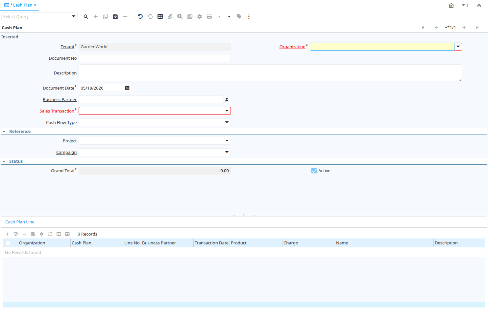

# Cash Plan

Window ID 53134

*08/12/2010 → 03/06/2021*

## Tab: Cash Plan

*Tab Level 0 · Created 08/12/2010 · Updated 08/12/2010*

| **Name** | **Description** | **Comment/Help** | **Technical Data** |
|---|---|---|---|
| Tenant | Tenant for this installation. | A Tenant is a company or a legal entity. You cannot share data between Tenants. | C_CashPlan.AD_Client_ID<small> numeric(10)   Table Direct</small> |
| Organization | Organizational entity within tenant | An organization is a unit of your tenant or legal entity - examples are store, department. You can share data between organizations. | C_CashPlan.AD_Org_ID<small> numeric(10)   Table Direct</small> |
| Document No | Document sequence number of the document | The document number is usually automatically generated by the system and determined by the document type of the document. If the document is not saved, the preliminary number is displayed in "&lt;&gt;".  If the document type of your document has no automatic document sequence defined, the field is empty if you create a new document. This is for documents which usually have an external number (like vendor invoice).  If you leave the field empty, the system will generate a document number for you. The document sequence used for this fallback number is defined in the "Maintain Sequence" window with the name "DocumentNo_&lt;TableName&gt;", where TableName is the actual name of the table (e.g. C_Order). | C_CashPlan.DocumentNo<small> character varying(30)   String</small> |
| Description | Optional short description of the record | A description is limited to 255 characters. | C_CashPlan.Description<small> character varying(255)   Text</small> |
| Document Date | Date of the Document | The Document Date indicates the date the document was generated.  It may or may not be the same as the accounting date. | C_CashPlan.DateDoc<small> timestamp without time zone   Date</small> |
| Business Partner | Identifies a Business Partner | A Business Partner is anyone with whom you transact.  This can include Vendor, Customer, Employee or Salesperson | C_CashPlan.C_BPartner_ID<small> numeric(10)   Search</small> |
| Sales Transaction | This is a Sales Transaction | The Sales Transaction checkbox indicates if this item is a Sales Transaction. | C_CashPlan.IsSOTrx<small> character(1)   Yes-No</small> |
| Cash Flow Type |  |  | C_CashPlan.CashFlowType<small> character(1)   List</small> |
| Generate Periodic Plan |  |  | C_CashPlan.GeneratePeriodic<small> character(1)   Button</small> |
| Project | Financial Project | A Project allows you to track and control internal or external activities. | C_CashPlan.C_Project_ID<small> numeric(10)   Table Direct</small> |
| Activity | Business Activity | Activities indicate tasks that are performed and used to utilize Activity based Costing | C_CashPlan.C_Activity_ID<small> numeric(10)   Table Direct</small> |
| Campaign | Marketing Campaign | The Campaign defines a unique marketing program.  Projects can be associated with a pre defined Marketing Campaign.  You can then report based on a specific Campaign. | C_CashPlan.C_Campaign_ID<small> numeric(10)   Table Direct</small> |
| Trx Organization | Performing or initiating organization | The organization which performs or initiates this transaction (for another organization).  The owning Organization may not be the transaction organization in a service bureau environment, with centralized services, and inter-organization transactions. | C_CashPlan.AD_OrgTrx_ID<small> numeric(10)   Table</small> |
| User Element List 1 | User defined list element #1 | The user defined element displays the optional elements that have been defined for this account combination. | C_CashPlan.User1_ID<small> numeric(10)   Search</small> |
| User Element List 2 | User defined list element #2 | The user defined element displays the optional elements that have been defined for this account combination. | C_CashPlan.User2_ID<small> numeric(10)   Search</small> |
| Grand Total | Total amount of document | The Grand Total displays the total amount including Tax and Freight in document currency | C_CashPlan.GrandTotal<small> numeric   Amount</small> |
| Copy From Cash Plan | Copy From Another Cash Plan | Copy From Another Cash Plan | C_CashPlan.CopyFrom<small> character(1)   Button</small> |
| Active | The record is active in the system | There are two methods of making records unavailable in the system: One is to delete the record, the other is to de-activate the record. A de-activated record is not available for selection, but available for reports. There are two reasons for de-activating and not deleting records: (1) The system requires the record for audit purposes. (2) The record is referenced by other records. E.g., you cannot delete a Business Partner, if there are invoices for this partner record existing. You de-activate the Business Partner and prevent that this record is used for future entries. | C_CashPlan.IsActive<small> character(1)   Yes-No</small> |

## Tab: › Cash Plan Line

*Tab Level 1 · Created 08/12/2010 · Updated 08/12/2010*

| **Name** | **Description** | **Comment/Help** | **Technical Data** |
|---|---|---|---|
| Tenant | Tenant for this installation. | A Tenant is a company or a legal entity. You cannot share data between Tenants. | C_CashPlanLine.AD_Client_ID<small> numeric(10)   Table Direct</small> |
| Organization | Organizational entity within tenant | An organization is a unit of your tenant or legal entity - examples are store, department. You can share data between organizations. | C_CashPlanLine.AD_Org_ID<small> numeric(10)   Table Direct</small> |
| Cash Plan |  |  | C_CashPlanLine.C_CashPlan_ID<small> numeric(10)   Search</small> |
| Line No | Unique line for this document | Indicates the unique line for a document.  It will also control the display order of the lines within a document. | C_CashPlanLine.Line<small> numeric(10)   Integer</small> |
| Business Partner | Identifies a Business Partner | A Business Partner is anyone with whom you transact.  This can include Vendor, Customer, Employee or Salesperson | C_CashPlanLine.C_BPartner_ID<small> numeric(10)   Search</small> |
| Transaction Date | Transaction Date | The Transaction Date indicates the date of the transaction. | C_CashPlanLine.DateTrx<small> timestamp without time zone   Date</small> |
| Product | Product, Service, Item | Identifies an item which is either purchased or sold in this organization. | C_CashPlanLine.M_Product_ID<small> numeric(10)   Search</small> |
| Charge | Additional document charges | The Charge indicates a type of Charge (Handling, Shipping, Restocking) | C_CashPlanLine.C_Charge_ID<small> numeric(10)   Table Direct</small> |
| Name | Alphanumeric identifier of the entity | The name of an entity (record) is used as an default search option in addition to the search key. The name is up to 60 characters in length. | C_CashPlanLine.Name<small> character varying(60)   String</small> |
| Description | Optional short description of the record | A description is limited to 255 characters. | C_CashPlanLine.Description<small> character varying(255)   Text</small> |
| Quantity | The Quantity Entered is based on the selected UoM | The Quantity Entered is converted to base product UoM quantity | C_CashPlanLine.QtyEntered<small> numeric   Quantity</small> |
| Probability |  |  | C_CashPlanLine.Probability<small> numeric   Number</small> |
| Line Total | Total line amount incl. Tax | Total line amount | C_CashPlanLine.LineTotalAmt<small> numeric   Amount</small> |
| Project | Financial Project | A Project allows you to track and control internal or external activities. | C_CashPlanLine.C_Project_ID<small> numeric(10)   Table Direct</small> |
| Activity | Business Activity | Activities indicate tasks that are performed and used to utilize Activity based Costing | C_CashPlanLine.C_Activity_ID<small> numeric(10)   Table Direct</small> |
| Campaign | Marketing Campaign | The Campaign defines a unique marketing program.  Projects can be associated with a pre defined Marketing Campaign.  You can then report based on a specific Campaign. | C_CashPlanLine.C_Campaign_ID<small> numeric(10)   Table Direct</small> |
| Trx Organization | Performing or initiating organization | The organization which performs or initiates this transaction (for another organization).  The owning Organization may not be the transaction organization in a service bureau environment, with centralized services, and inter-organization transactions. | C_CashPlanLine.AD_OrgTrx_ID<small> numeric(10)   Table</small> |
| User Element List 1 | User defined list element #1 | The user defined element displays the optional elements that have been defined for this account combination. | C_CashPlanLine.User1_ID<small> numeric(10)   Search</small> |
| User Element List 2 | User defined list element #2 | The user defined element displays the optional elements that have been defined for this account combination. | C_CashPlanLine.User2_ID<small> numeric(10)   Search</small> |

