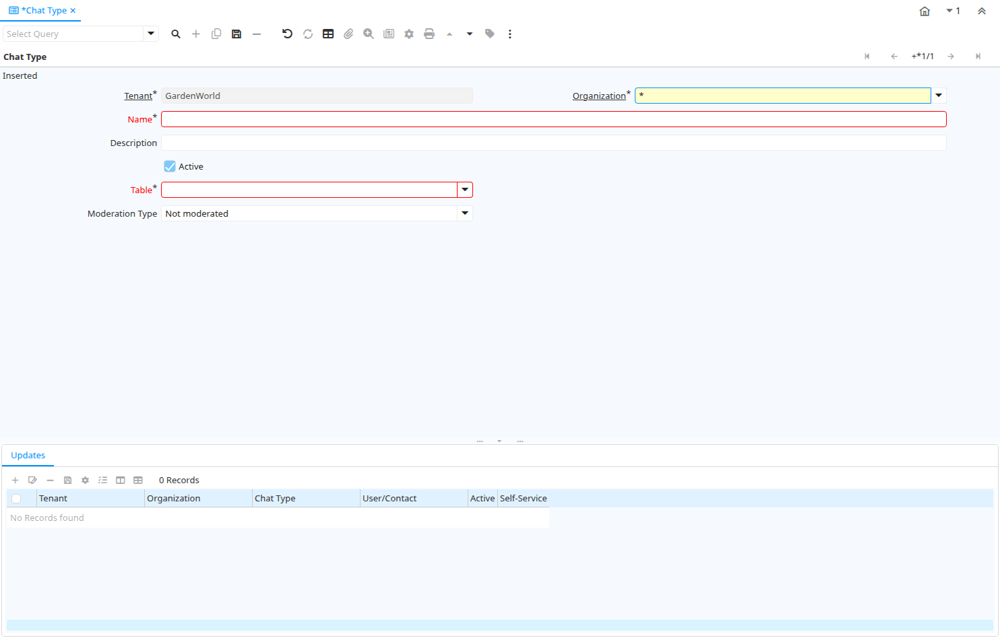

# Chat Type

Window ID 380

*16/04/2006 → 18/04/2006*

**Description:** Maintain Chat Types

**Comment/Help:** Chat Types

## Tab: Chat Type

*Tab Level 0 · Created 18/04/2006 · Updated 18/04/2006*

**Description:** Maintain Type of discussion / chat

**Comment/Help:** Chat Type allows you to receive subscriptions for particular content of discussions. It is linked to a table.

| **Name** | **Description** | **Comment/Help** | **Technical Data** |
|---|---|---|---|
| Tenant | Tenant for this installation. | A Tenant is a company or a legal entity. You cannot share data between Tenants. | CM_ChatType.AD_Client_ID<small> numeric(10)   Table Direct</small> |
| Organization | Organizational entity within tenant | An organization is a unit of your tenant or legal entity - examples are store, department. You can share data between organizations. | CM_ChatType.AD_Org_ID<small> numeric(10)   Table Direct</small> |
| Name | Alphanumeric identifier of the entity | The name of an entity (record) is used as an default search option in addition to the search key. The name is up to 60 characters in length. | CM_ChatType.Name<small> character varying(60)   String</small> |
| Description | Optional short description of the record | A description is limited to 255 characters. | CM_ChatType.Description<small> character varying(255)   String</small> |
| Active | The record is active in the system | There are two methods of making records unavailable in the system: One is to delete the record, the other is to de-activate the record. A de-activated record is not available for selection, but available for reports. There are two reasons for de-activating and not deleting records: (1) The system requires the record for audit purposes. (2) The record is referenced by other records. E.g., you cannot delete a Business Partner, if there are invoices for this partner record existing. You de-activate the Business Partner and prevent that this record is used for future entries. | CM_ChatType.IsActive<small> character(1)   Yes-No</small> |
| Table | Database Table information | The Database Table provides the information of the table definition | CM_ChatType.AD_Table_ID<small> numeric(10)   Table Direct</small> |
| Moderation Type | Type of moderation |  | CM_ChatType.ModerationType<small> character(1)   List</small> |

## Tab: › Updates

*Tab Level 1 · Created 18/04/2006 · Updated 18/04/2006*

**Description:** Subscribers for the Chat Type

**Comment/Help:** Subscribers receive updates per email or notice

| **Name** | **Description** | **Comment/Help** | **Technical Data** |
|---|---|---|---|
| Tenant | Tenant for this installation. | A Tenant is a company or a legal entity. You cannot share data between Tenants. | CM_ChatTypeUpdate.AD_Client_ID<small> numeric(10)   Table Direct</small> |
| Organization | Organizational entity within tenant | An organization is a unit of your tenant or legal entity - examples are store, department. You can share data between organizations. | CM_ChatTypeUpdate.AD_Org_ID<small> numeric(10)   Table Direct</small> |
| Chat Type | Type of discussion / chat | Chat Type allows you to receive subscriptions for particular content of discussions. It is linked to a table. | CM_ChatTypeUpdate.CM_ChatType_ID<small> numeric(10)   Table Direct</small> |
| User/Contact | User within the system - Internal or Business Partner Contact | The User identifies a unique user in the system. This could be an internal user or a business partner contact | CM_ChatTypeUpdate.AD_User_ID<small> numeric(10)   Table Direct</small> |
| Active | The record is active in the system | There are two methods of making records unavailable in the system: One is to delete the record, the other is to de-activate the record. A de-activated record is not available for selection, but available for reports. There are two reasons for de-activating and not deleting records: (1) The system requires the record for audit purposes. (2) The record is referenced by other records. E.g., you cannot delete a Business Partner, if there are invoices for this partner record existing. You de-activate the Business Partner and prevent that this record is used for future entries. | CM_ChatTypeUpdate.IsActive<small> character(1)   Yes-No</small> |
| Self-Service | This is a Self-Service entry or this entry can be changed via Self-Service | Self-Service allows users to enter data or update their data.  The flag indicates, that this record was entered or created via Self-Service or that the user can change it via the Self-Service functionality. | CM_ChatTypeUpdate.IsSelfService<small> character(1)   Yes-No</small> |

