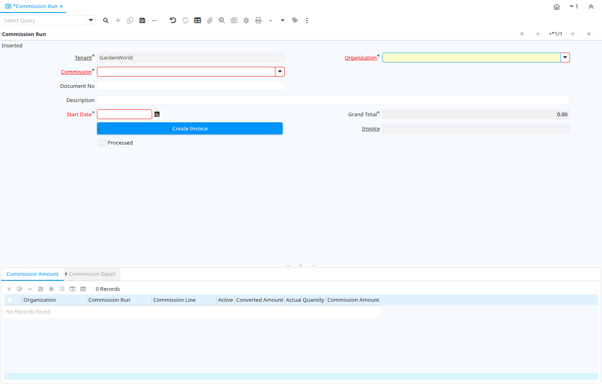

# Commission Run

Window ID 210

*31/03/2001 → 27/02/2026*

**Description:** Check and modify Commissions

**Comment/Help:** The Commission Run Window displays the results of processing commissions.  When the Generate Commission process is selected from the Commissions Window, the results are displayed here. If the result is satisfactory, generate an AP invoice to pay the commission.

## Tab: Commission Run

*Tab Level 0 · Created 31/03/2001 · Updated 02/01/2000*

**Description:** Commission run for a period

**Comment/Help:** Commission run for a period defined in the Commission window.

| **Name** | **Description** | **Comment/Help** | **Technical Data** |
|---|---|---|---|
| Tenant | Tenant for this installation. | A Tenant is a company or a legal entity. You cannot share data between Tenants. | C_CommissionRun.AD_Client_ID<small> numeric(10)   Table Direct</small> |
| Organization | Organizational entity within tenant | An organization is a unit of your tenant or legal entity - examples are store, department. You can share data between organizations. | C_CommissionRun.AD_Org_ID<small> numeric(10)   Table Direct</small> |
| Commission | Commission | The Commission Rules or internal or external company agents, sales reps or vendors. | C_CommissionRun.C_Commission_ID<small> numeric(10)   Table Direct</small> |
| Document No | Document sequence number of the document | The document number is usually automatically generated by the system and determined by the document type of the document. If the document is not saved, the preliminary number is displayed in "&lt;&gt;".  If the document type of your document has no automatic document sequence defined, the field is empty if you create a new document. This is for documents which usually have an external number (like vendor invoice).  If you leave the field empty, the system will generate a document number for you. The document sequence used for this fallback number is defined in the "Maintain Sequence" window with the name "DocumentNo_&lt;TableName&gt;", where TableName is the actual name of the table (e.g. C_Order). | C_CommissionRun.DocumentNo<small> character varying(30)   String</small> |
| Description | Optional short description of the record | A description is limited to 255 characters. | C_CommissionRun.Description<small> character varying(255)   String</small> |
| Start Date | First effective day (inclusive) | The Start Date indicates the first or starting date | C_CommissionRun.StartDate<small> timestamp without time zone   Date</small> |
| Grand Total | Total amount of document | The Grand Total displays the total amount including Tax and Freight in document currency | C_CommissionRun.GrandTotal<small> numeric   Amount</small> |
| Create Invoice | Create Invoice from Commission Calculation |  | C_CommissionRun.Processing<small> character(1)   Button</small> |
| Invoice | Invoice Identifier | The Invoice Document. | C_CommissionRun.C_Invoice_ID<small> numeric(10)   Search</small> |
| Processed | The document has been processed | The Processed checkbox indicates that a document has been processed. | C_CommissionRun.Processed<small> character(1)   Yes-No</small> |

## Tab: › Commission Amount

*Tab Level 1 · Created 31/03/2001 · Updated 02/01/2000*

**Description:** Commission line amounts

**Comment/Help:** For each commission line, a line is generated.  You can overwrite the amount and quantity to modify the commission amount, but the suggested way is creating additional Commission Detail lines.  Please be aware that manual changes will not reconcile with the Commission Details.

| **Name** | **Description** | **Comment/Help** | **Technical Data** |
|---|---|---|---|
| Tenant | Tenant for this installation. | A Tenant is a company or a legal entity. You cannot share data between Tenants. | C_CommissionAmt.AD_Client_ID<small> numeric(10)   Table Direct</small> |
| Organization | Organizational entity within tenant | An organization is a unit of your tenant or legal entity - examples are store, department. You can share data between organizations. | C_CommissionAmt.AD_Org_ID<small> numeric(10)   Table Direct</small> |
| Commission Run | Commission Run or Process | The Commission Run is a unique system defined identifier of a specific run of commission.  When a Commission is processed on the Commission Screen, the Commission Run will display. | C_CommissionAmt.C_CommissionRun_ID<small> numeric(10)   Search</small> |
| Commission Line | Commission Line | The Commission Line is a unique instance of a Commission Run.  If the commission run was done in summary mode then there will be a single line representing the selected documents totals.  If the commission run was done in detail mode then each document that was included in the run will have its own commission line. | C_CommissionAmt.C_CommissionLine_ID<small> numeric(10)   Table Direct</small> |
| Active | The record is active in the system | There are two methods of making records unavailable in the system: One is to delete the record, the other is to de-activate the record. A de-activated record is not available for selection, but available for reports. There are two reasons for de-activating and not deleting records: (1) The system requires the record for audit purposes. (2) The record is referenced by other records. E.g., you cannot delete a Business Partner, if there are invoices for this partner record existing. You de-activate the Business Partner and prevent that this record is used for future entries. | C_CommissionAmt.IsActive<small> character(1)   Yes-No</small> |
| Converted Amount | Converted Amount | The Converted Amount is the result of multiplying the Source Amount by the Conversion Rate for this target currency. | C_CommissionAmt.ConvertedAmt<small> numeric   Amount</small> |
| Actual Quantity | The actual quantity | The Actual Quantity indicates the quantity as referenced on a document. | C_CommissionAmt.ActualQty<small> numeric   Quantity</small> |
| Commission Amount | Commission Amount | The Commission Amount is the total calculated commission.  It is based on the parameters as defined for this Commission Run. | C_CommissionAmt.CommissionAmt<small> numeric   Amount</small> |

## Tab: › › Commission Detail

*Tab Level 2 · Created 09/04/2001 · Updated 02/01/2000*

**Description:** Commission Detail Information

**Comment/Help:** You may alter the amount and quantity of the detail records, but the suggested way is to add new correcting lines.
The amounts are converted from the transaction currency to the Commission Currency (defined in the Commission window) using the start date and the spot exchange rate.

| **Name** | **Description** | **Comment/Help** | **Technical Data** |
|---|---|---|---|
| Tenant | Tenant for this installation. | A Tenant is a company or a legal entity. You cannot share data between Tenants. | C_CommissionDetail.AD_Client_ID<small> numeric(10)   Table Direct</small> |
| Organization | Organizational entity within tenant | An organization is a unit of your tenant or legal entity - examples are store, department. You can share data between organizations. | C_CommissionDetail.AD_Org_ID<small> numeric(10)   Table Direct</small> |
| Commission Amount | Generated Commission Amount  | The Commission Amount indicates the resulting amount from a Commission Run. | C_CommissionDetail.C_CommissionAmt_ID<small> numeric(10)   Search</small> |
| Reference | Reference for this record | The Reference displays the source document number. | C_CommissionDetail.Reference<small> character varying(60)   String</small> |
| Sales Order Line | Sales Order Line | The Sales Order Line is a unique identifier for a line in an order. | C_CommissionDetail.C_OrderLine_ID<small> numeric(10)   Search</small> |
| Invoice Line | Invoice Detail Line | The Invoice Line uniquely identifies a single line of an Invoice. | C_CommissionDetail.C_InvoiceLine_ID<small> numeric(10)   Search</small> |
| Active | The record is active in the system | There are two methods of making records unavailable in the system: One is to delete the record, the other is to de-activate the record. A de-activated record is not available for selection, but available for reports. There are two reasons for de-activating and not deleting records: (1) The system requires the record for audit purposes. (2) The record is referenced by other records. E.g., you cannot delete a Business Partner, if there are invoices for this partner record existing. You de-activate the Business Partner and prevent that this record is used for future entries. | C_CommissionDetail.IsActive<small> character(1)   Yes-No</small> |
| Info | Information | The Information displays data from the source document line. | C_CommissionDetail.Info<small> character varying(60)   String</small> |
| Actual Amount | The actual amount | Actual amount indicates the agreed upon amount for a document. | C_CommissionDetail.ActualAmt<small> numeric   Amount</small> |
| Currency | The Currency for this record | Indicates the Currency to be used when processing or reporting on this record | C_CommissionDetail.C_Currency_ID<small> numeric(10)   Table Direct</small> |
| Converted Amount | Converted Amount | The Converted Amount is the result of multiplying the Source Amount by the Conversion Rate for this target currency. | C_CommissionDetail.ConvertedAmt<small> numeric   Amount</small> |
| Actual Quantity | The actual quantity | The Actual Quantity indicates the quantity as referenced on a document. | C_CommissionDetail.ActualQty<small> numeric   Number</small> |

