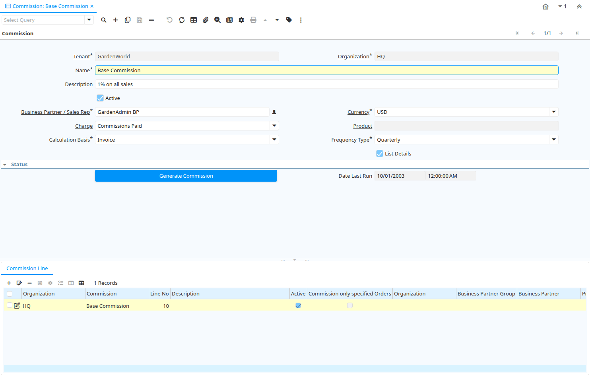

# Commission

Window ID 207

*11/03/2001 → 27/02/2026*

**Description:** Maintain Commissions and Royalties

**Comment/Help:** Define how and when you want the commissions to be calculated and to whom to pay it.
The Commissions Window allows you define how commissions and royalties will be paid. You can pay multiple commissions for the same order or invoice (e.g. to the person entering the transaction, to the person responsible for sale of the product (category) and or business partner (group).

## Tab: Commission

*Tab Level 0 · Created 11/03/2001 · Updated 02/01/2000*

**Description:** Define Commission Rule

**Comment/Help:** Define when to pay a commission to whom.  For each period, you start the calculation of the commission after the transaction for that period are completed or closed.

| **Name** | **Description** | **Comment/Help** | **Technical Data** |
|---|---|---|---|
| Tenant | Tenant for this installation. | A Tenant is a company or a legal entity. You cannot share data between Tenants. | C_Commission.AD_Client_ID<small> numeric(10)   Table Direct</small> |
| Organization | Organizational entity within tenant | An organization is a unit of your tenant or legal entity - examples are store, department. You can share data between organizations. | C_Commission.AD_Org_ID<small> numeric(10)   Table Direct</small> |
| Name | Alphanumeric identifier of the entity | The name of an entity (record) is used as an default search option in addition to the search key. The name is up to 60 characters in length. | C_Commission.Name<small> character varying(60)   String</small> |
| Description | Optional short description of the record | A description is limited to 255 characters. | C_Commission.Description<small> character varying(255)   String</small> |
| Active | The record is active in the system | There are two methods of making records unavailable in the system: One is to delete the record, the other is to de-activate the record. A de-activated record is not available for selection, but available for reports. There are two reasons for de-activating and not deleting records: (1) The system requires the record for audit purposes. (2) The record is referenced by other records. E.g., you cannot delete a Business Partner, if there are invoices for this partner record existing. You de-activate the Business Partner and prevent that this record is used for future entries. | C_Commission.IsActive<small> character(1)   Yes-No</small> |
| Business Partner / Sales Rep | Identifies a Business Partner (Sales Rep) receiving the Commission | The Business Partner should be a vendor and may be a Sales Representative | C_Commission.C_BPartner_ID<small> numeric(10)   Search</small> |
| Currency | The Currency for this record | Indicates the Currency to be used when processing or reporting on this record | C_Commission.C_Currency_ID<small> numeric(10)   Table Direct</small> |
| Charge | Additional document charges | The Charge indicates a type of Charge (Handling, Shipping, Restocking) | C_Commission.C_Charge_ID<small> numeric(10)   Table Direct</small> |
| Product | Product, Service, Item | Identifies an item which is either purchased or sold in this organization. | C_Commission.M_Product_ID<small> numeric(10)   Search</small> |
| Calculation Basis | Basis for the calculation the commission | The Calculation Basis indicates the basis to be used for the commission calculation.  | C_Commission.DocBasisType<small> character(1)   List</small> |
| Frequency Type | Frequency of event | The frequency type is used for calculating the date of the next event. | C_Commission.FrequencyType<small> character(1)   List</small> |
| Copy Lines | Copy Commission Lines from other Commission |  | C_Commission.CreateFrom<small> character(1)   Button</small> |
| List Details | List document details | The List Details checkbox indicates that the details for each document line will be displayed. | C_Commission.ListDetails<small> character(1)   Yes-No</small> |
| Generate Commission | Generate Commission |  | C_Commission.Processing<small> character(1)   Button</small> |
| Date Last Run | Date the process was last run. | The Date Last Run indicates the last time that a process was run. | C_Commission.DateLastRun<small> timestamp without time zone   Date+Time</small> |

## Tab: › Commission Line

*Tab Level 1 · Created 11/03/2001 · Updated 02/01/2000*

**Description:** Define your commission calculation rule

**Comment/Help:** Define the selection criteria for paying the commission. If you do not enter restricting parameters (e.g. for specific Business Partner (Groups) or Product (Categories), etc. all transactions for the period will be used to calculate the commission.

After converting from the transaction to the commission currency,
the formula for calculating the commission is:

(Converted Amount - Subtract Amount) * Amount Multiplier
+ (Actual Quantity - Subtract Quantity) * Quantity Multiplier

You can choose, that only positive amounts (Converted Amount - Subtract Amount) and positive quantities (Actual Quantity - Subtract Quantity) are used in the calculation.

| **Name** | **Description** | **Comment/Help** | **Technical Data** |
|---|---|---|---|
| Tenant | Tenant for this installation. | A Tenant is a company or a legal entity. You cannot share data between Tenants. | C_CommissionLine.AD_Client_ID<small> numeric(10)   Table Direct</small> |
| Organization | Organizational entity within tenant | An organization is a unit of your tenant or legal entity - examples are store, department. You can share data between organizations. | C_CommissionLine.AD_Org_ID<small> numeric(10)   Table Direct</small> |
| Commission | Commission | The Commission Rules or internal or external company agents, sales reps or vendors. | C_CommissionLine.C_Commission_ID<small> numeric(10)   Table Direct</small> |
| Line No | Unique line for this document | Indicates the unique line for a document.  It will also control the display order of the lines within a document. | C_CommissionLine.Line<small> numeric(10)   Integer</small> |
| Description | Optional short description of the record | A description is limited to 255 characters. | C_CommissionLine.Description<small> character varying(255)   String</small> |
| Active | The record is active in the system | There are two methods of making records unavailable in the system: One is to delete the record, the other is to de-activate the record. A de-activated record is not available for selection, but available for reports. There are two reasons for de-activating and not deleting records: (1) The system requires the record for audit purposes. (2) The record is referenced by other records. E.g., you cannot delete a Business Partner, if there are invoices for this partner record existing. You de-activate the Business Partner and prevent that this record is used for future entries. | C_CommissionLine.IsActive<small> character(1)   Yes-No</small> |
| Commission only specified Orders | Commission only Orders or Invoices, where this Sales Rep is entered | Sales Reps are entered in Orders and Invoices. If selected, only Orders and Invoices for this Sales Reps are included in the calculation of the commission. | C_CommissionLine.CommissionOrders<small> character(1)   Yes-No</small> |
| Organization | Organizational entity within tenant | An organization is a unit of your tenant or legal entity - examples are store, department. | C_CommissionLine.Org_ID<small> numeric(10)   Table</small> |
| Business Partner Group | Business Partner Group | The Business Partner Group provides a method of defining defaults to be used for individual Business Partners. | C_CommissionLine.C_BP_Group_ID<small> numeric(10)   Table Direct</small> |
| Business Partner | Identifies a Business Partner | A Business Partner is anyone with whom you transact.  This can include Vendor, Customer, Employee or Salesperson | C_CommissionLine.C_BPartner_ID<small> numeric(10)   Search</small> |
| Product Category | Category of a Product | Identifies the category which this product belongs to.  Product categories are used for pricing and selection. | C_CommissionLine.M_Product_Category_ID<small> numeric(10)   Table Direct</small> |
| Product | Product, Service, Item | Identifies an item which is either purchased or sold in this organization. | C_CommissionLine.M_Product_ID<small> numeric(10)   Search</small> |
| Sales Region | Sales coverage region | The Sales Region indicates a specific area of sales coverage. | C_CommissionLine.C_SalesRegion_ID<small> numeric(10)   Table Direct</small> |
| Payment Rule | How you pay the invoice | The Payment Rule indicates the method of invoice payment. | C_CommissionLine.PaymentRule<small> character varying(1)   List</small> |
| Subtract Quantity | Quantity to subtract when generating commissions | The Quantity Subtract identifies the quantity to be subtracted before multiplication | C_CommissionLine.QtySubtract<small> numeric   Number</small> |
| Multiplier Quantity | Value to multiply quantities by for generating commissions. | The Multiplier Quantity field indicates the amount to multiply the quantities accumulated for this commission run. | C_CommissionLine.QtyMultiplier<small> numeric   Number</small> |
| Subtract Amount | Subtract Amount for generating commissions | The Subtract Amount indicates the amount to subtract from the total amount prior to multiplication. | C_CommissionLine.AmtSubtract<small> numeric   Amount</small> |
| Multiplier Amount | Multiplier Amount for generating commissions | The Multiplier Amount indicates the amount to multiply the total amount generated by this commission run by. | C_CommissionLine.AmtMultiplier<small> numeric   Number</small> |
| Positive only | Do not generate negative commissions | The Positive Only check box indicates that if the result of the subtraction is negative, it is ignored.  This would mean that negative commissions would not be generated. | C_CommissionLine.IsPositiveOnly<small> character(1)   Yes-No</small> |

