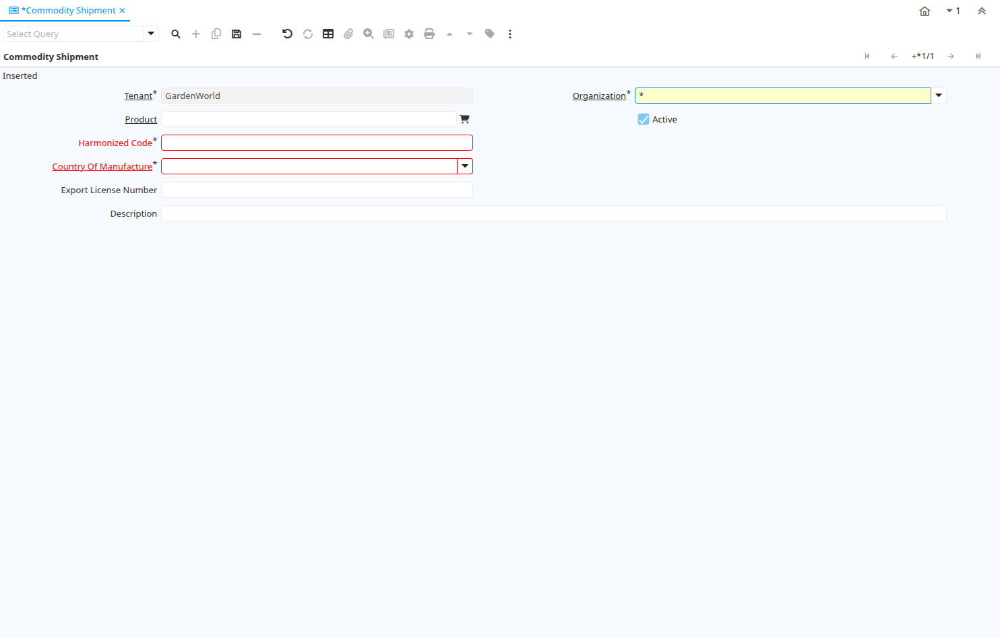

# Commodity Shipment

Window ID 200026

*06/12/2012 → 06/12/2012*

## Tab: Commodity Shipment

*Tab Level 0 · Created 06/12/2012 · Updated 06/12/2012*

| **Name** | **Description** | **Comment/Help** | **Technical Data** |
|---|---|---|---|
| Tenant | Tenant for this installation. | A Tenant is a company or a legal entity. You cannot share data between Tenants. | M_CommodityShipment.AD_Client_ID<small> numeric(10)   Table Direct</small> |
| Organization | Organizational entity within tenant | An organization is a unit of your tenant or legal entity - examples are store, department. You can share data between organizations. | M_CommodityShipment.AD_Org_ID<small> numeric(10)   Table Direct</small> |
| Product | Product, Service, Item | Identifies an item which is either purchased or sold in this organization. | M_CommodityShipment.M_Product_ID<small> numeric(10)   Search</small> |
| Active | The record is active in the system | There are two methods of making records unavailable in the system: One is to delete the record, the other is to de-activate the record. A de-activated record is not available for selection, but available for reports. There are two reasons for de-activating and not deleting records: (1) The system requires the record for audit purposes. (2) The record is referenced by other records. E.g., you cannot delete a Business Partner, if there are invoices for this partner record existing. You de-activate the Business Partner and prevent that this record is used for future entries. | M_CommodityShipment.IsActive<small> character(1)   Yes-No</small> |
| Harmonized Code |  |  | M_CommodityShipment.HarmonizedCode<small> character varying(30)   String</small> |
| Country Of Manufacture |  |  | M_CommodityShipment.CountryOfManufacture_ID<small> numeric(10)   Table</small> |
| Export License Number |  |  | M_CommodityShipment.ExportLicenseNum<small> character varying(30)   String</small> |
| Description | Optional short description of the record | A description is limited to 255 characters. | M_CommodityShipment.Description<small> character varying(255)   String</small> |

